---
## Front matter
lang: ru-RU
title: Лабораторная работа №1
subtitle: Операционные системы
author:
  - Павлова Т.Ю.
institute:
  - Российский университет дружбы народов, Москва, Россия

## i18n babel
babel-lang: russian
babel-otherlangs: english

## Formatting pdf
toc: false
toc-title: Содержание
slide_level: 2
aspectratio: 169
section-titles: true
theme: metropolis
header-includes:
 - \metroset{progressbar=frametitle,sectionpage=progressbar,numbering=fraction}
---

# Цель работы

Целью данной работы является приобретение практических навыков установки операционной системы на виртуальную машину, настройки минимально необходимых для дальнейшей работы сервисов.

# Задание

1. Создание виртуальной машины
2. Установка операционной системы
3. Работа с операционной системой после установки
4. Установка ПО для создания документации

# Создание виртуальной машины

Virtualbox я уже устанавливала в прошлом семестре для дисциплины "Архитектура компьютеров", поэтому я его сразу открываю (рис. [-@fig:001]).

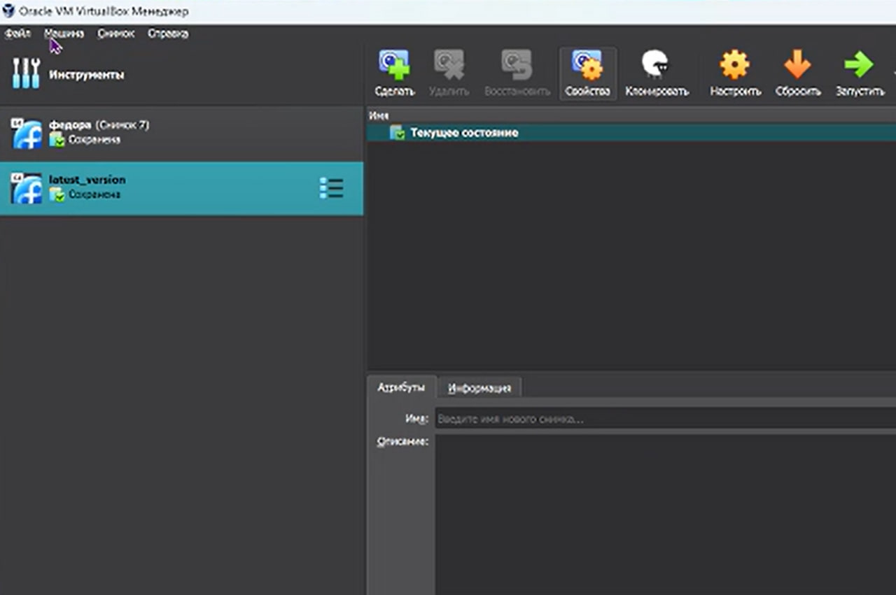{#fig:001 width=70%}

# Создание виртуальной машины

Нажимаю создать и приступаю к установке новой виртуальной машины: даю ей имя и выбираю нужный исошник (рис. [-@fig:002]).

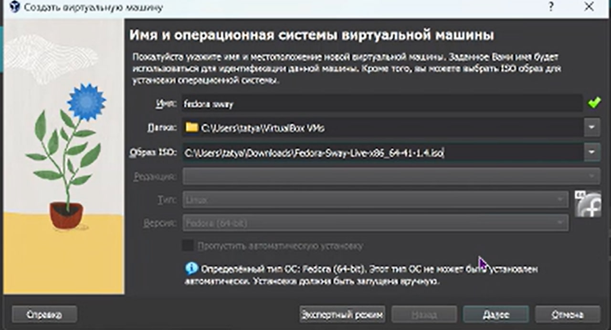{#fig:002 width=70%}

# Создание виртуальной машины

Выбираю размер памяти, которую будет использовать моя виртуальная машина (рис. [-@fig:003]).

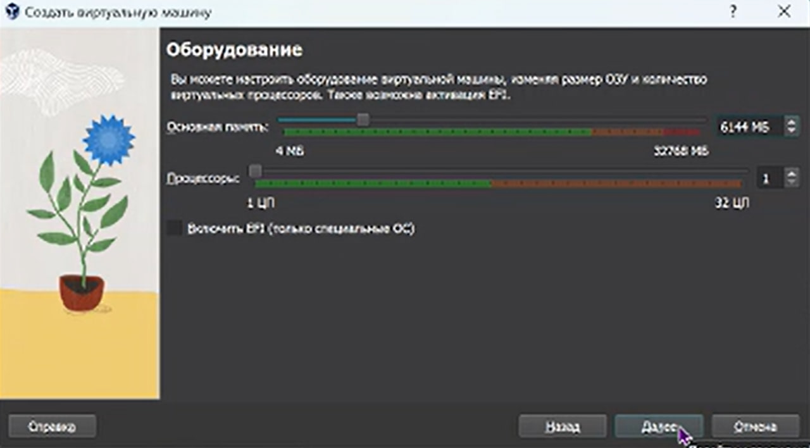{#fig:003 width=70%}

# Создание виртуальной машины

Настраиваю размер жесткого диска (рис. [-@fig:004]).

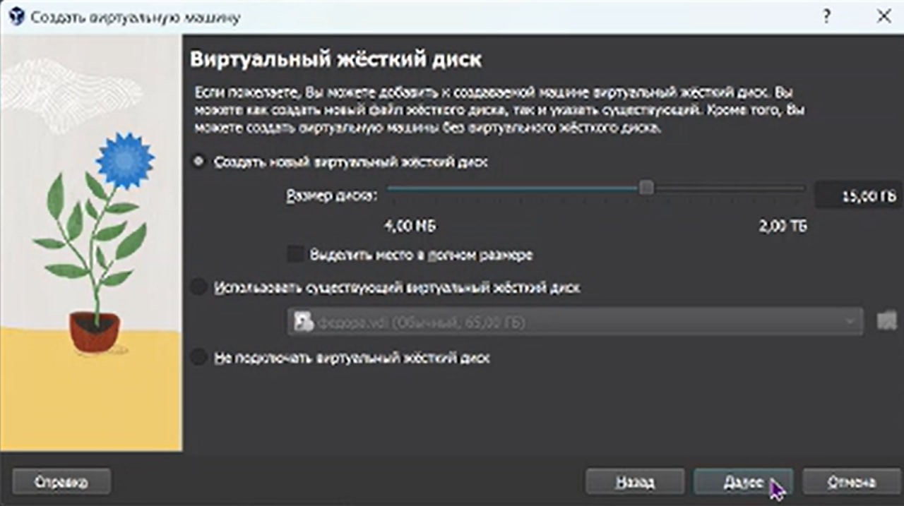{#fig:004 width=70%}

# Создание виртуальной машины

Далее в настройках выбираю динамический буфер обмена (рис. [-@fig:005]).

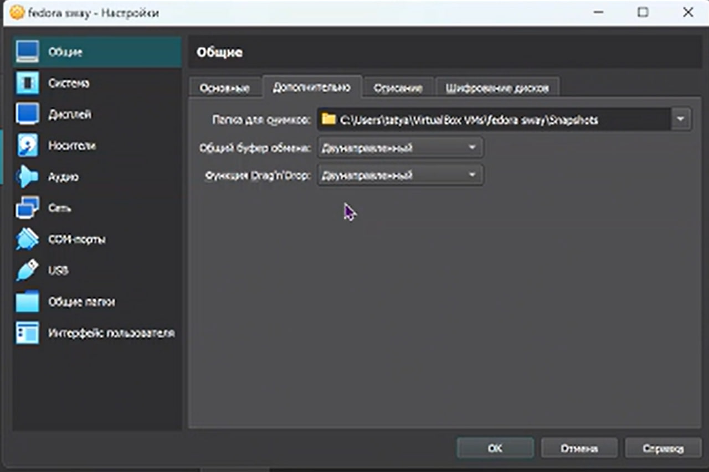{#fig:005 width=70%}

# Установка операционной системы

Запускаю созданную виртуальную машину (рис. [-@fig:006]).

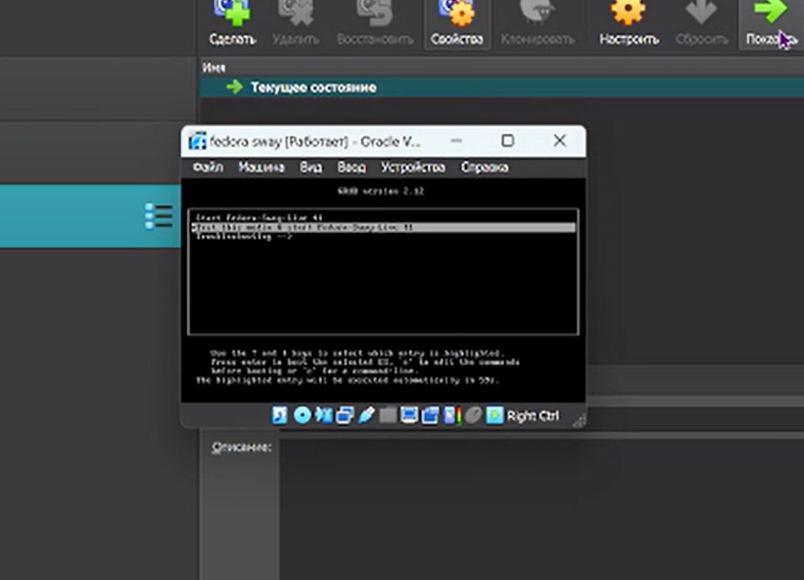{#fig:006 width=70%}

# Установка операционной системы

Далее запускаю liveinst (рис. [-@fig:007]).

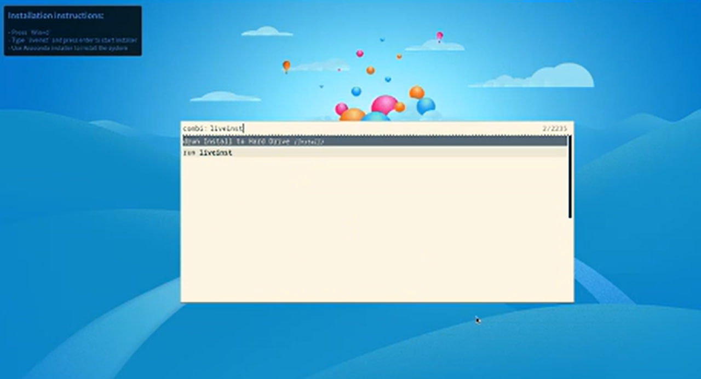{#fig:007 width=70%}

# Установка операционной системы

В открывшемся окне настраиваю все для установки федоры: 
1. Настраиваю язык
2. Настраиваю раскладку клавиатуры
3. Устанавливаю часовой пояс
4. Выбираю место установки
5. Задаю сетевое имя компьютера
6. Создаю аккаунт администратора
7. Создаю пользователя

# Установка операционной системы

Далее начинается установка операционной системы (рис. [-@fig:008]).

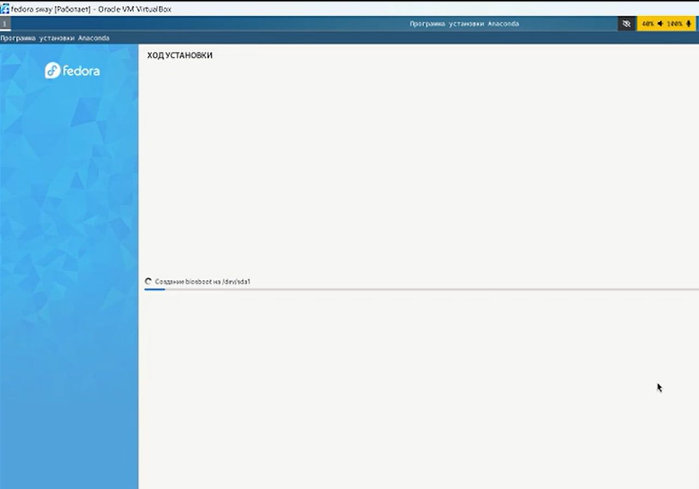{#fig:008 width=70%}

# Работа с операционной системой после установки

После установки операционной системы виртуальная машина перезагрузилась. Далее открываю терминал, переключаюсь на роль суперпользоователя и обновляю все пакеты (рис. [-@fig:009]).

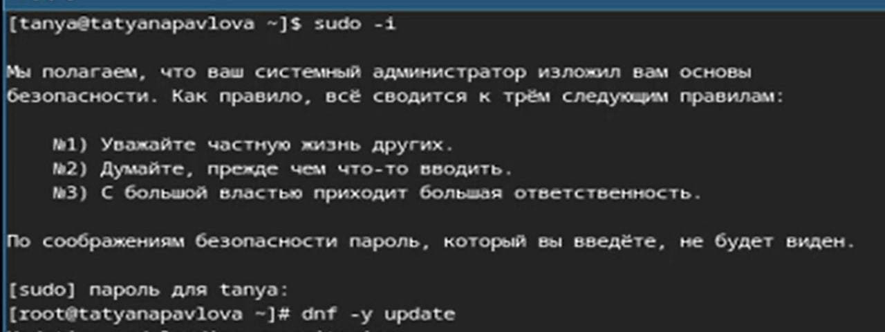{#fig:009 width=70%}

# Работа с операционной системой после установки

Устанавливаю программы для удобства работы в консоли: tmux для открытия нескольких "вкладок" в одном терминале, mc в качестве файлового менеджера в терминале (рис. [-@fig:010]).

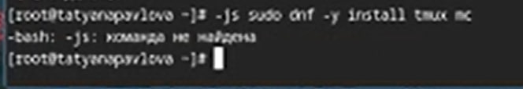{#fig:010 width=70%}

# Работа с операционной системой после установки

Устанавливаю программы для автоматического обновления (рис. [-@fig:011]).

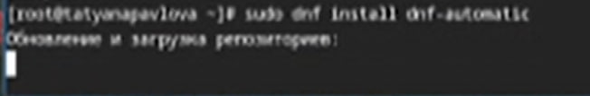{#fig:011 width=70%}

# Работа с операционной системой после установки

Запускаю таймер (рис. [-@fig:012]).

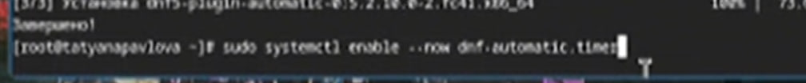{#fig:012 width=70%}

# Работа с операционной системой после установки

Изменяю открытый файл: SELINUX=enforcing меняю на значение SELINUX=permissive (рис. [-@fig:013]).

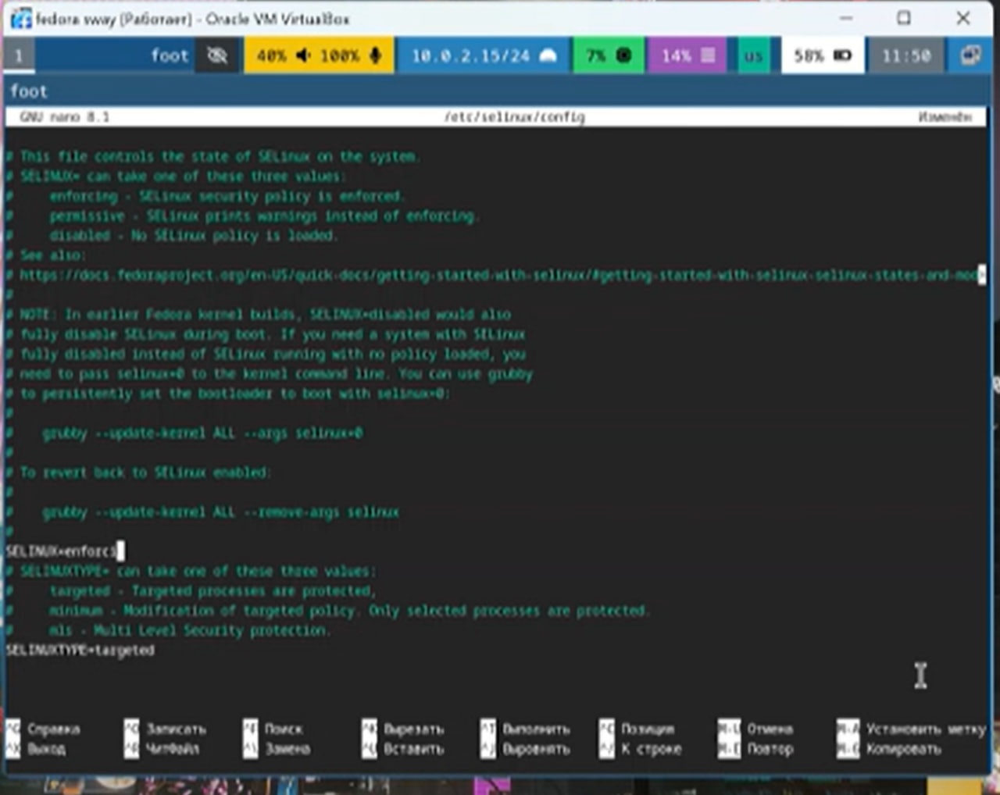{#fig:013 width=70%}

# Работа с операционной системой после установки

Перезагружаю и заново захожу в виртуальную машину (рис. [-@fig:014]).

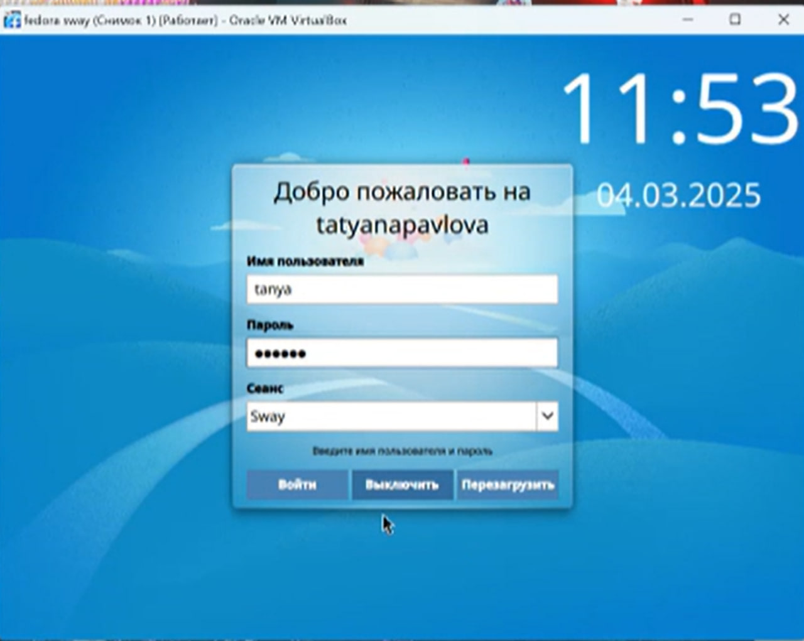{#fig:014 width=70%}

# Работа с операционной системой после установки

В меню ВМ подключаю образ диска гостевой ОС и примонтирую диск с помощью утилиты mount и устанавливаю драйвера (рис. [-@fig:015]).

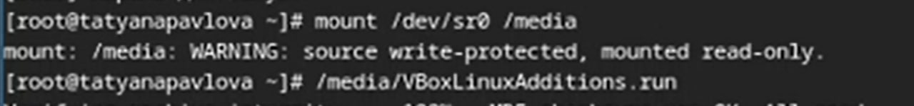{#fig:015 width=70%}

# Работа с операционной системой после установки

Снова перезагружаю ВМ (рис. [-@fig:016]).

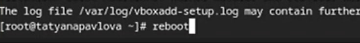{#fig:016 width=70%}

# Работа с операционной системой после установки

Перехожу в директорию /tc/X11/xorg.conf.d, открываю mc для удобства, открываю файл 00-keyboard.conf (рис. [-@fig:017]).

{#fig:017 width=70%}

# Работа с операционной системой после установки

Редактирую конфигурационный файл (рис. [-@fig:018]).

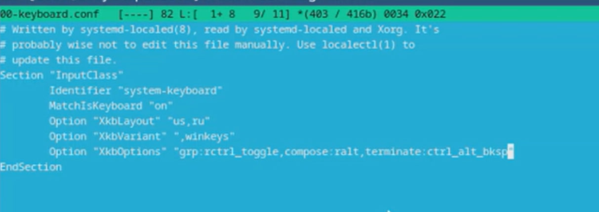{#fig:018 width=70%}

# Работа с операционной системой после установки

Снова перезагружаю ВМ (рис. [-@fig:019]).

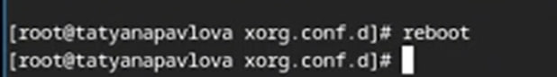{#fig:019 width=70%}

# Установка программного обеспечения для создания документации

Устанавливаю pandoc с помощью утилиты dnf и флага -y, который автоматически на все вопросы системы отвечает "yes" (рис. [-@fig:020]).

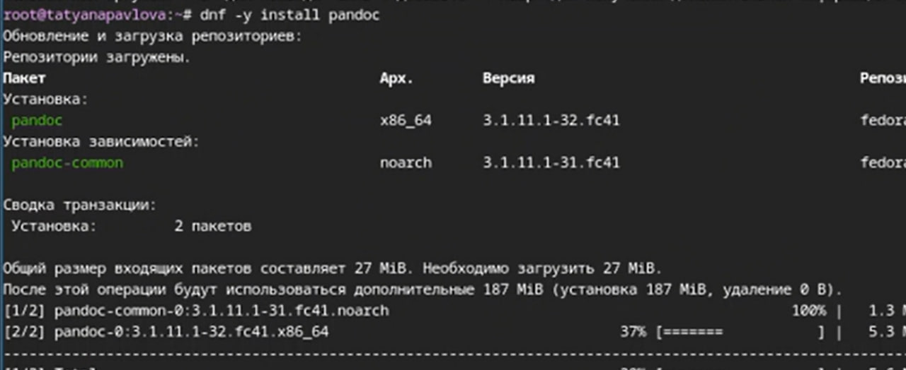{#fig:020 width=70%}

# Установка программного обеспечения для создания документации

Устанавливаю дистрибутив texlive (рис. [-@fig:021]).

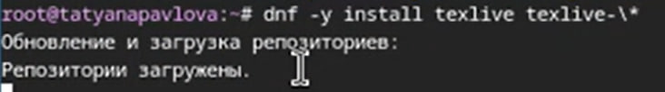{#fig:021 width=70%}

# Выводы

При выполнении данной лабораторной работы я приоьрела практические навыки установки ОС на виртуальную машину, а также сделала настройки минимально необходимых для дальней работы сервисов.
