---
## Front matter
title: "Лабораторная работа №1"
subtitle: "Операционные системы"
author: "Павлова Татьяна Юрьевна"

## Generic otions
lang: ru-RU
toc-title: "Содержание"

## Bibliography
bibliography: bib/cite.bib
csl: pandoc/csl/gost-r-7-0-5-2008-numeric.csl

## Pdf output format
toc: true # Table of contents
toc-depth: 2
lof: true # List of figures
lot: true # List of tables
fontsize: 12pt
linestretch: 1.5
papersize: a4
documentclass: scrreprt
## I18n polyglossia
polyglossia-lang:
  name: russian
  options:
	- spelling=modern
	- babelshorthands=true
polyglossia-otherlangs:
  name: english
## I18n babel
babel-lang: russian
babel-otherlangs: english
## Fonts
mainfont: IBM Plex Serif
romanfont: IBM Plex Serif
sansfont: IBM Plex Sans
monofont: IBM Plex Mono
mathfont: STIX Two Math
mainfontoptions: Ligatures=Common,Ligatures=TeX,Scale=0.94
romanfontoptions: Ligatures=Common,Ligatures=TeX,Scale=0.94
sansfontoptions: Ligatures=Common,Ligatures=TeX,Scale=MatchLowercase,Scale=0.94
monofontoptions: Scale=MatchLowercase,Scale=0.94,FakeStretch=0.9
mathfontoptions:
## Biblatex
biblatex: true
biblio-style: "gost-numeric"
biblatexoptions:
  - parentracker=true
  - backend=biber
  - hyperref=auto
  - language=auto
  - autolang=other*
  - citestyle=gost-numeric
## Pandoc-crossref LaTeX customization
figureTitle: "Рис."
tableTitle: "Таблица"
listingTitle: "Листинг"
lofTitle: "Список иллюстраций"
lotTitle: "Список таблиц"
lolTitle: "Листинги"
## Misc options
indent: true
header-includes:
  - \usepackage{indentfirst}
  - \usepackage{float} # keep figures where there are in the text
  - \floatplacement{figure}{H} # keep figures where there are in the text
---

# Цель работы

Целью данной работы является приобретение практических навыков установки операционной системы на виртуальную машину, настройки минимально необходимых для дальнейшей работы сервисов.

# Задание

1. Создание виртуальной машины
2. Установка операционной системы
3. Работа с операционной системой после установки
4. Установка ПО для создания документации

# Выполнение лабораторной работы

## Создание виртуальной машины

Virtualbox я уже устанавливала в прошлом семестре для дисциплины "Архитектура компьютеров", поэтому я его сразу открываю (рис. [-@fig:001]).

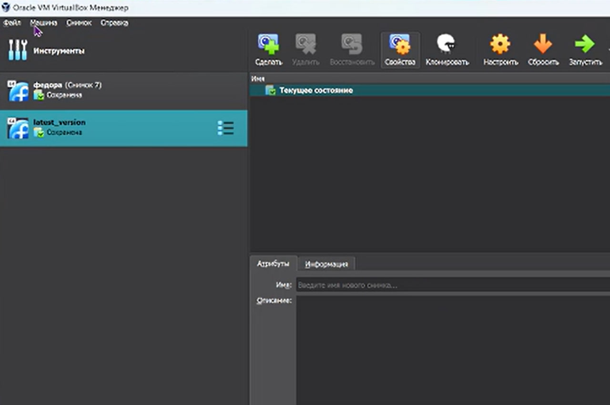{#fig:001 width=70%}

Нажимаю создать и приступаю к установке новой виртуальной машины: даю ей имя и выбираю нужный исошник (рис. [-@fig:002]).

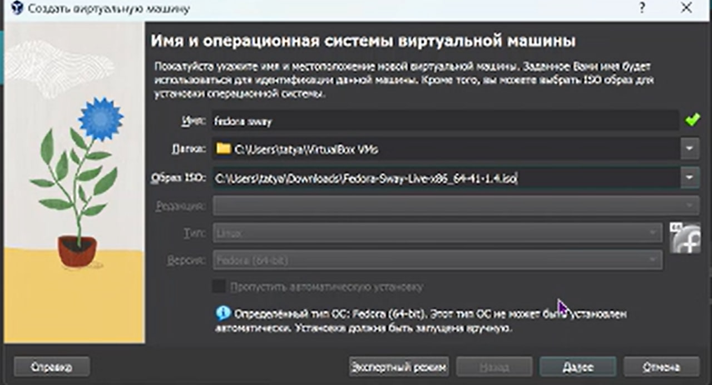{#fig:002 width=70%}

Выбираю размер памяти, которую будет использовать моя виртуальная машина (рис. [-@fig:003]).

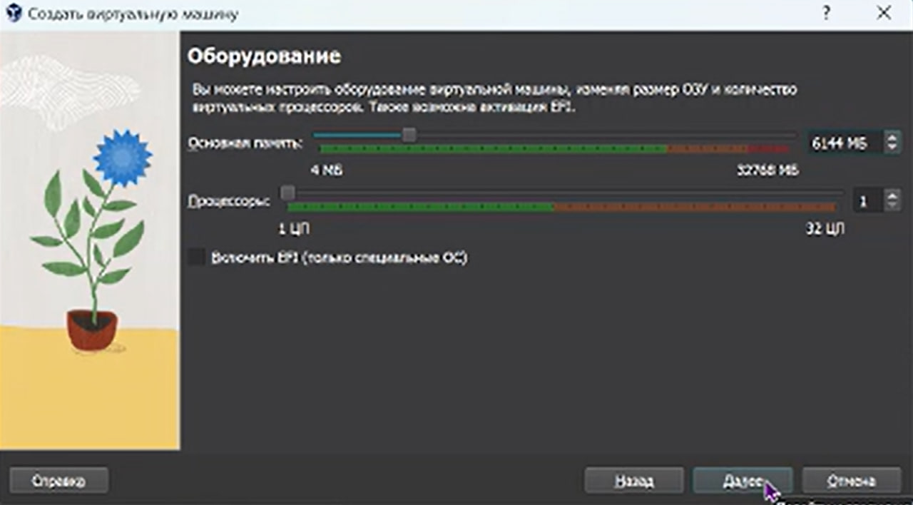{#fig:003 width=70%}

Настраиваю размер жесткого диска (рис. [-@fig:004]).

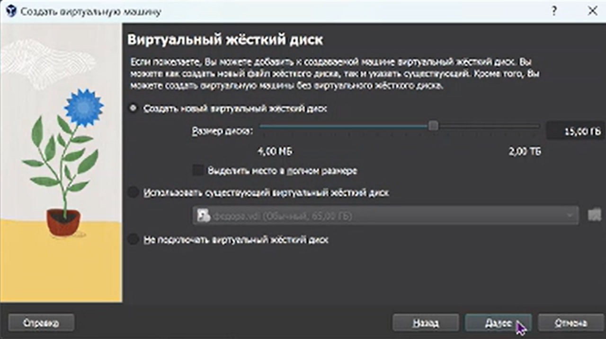{#fig:004 width=70%}

Далее в настройках выбираю динамический буфер обмена (рис. [-@fig:005]).

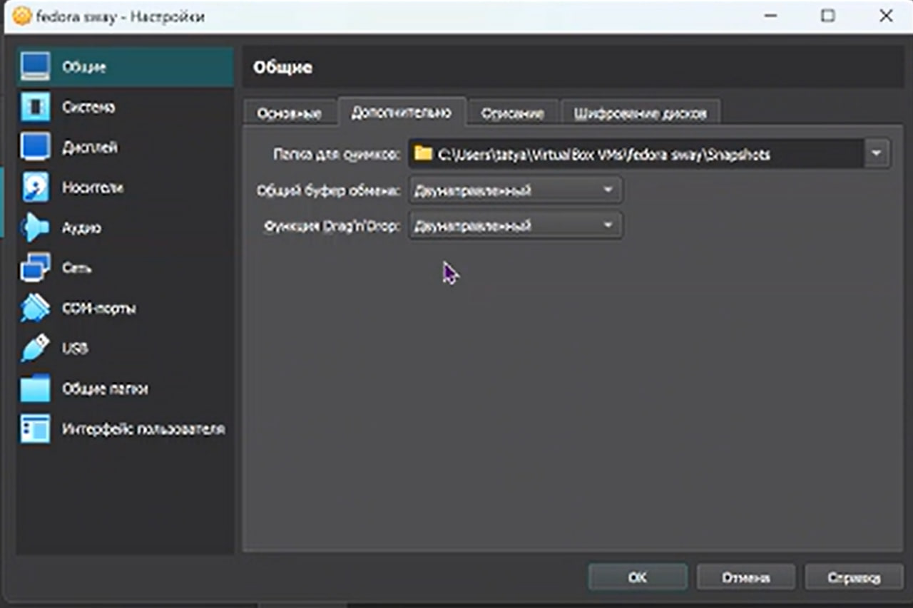{#fig:005 width=70%}

## Установка операционной системы

Запускаю созданную виртуальную машину (рис. [-@fig:006]).

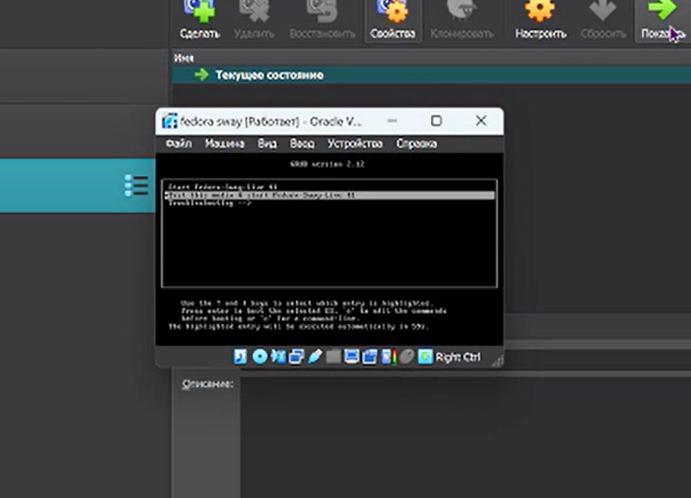{#fig:006 width=70%}

Далее запускаю liveinst (рис. [-@fig:007]).

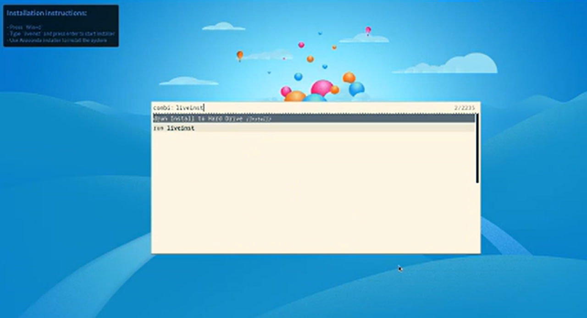{#fig:007 width=70%}

В открывшемся окне настраиваю все для установки федоры: настраиваю язык, раскладку клавиатуры, часовой пояс, выбираю место установки, задаю сетевое имя компьютера, создаю аккаунт администратора и создаю пользователя (рис. [-@fig:008]).

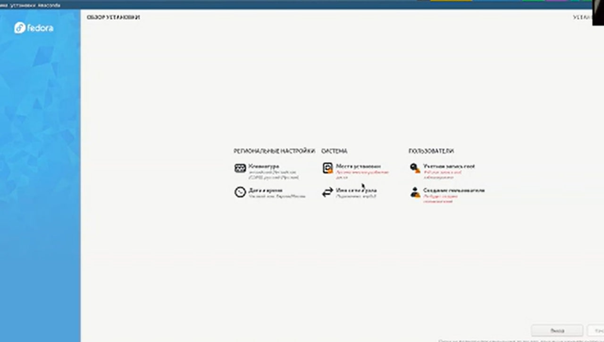{#fig:008 width=70%}

Далее начинается установка операционной системы (рис. [-@fig:009]).

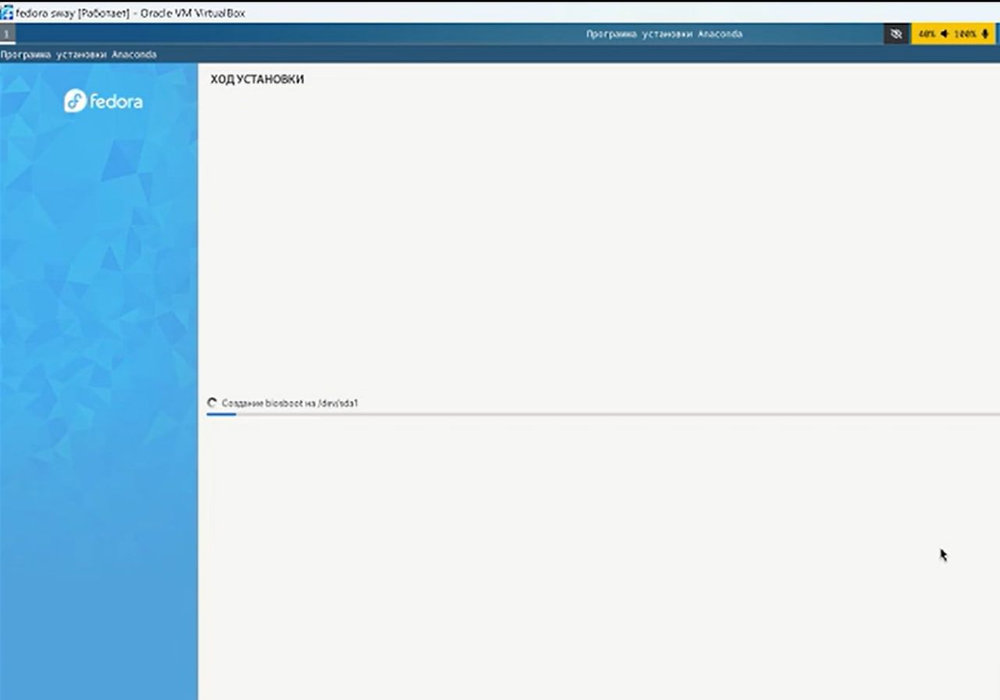{#fig:009 width=70%}

## Работа с операционной системой после установки

После установки операционной системы виртуальная машина перезагрузилась. Далее открываю терминал, переключаюсь на роль суперпользоователя и обновляю все пакеты (рис. [-@fig:010]).

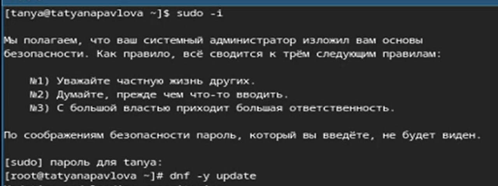{#fig:010 width=70%}

Устанавливаю программы для удобства работы в консоли: tmux для открытия нескольких "вкладок" в одном терминале, mc в качестве файлового менеджера в терминале (рис. [-@fig:011]).

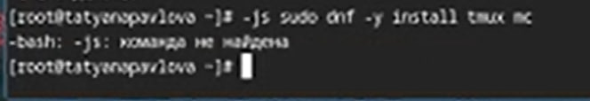{#fig:011 width=70%}

Устанавливаю программы для автоматического обновления (рис. [-@fig:012]).

{#fig:012 width=70%}

Запускаю таймер (рис. [-@fig:013]).

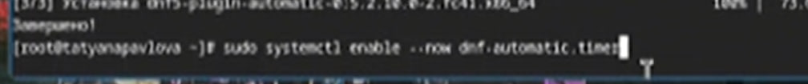{#fig:013 width=70%}

Изменяю открытый файл: SELINUX=enforcing меняю на значение SELINUX=permissive (рис. [-@fig:014]).

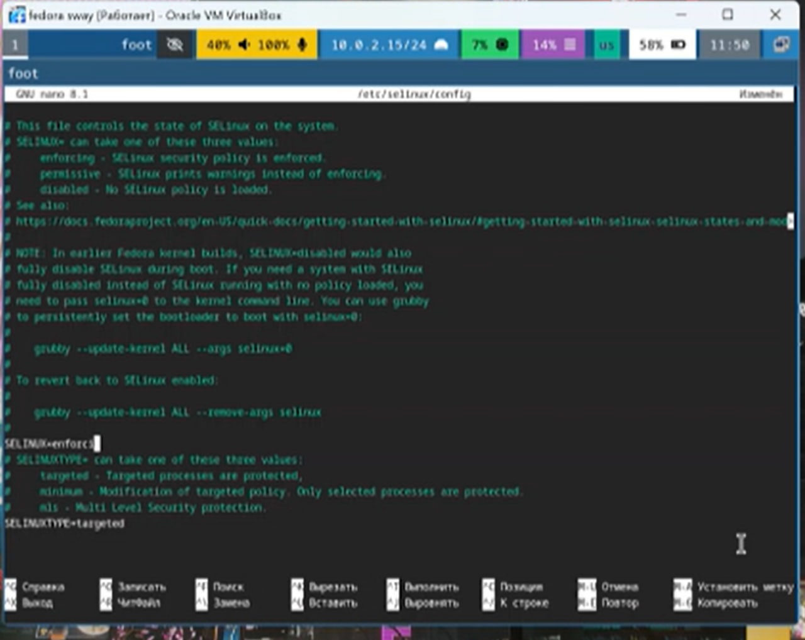{#fig:014 width=70%}

Перезагружаю и заново захожу в виртуальную машину (рис. [-@fig:015]).

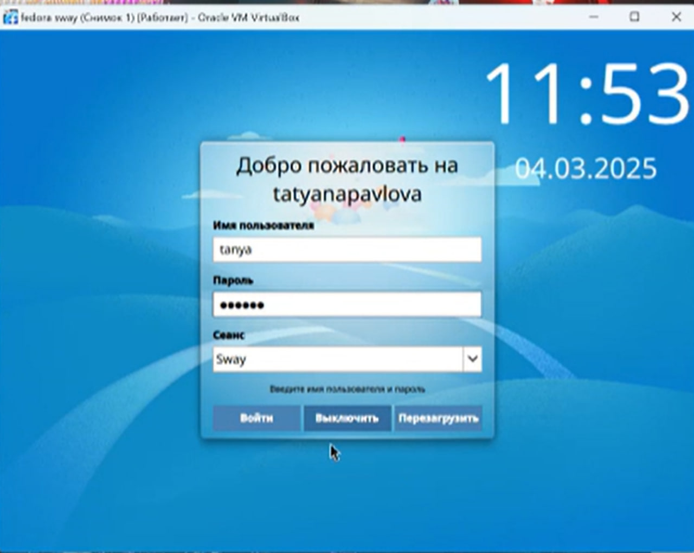{#fig:015 width=70%}

В меню ВМ подключаю образ диска гостевой ОС и примонтирую диск с помощью утилиты mount и устанавливаю драйвера (рис. [-@fig:016]).

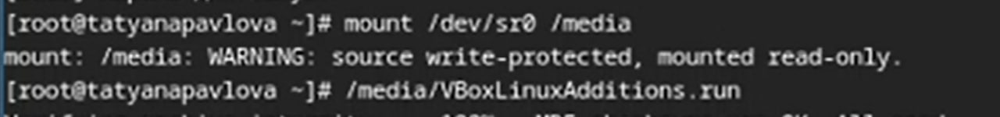{#fig:016 width=70%}

Снова перезагружаю ВМ (рис. [-@fig:017]).

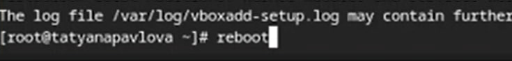{#fig:017 width=70%}

Перехожу в директорию /tc/X11/xorg.conf.d, открываю mc для удобства, открываю файл 00-keyboard.conf (рис. [-@fig:018]).

{#fig:018 width=70%}

Редактирую конфигурационный файл (рис. [-@fig:019]).

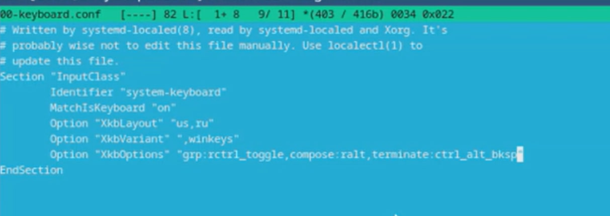{#fig:019 width=70%}

Снова перезагружаю ВМ (рис. [-@fig:020]).

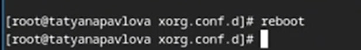{#fig:020 width=70%}

## Установка программного обеспечения для создания документации

Устанавливаю pandoc с помощью утилиты dnf и флага -y, который автоматически на все вопросы системы отвечает "yes" (рис. [-@fig:021]).

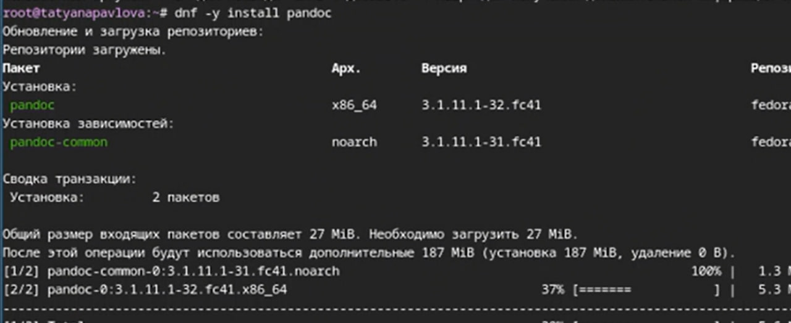{#fig:021 width=70%}

Устанавливаю дистрибутив texlive (рис. [-@fig:022]).

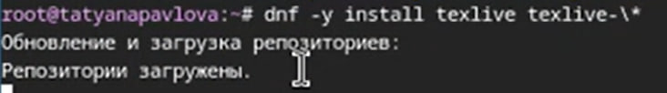{#fig:022 width=70%}

# Выводы

При выполнении данной лабораторной работы я приоьрела практические навыки установки ОС на виртуальную машину, а также сделала настройки минимально необходимых для дальней работы сервисов.
