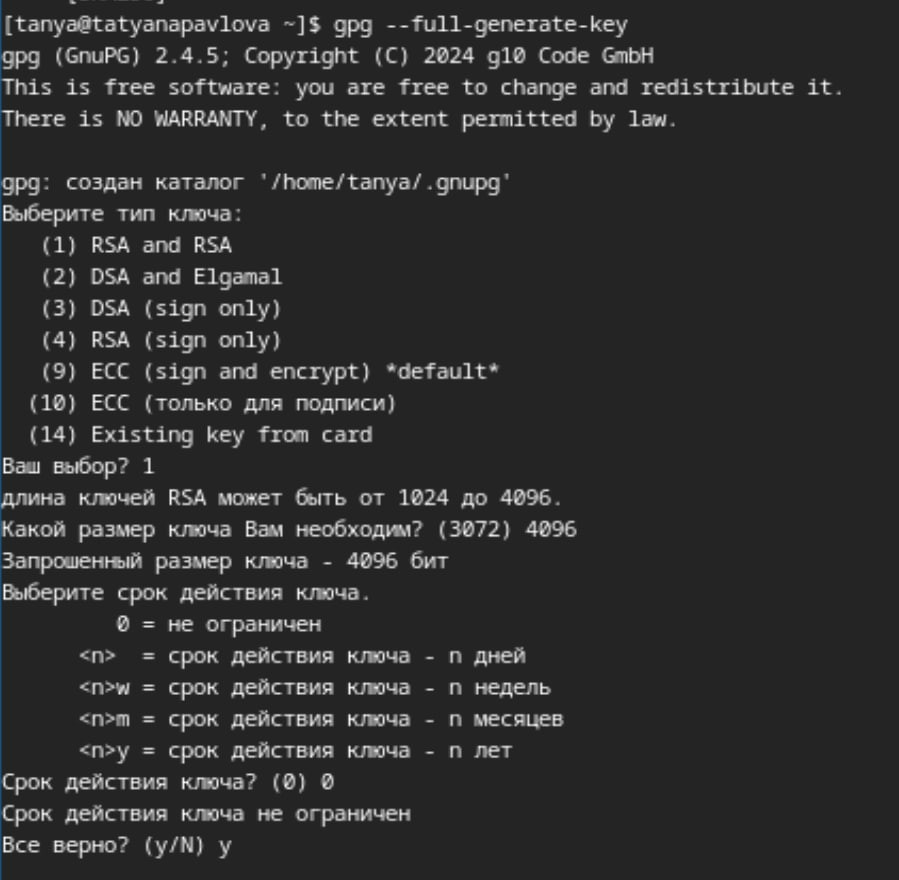
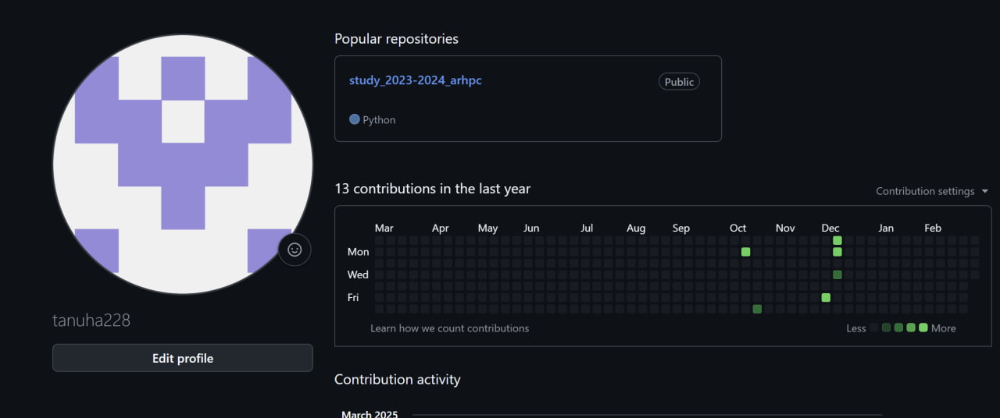
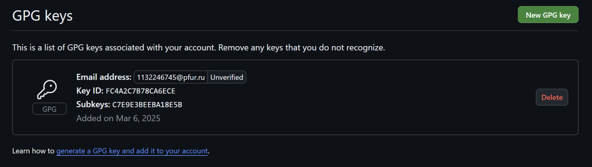
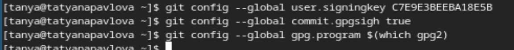
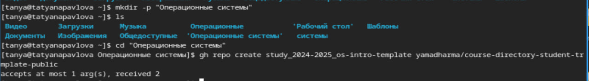

---
## Front matter
lang: ru-RU
title: Лабораторная работа №2
subtitle: Операционные системы
author:
  - Павлова Т.Ю.
institute:
  - Российский университет дружбы народов, Москва, Россия

## i18n babel
babel-lang: russian
babel-otherlangs: english

## Formatting pdf
toc: false
toc-title: Содержание
slide_level: 2
aspectratio: 169
section-titles: true
theme: metropolis
header-includes:
 - \metroset{progressbar=frametitle,sectionpage=progressbar,numbering=fraction}
---

## Цель работы

цель данной работы - изучение идеологии и применения средств контроля версий, освоение умения по работе с git.

## Задание

1. Создать базовую конфигурацию для работы с git.
2. Создать ключ SSH
3. Создать ключ GPG 
4. Настроить подписи git
5. Зарегистрироваться на GitHub
6. Создать локальный каталог для выполнения заданий по предмету

## Выполнение лабораторной работы. Установка программного обеспечения

Устанавливаю необходимое программное обеспечение через терминал (рис. 1).

## Базовая настройка git

1. Задаю имя и email 
2. Настраиваю urf-8 
3. Начальной ветке задаю имя master
4. Задаю параметры autocrlf и safecrlf для корректного отображения конца строки
5. Создаю ключ ssh размером 4096 бит по алгоритму rsa 
6. Создаю ключ ssh по алгоритму ed25519 

## Создание ключа GPG

Генерирую ключ gpg, затем выбираю тип ключа rsa and rsa, задаю максимальную длину ключа:4096, оставляю неограниченный срок действия (рис. 2).

## Регистрация на GitHub

У меня уже создан аккаунт, поэтому я буду использовать его (рис. 3).

## Добавление ключа GPG в GitHub

Вывожу список созданных ключей с помощью комманды и копирую нужную мне часть в буфер обмена. Далее ввожу в терминал комманду, с помощью которой копирую сам ключ и ищу в настройках github. Вставляю в поле ключ из буфера обмена (рис. 4).

## Настройки подписи Git

Настраиваю автоматические подписи комментов git (рис. 5).

## Настройка gh

Начинаю авторизацию в gh, далее завершаю авторизацию на сайте и вижу сообщение о ее завершении (рис. 5).

## Создание репозитория курса на основе шаблона

1. Создаю директорию "Операционные системы" и создаю репозиторий на основе шаблона с помощью комманды 
2. Клонирую репозиторий 
3. Удаляю лишние файлы и создаю необходимые каталоги 
4. Отправляю все новые вайлы на сервер.

## Выводы

При выполнении данной лабораторной работы я узнала идеологию и применение средств контроля версий, освоила умение по работе с git.

