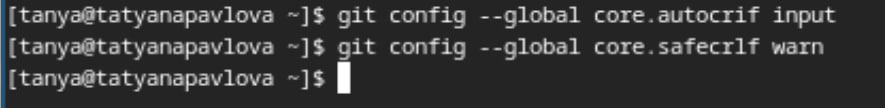

---
## Front matter
title: "лабораторная работа №2"
subtitle: "Операционные системы"
author: "Павлова Татьяна Юрьевна"

## Generic otions
lang: ru-RU
toc-title: "Содержание"

## Bibliography
bibliography: bib/cite.bib
csl: pandoc/csl/gost-r-7-0-5-2008-numeric.csl

## Pdf output format
toc: true # Table of contents
toc-depth: 2
lof: true # List of figures
lot: true # List of tables
fontsize: 12pt
linestretch: 1.5
papersize: a4
documentclass: scrreprt
## I18n polyglossia
polyglossia-lang:
  name: russian
  options:
	- spelling=modern
	- babelshorthands=true
polyglossia-otherlangs:
  name: english
## I18n babel
babel-lang: russian
babel-otherlangs: english
## Fonts
mainfont: IBM Plex Serif
romanfont: IBM Plex Serif
sansfont: IBM Plex Sans
monofont: IBM Plex Mono
mathfont: STIX Two Math
mainfontoptions: Ligatures=Common,Ligatures=TeX,Scale=0.94
romanfontoptions: Ligatures=Common,Ligatures=TeX,Scale=0.94
sansfontoptions: Ligatures=Common,Ligatures=TeX,Scale=MatchLowercase,Scale=0.94
monofontoptions: Scale=MatchLowercase,Scale=0.94,FakeStretch=0.9
mathfontoptions:
## Biblatex
biblatex: true
biblio-style: "gost-numeric"
biblatexoptions:
  - parentracker=true
  - backend=biber
  - hyperref=auto
  - language=auto
  - autolang=other*
  - citestyle=gost-numeric
## Pandoc-crossref LaTeX customization
figureTitle: "Рис."
tableTitle: "Таблица"
listingTitle: "Листинг"
lofTitle: "Список иллюстраций"
lotTitle: "Список таблиц"
lolTitle: "Листинги"
## Misc options
indent: true
header-includes:
  - \usepackage{indentfirst}
  - \usepackage{float} # keep figures where there are in the text
  - \floatplacement{figure}{H} # keep figures where there are in the text
---

# Цель работы

цель данной работы - изучение идеологии и применения средств контроля версий, освоение умения по работе с git.

# Задание

1. Создать базовую конфигурацию для работы с git.
2. Создать ключ SSH
3. Создать ключ GPG 
4. Настроить подписи git
5. Зарегистрироваться на GitHub
6. Создать локальный каталог для выполнения заданий по предмету

# Выполнение лабораторной работы

## Установка программного обеспечения

Устанавливаю необходимое программное обеспечение через терминал (рис. [-@fig:001]).

{#fig:001 width=70%}

## Базовая настройка git

Задаю имя и email (рис. [-@fig:002]).

{#fig:002 width=70%}

Настраиваю urf-8 (рис. [-@fig:003]).

{#fig:003 width=70%}

Начальной ветке задаю имя master (рис. [-@fig:004]).

{#fig:004 width=70%}

Задаю параметры autocrlf и safecrlf для корректного отображения конца строки (рис. [-@fig:005]).

{#fig:005 width=70%}

Создаю ключ ssh размером 4096 бит по алгоритму rsa (рис. [-@fig:006]).

{#fig:006 width=70%}

Создаю ключ ssh по алгоритму ed25519 (рис. [-@fig:007]).

{#fig:007 width=70%}

## Создание ключа GPG

Генерирую ключ gpg, затем выбираю тип ключа rsa and rsa, задаю максимальную длину ключа:4096, оставляю неограниченный срок действия (рис. [-@fig:008]).

{#fig:008 width=70%}

## Регистрация на GitHub

У меня уже создан аккаунт, поэтому я буду использовать его (рис. [-@fig:009]).

{#fig:009 width=70%}

## Добавление ключа GPG в GitHub

Вывожу список созданных ключей с помощью комманды и копирую нужную мне часть в буфер обмена (рис. [-@fig:010]).

{#fig:010 width=70%}

Ввожу в терминал комманду, с помощью которой копирую сам ключ (рис. [-@fig:011]).

{#fig:011 width=70%}

Ищу в настройках github добавление gpg ключа (рис. [-@fig:012]).

{#fig:012 width=70%}

Вставляю в поле ключ из буфера обмена (рис. [-@fig:013]).

{#fig:013 width=70%}

## Настройки подписи Git

Настраиваю автоматические пидписи комментов git (рис. [-@fig:014]).

{#fig:014 width=70%}

## Настройка gh

Начинаю авторизацию в gh (рис. [-@fig:015]).

{#fig:015 width=70%}

Далее завершаю авторизацию на сайте и вижу сообщение о ее завершении (рис. [-@fig:016]).

{#fig:016 width=70%}

## Создание репозитория курса на основе шаблона

Создаю директорию "Операционные системы" и создаю репозиторий на основе шаблона с помощью комманды (рис. [-@fig:017]).

{#fig:017 width=70%}

Клонирую репозиторий (рис. [-@fig:018]).

{#fig:018 width=70%}

Удаляю лишние файлы и создаю необходимые каталоги (рис. [-@fig:019]).

{#fig:019 width=70%}

Далее отправляю все новые вайлы на сервер.

# Выводы

При выполнении данной лабораторной работы я узнала идеологию и применение средств контроля версий, освоила умение по работе с git.

# Список литературы{.unnumbered}

1. лабораторная работа №2 [Электронный курс]
