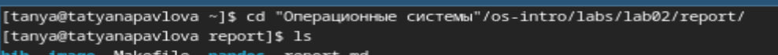
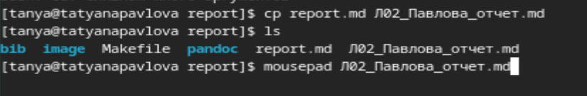
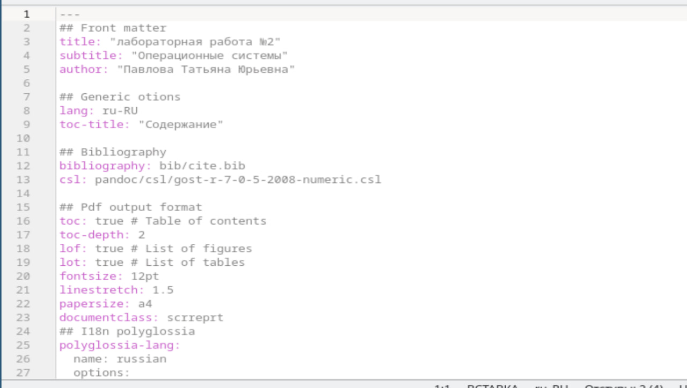
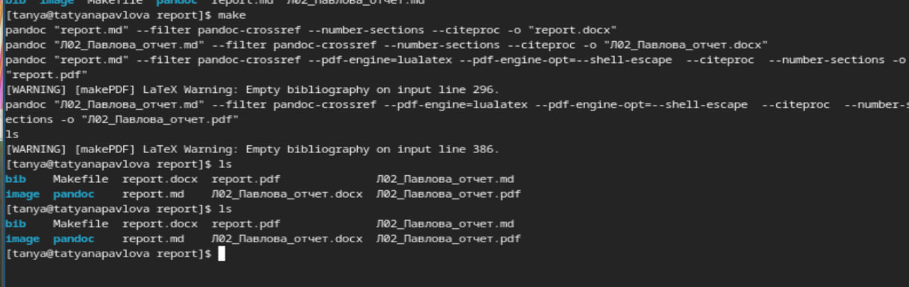
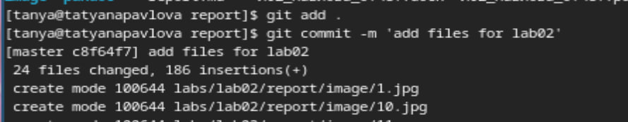

---
## Front matter
lang: ru-RU
title: Лабораторная работа №3
subtitle: Операционные системы
author:
  - Павлова Т.Ю.
institute:
  - Российский университет дружбы народов, Москва, Россия

## i18n babel
babel-lang: russian
babel-otherlangs: english

## Formatting pdf
toc: false
toc-title: Содержание
slide_level: 2
aspectratio: 169
section-titles: true
theme: metropolis
header-includes:
 - \metroset{progressbar=frametitle,sectionpage=progressbar,numbering=fraction}
---

## Цель работы

Цель данной работы - научиться оформлять отчеты с помощью легковесного языка разметки Markdown

## Задание

1. Сделать отчет по предыдущей лабораторной работе в формате Markdown
2. В качестве отчета предоставляются работы в 3 форматах: pdf, docx и md

## Выполнение лабораторной работы. Переход в каталог

Перехожу в каталог, в котором находится шаблон для отчета по лабораторной работе (рис. 1).

## Выполнение лабораторной работы. Создание копии шаблона 

Создаю копию шаблона, в которой буду работать (рис. 2).

## Выполнение лабораторной работы. Заполнение файла

Открываю файл с помощью текстового редактора. Далее его заполняю (более подробно можно посмотреть в моем плейлисте) (рис. 3).

Выполняю компмиляцию шаблона из md в pdf и docx (рис. 4)

Далее отправляю созданные и скомпилированные файлы на глобальный репозиторий (рис. 5)

# Выводы

При выполнении данной работы я научилось оформлять отчеты с помощью языка разметки MArkdown.

