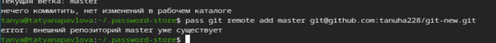
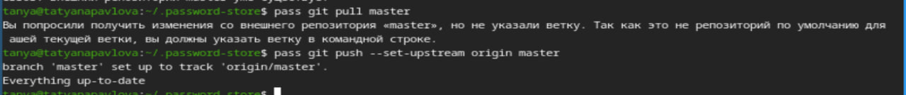
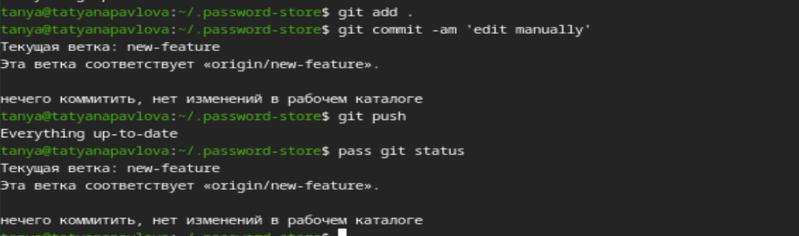
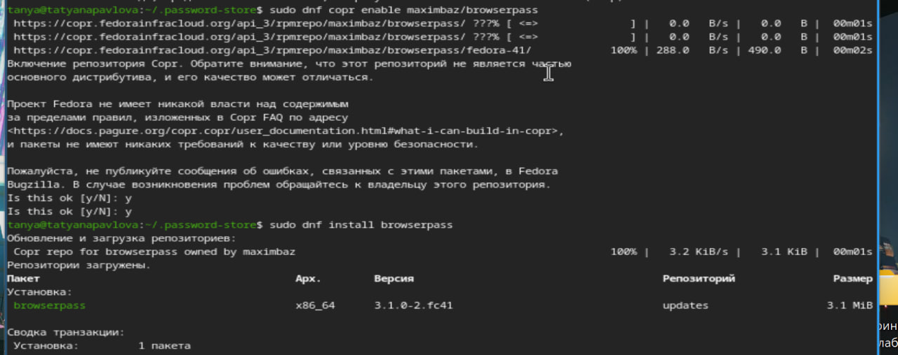
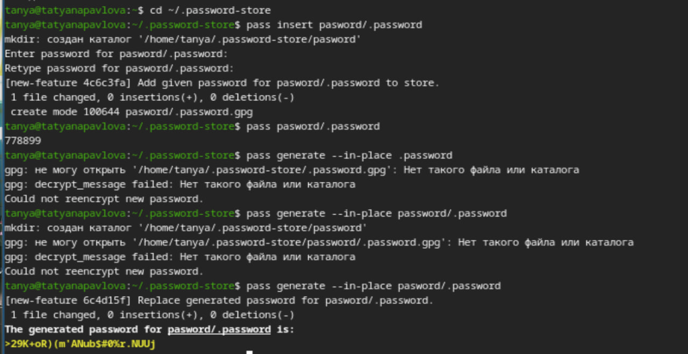
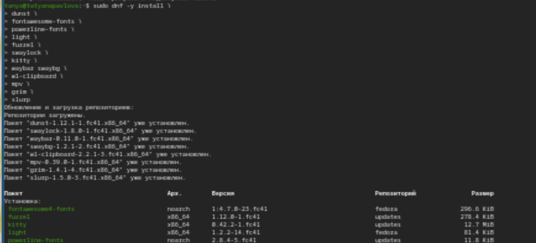
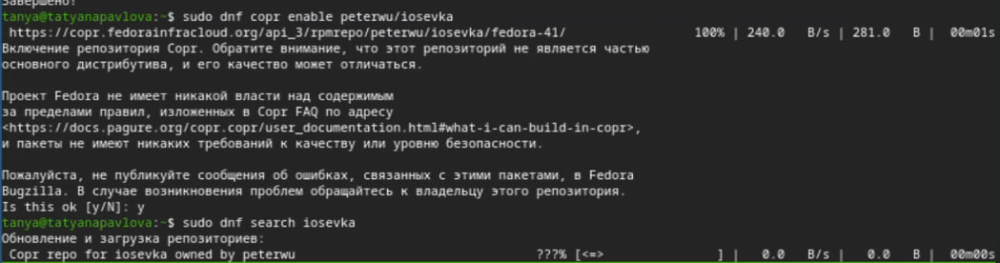
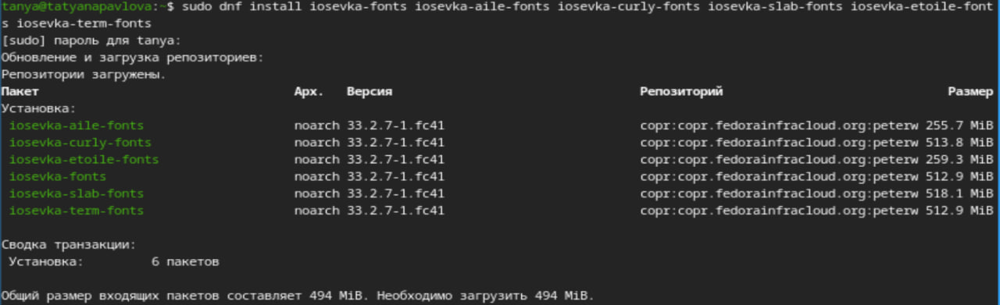
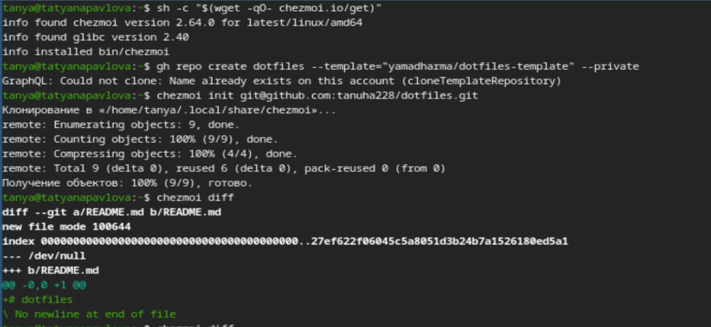
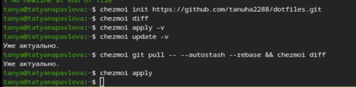

---
## Front matter
lang: ru-RU
title: Лабораторная работы №5
subtitle: Операционные системы
author:
  - Павлова Т. Ю.
institute:
  - Российский университет дружбы народов, Москва, Россия

## i18n babel
babel-lang: russian
babel-otherlangs: english

## Formatting pdf
toc: false
toc-title: Содержание
slide_level: 2
aspectratio: 169
section-titles: true
theme: metropolis
header-includes:
 - \metroset{progressbar=frametitle,sectionpage=progressbar,numbering=fraction}
---

# Цель работы

Целью данной работы является ознакомление с pass, gopass, native massaging и chezmoi, а также научиться пользоваться этими утилитами, синхронизировать их с git.

# Задание

1. Установить дополнительное ПО.
2. Установить и настроить pass.
3. Настроить  интерфейс с браузером.
4. Сохранить пароль.
5. Установить и настроить chezmoi.
6. Настроить chezmoi на новой машине.
7. Выполнить ежедневные операции с chezmoi.

# Выполнение лабораторной работы.

# Менеджер паролей pass. Установка, настройка.

1. Устанавливаю pass и gopass
2. Пересматриваю список ключей
3. Инициализирую хранилище
4. Синхронизирую с git
5. Создаю структуру git 

# Менеджер паролей pass. Установка, настройка.

Задаю адрес репозитория на хостинге (рис. 1).

{#fig:004 width=70%}

# Менеджер паролей pass. Установка, настройка.

Задаю адрес репозитория на хостинге (рис. 2)

{#fig:005 width=70%}

# Менеджер паролей pass. Установка, настройка.

Задаю адрес репозитория на хостинге (рис. 3)

{#fig:006 width=70%}

# Настройка интерфейса с броузером.

Для взаимодействия с броузером буду использовать интерфейс native messaging. Кроме плагина к броузеру мне нужно установить программу, обеспечивающую интерфейс native messaging (рис. 4).

{#fig:007 width=70%}

# Сохранение пароля.

Добавляю новый пароль, отображу пароль для указанного имени файла и заменю существующий пароль (рис. 5).

{#fig:008 width=70%}

# Управление файлами конфигурации. Установка. Использование chezmoi.

Устанавливаю дополнительное ПО и шрифты (рис. 6).

{#fig:009 width=70%}

# Управление файлами конфигурации. Установка. Использование chezmoi.

Устанавливаю дополнительное ПО и шрифты (рис. 7).

{#fig:010 width=70%}

# Управление файлами конфигурации. Установка. Использование chezmoi.

Устанавливаю дополнительное ПО и шрифты (рис. 8).

{#fig:011 width=70%}

# Управление файлами конфигурации. Установка. Использование chezmoi.

Устанавливаю бинарный файл, создаю собственный репозиторий с помощью утилит и создаю свой репозиторий для конфигурационных файлов на основе шаблона. Инициализирую chezmoi с репозиторием dotgiles, проверяю, какие изменения внесет chezmoi в домашний каталог и запущу chezmoi apply -v 12 (рис. 9).

{#fig:012 width=70%}

# Управление файлами конфигурации. Установка. Использование chezmoi.

На второй машине инициализирую chezmoi с репозиторием dotfiles, проверяю, какие изменения внесет chezmoi в домашний каталог (я настроила репозиторий заранее, поэтому изменений нет).  (рис. 10).

{#fig:013 width=70%}

# Выводы

При выполнении данной лабораторной работы, я познакомилась с pass, gopass, native messaging и cgezmoi, а также научилась пользоваться этими утилитами, синхронизировала их с git. 
