---
## Front matter
title: "Лабораторная работа №5"
subtitle: "Операционные системы"
author: "Павлова Татьяна Юрьевна"

## Generic otions
lang: ru-RU
toc-title: "Содержание"

## Bibliography
bibliography: bib/cite.bib
csl: pandoc/csl/gost-r-7-0-5-2008-numeric.csl

## Pdf output format
toc: true # Table of contents
toc-depth: 2
lof: true # List of figures
lot: true # List of tables
fontsize: 12pt
linestretch: 1.5
papersize: a4
documentclass: scrreprt
## I18n polyglossia
polyglossia-lang:
  name: russian
  options:
	- spelling=modern
	- babelshorthands=true
polyglossia-otherlangs:
  name: english
## I18n babel
babel-lang: russian
babel-otherlangs: english
## Fonts
mainfont: IBM Plex Serif
romanfont: IBM Plex Serif
sansfont: IBM Plex Sans
monofont: IBM Plex Mono
mathfont: STIX Two Math
mainfontoptions: Ligatures=Common,Ligatures=TeX,Scale=0.94
romanfontoptions: Ligatures=Common,Ligatures=TeX,Scale=0.94
sansfontoptions: Ligatures=Common,Ligatures=TeX,Scale=MatchLowercase,Scale=0.94
monofontoptions: Scale=MatchLowercase,Scale=0.94,FakeStretch=0.9
mathfontoptions:
## Biblatex
biblatex: true
biblio-style: "gost-numeric"
biblatexoptions:
  - parentracker=true
  - backend=biber
  - hyperref=auto
  - language=auto
  - autolang=other*
  - citestyle=gost-numeric
## Pandoc-crossref LaTeX customization
figureTitle: "Рис."
tableTitle: "Таблица"
listingTitle: "Листинг"
lofTitle: "Список иллюстраций"
lotTitle: "Список таблиц"
lolTitle: "Листинги"
## Misc options
indent: true
header-includes:
  - \usepackage{indentfirst}
  - \usepackage{float} # keep figures where there are in the text
  - \floatplacement{figure}{H} # keep figures where there are in the text
---

# Цель работы

Целью данной работы является ознакомление с pass, gopass, native massaging и chezmoi, а также научиться пользоваться этими утилитами, синхронизировать их с git.

# Задание

1. Установить дополнительное ПО.
2. Установить и настроить pass.
3. Настроить  интерфейс с браузером.
4. Сохранить пароль.
5. Установить и настроить chezmoi.
6. Настроить chezmoi на новой машине.
7. Выполнить ежедневные операции с chezmoi.

# Выполнение лабораторной работы.

## Менеджер паролей pass. Установка, настройка.

Устанавливаю pass и gopass (рис. 1), (рис. 2).

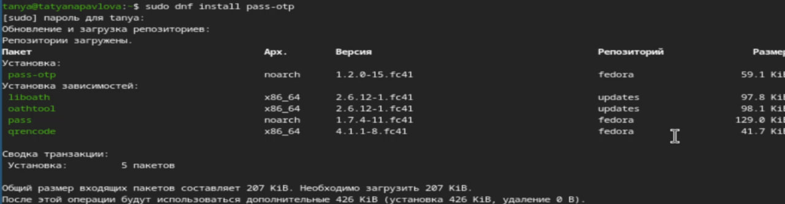{#fig:001 width=70%}

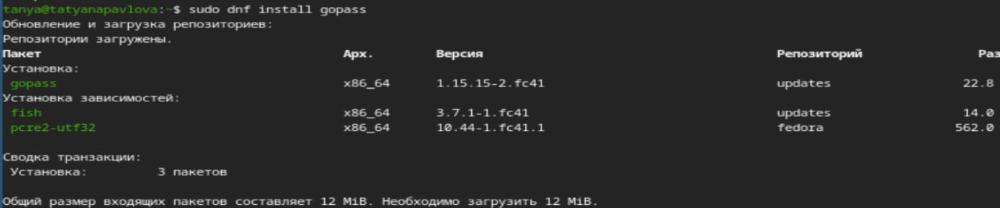{#fig:002 width=70%}

Пересматриваю список ключей, инициализирую хранилище, синхронизирую с git и создаю структуру git (рис. [-@fig:003]).

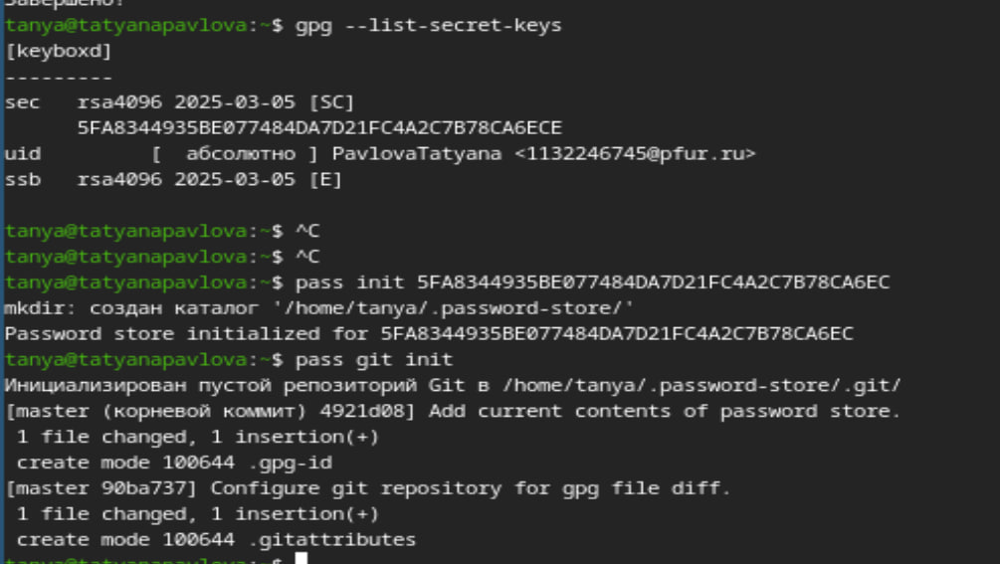{#fig:003 width=70%}

Задаю адрес репозитория на хостинге (рис. 4), (рис. 5), (рис. 6).

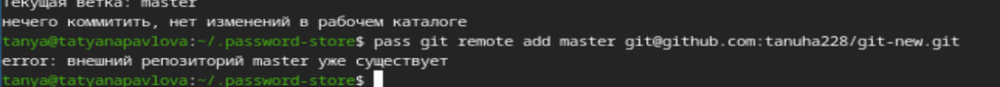{#fig:004 width=70%}

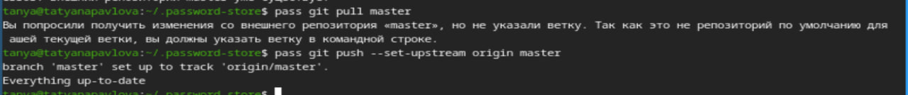{#fig:005 width=70%}

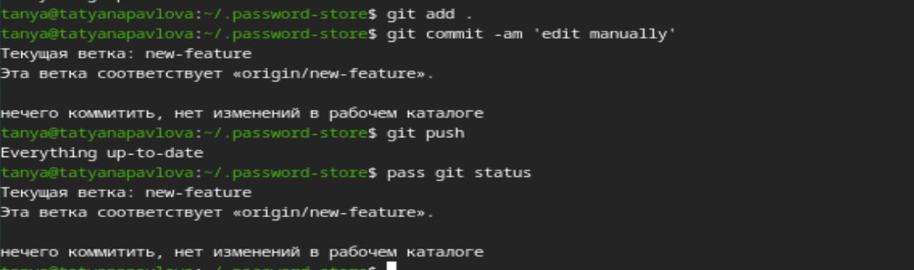{#fig:006 width=70%}

## Настройка интерфейса с броузером.

Для взаимодействия с броузером буду использовать интерфейс native messaging. Кроме плагина к броузеру мне нужно установить программу, обеспечивающую интерфейс native messaging (рис. [-@fig:007]).

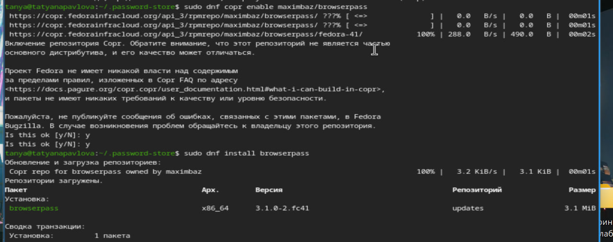{#fig:007 width=70%}

## Сохранение пароля.

Добавляю новый пароль, отображу пароль для указанного имени файла и заменю существующий пароль (рис. [-@fig:008]).

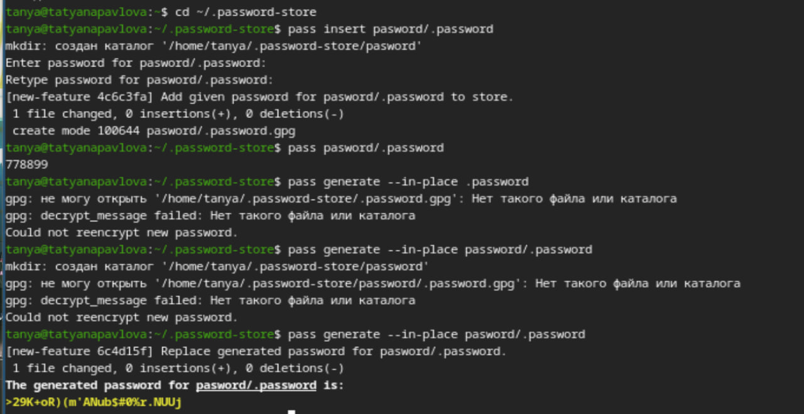{#fig:008 width=70%}

## Управление файлами конфигурации. Установка. Использование chezmoi.

Устанавливаю дополнительное ПО и шрифты (рис. 9), (рис. 10), (рис. 11).

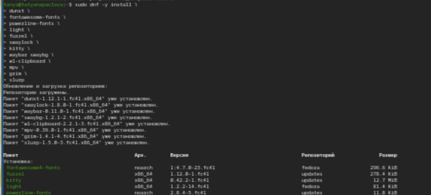{#fig:009 width=70%}

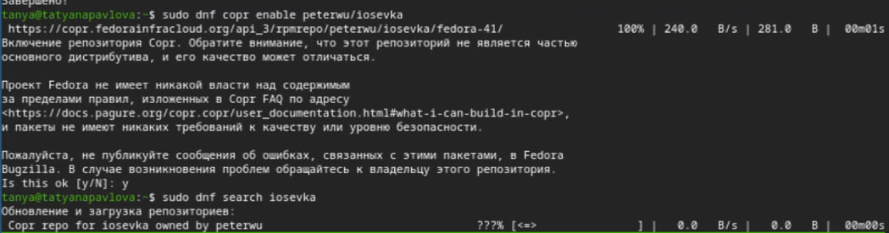{#fig:010 width=70%}

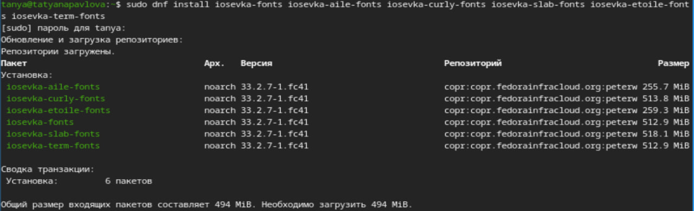{#fig:011 width=70%}

Устанавливаю бинарный файл, создаю собственный репозиторий с помощью утилит и создаю свой репозиторий для конфигурационных файлов на основе шаблона. Инициализирую chezmoi с репозиторием dotgiles, проверяю, какие изменения внесет chezmoi в домашний каталог и запущу chezmoi apply -v 12 (рис. [-@fig:012]).

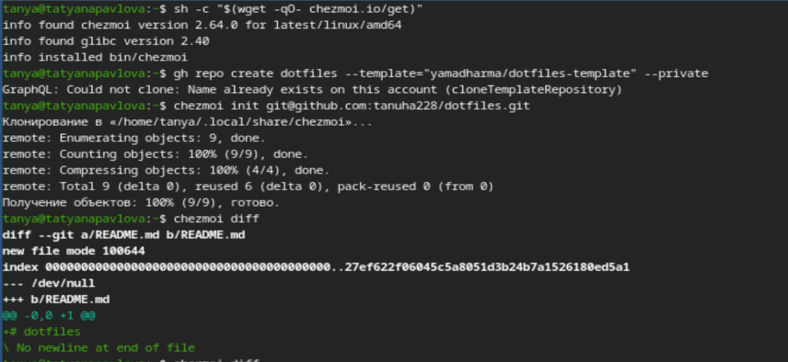{#fig:012 width=70%}

На второй машине инициализирую chezmoi с репозиторием dotfiles, проверяю, какие изменения внесет chezmoi в домашний каталог (я настроила репозиторий заранее, поэтому изменений нет).  (рис. [-@fig:013]).

{#fig:013 width=70%}

# Выводы

При выполнении данной лабораторной работы, я познакомилась с pass, gopass, native messaging и cgezmoi, а также научилась пользоваться этими утилитами, синхронизировала их с git. 
