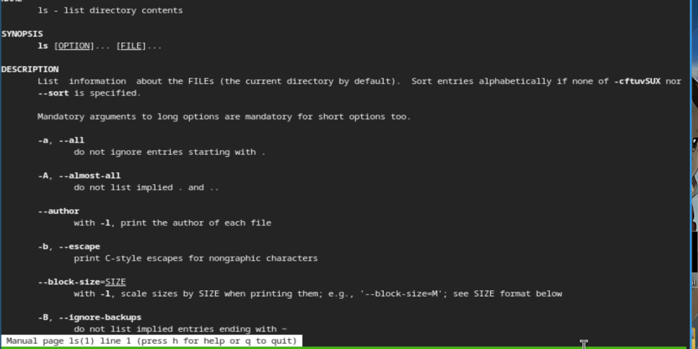

---
## Front matter
lang: ru-RU
title: Лабораторная работы №6
subtitle: Операционные системы
author:
  - Павлова Т. Ю.
institute:
  - Российский университет дружбы народов, Москва, Россия

## i18n babel
babel-lang: russian
babel-otherlangs: english

## Formatting pdf
toc: false
toc-title: Содержание
slide_level: 2
aspectratio: 169
section-titles: true
theme: metropolis
header-includes:
 - \metroset{progressbar=frametitle,sectionpage=progressbar,numbering=fraction}
---

# Цель работы

Целью данной работы является приобретение практических навыков взаимодействия пользователя с системой посредством командной строки.

# Задание

1. Определить полное имя домашнего каталога
2. Выполнить требуемые действия для выполнения лабораторной работы
3. Использовать команду man
4. Использовать команду history

# Выполнение лабораторной работы

Определю полное имя домашнего каталога. Перехожу в каталог /tmp. Вывожу на экран содержимое этого каталога. Далее использую команду ls с разными опциями (чтобы отразить имена скрытых файлов - ls с опцией a, чтобы вывести на экран под# Цель работы

Целью данной работы является приобретение практических навыков взаимодействия пользователя с системой посредством командной строки.

# Задание

1. Определить полное имя домашнего каталога
2. Выполнить требуемые действия для выполнения лабораторной работы
3. Использовать команду man
4. Использовать команду history

# Выполнение лабораторной работы

# Работа с домашним каталогом

Определю полное имя домашнего каталога. Перехожу в каталог /tmp. Вывожу на экран содержимое этого каталога (рис. 1).

{#fig:001 width=70%}

# Работа с домашним каталогом

Далее использую команду ls с разными опциями (чтобы отразить имена скрытых файлов - ls с опцией a) (рис. 2).

{#fig:002 width=70%}

# Работа с домашним каталогом

Далее использую команду ls с разными опциями (чтобы вывести на экран подробную информацию о файлах и каталогах - ls с опцией l) (рис. 3).

{#fig:003 width=70%}

# Работа с каталогом /var/spool

Определяю есть ли в каталоге /var/spool подкаталог с именем cron. У меня он есть (рис. 4).

{#fig:004 width=70%}

# Работа с домашним каталогом

Перехожу в свой домашний каталог и вывожу на экран его содержимое. Владелец файлов - я (рис. 5).

{#fig:005 width=70%}

# Создание каталогов

В домашнем каталоге создаю новый каталог с именем newdir. В каталоге ~/newdir создаю новый каталог с именем morefun (рис. 6).

{#fig:006 width=70%}

# Создание каталогов

В новом каталоге создаю одной командой три новых каталога с именами letters, memos, misk. Затем удаляю эти каталоги (рис. 7).

{#fig:007 width=70%}

# Удаление каталогов

Пробую удалить ранее созданный каталог ~/newdir командой rm. Проверяю, был ли каталог удален. Удаляю каталог ~/newdir/morefun из домашнего каталога (рис. 8).

{#fig:008 width=70%}

# Команда man

С помощью команды man определяю, какую опцию команды ls нужно использовать для просмотра содержимого не только указанного каталога, но и подкаталогов, входящих в него. С помощью команды man определяю набор опций ls, позволяющий отсортировать по времени последнего изменения выводимый список содержимого каталога с развернутым описанием файлов (рис. 9), (рис. 10).

# Команда man (ls -R)

{#fig:009 width=70%}

# Команда man (ls -time-style)

{#fig:010 width=70%}

# Команда man

Использую команду man для просмотра описания следующих команд: cd, pwd, mkdir, rmdir, rm (рис. 11), (рис. 12), (рис. 13), (рис. 14), (рис. 15).

# Команда man (cd)

{#fig:011 width=70%}

# Команда man (pwd)

{#fig:012 width=70%}

# Команда man (mkdir)

{#fig:013 width=70%}

# Команда man (rmdir)

{#fig:014 width=70%}

# Команда man (rm)

{#fig:015 width=70%}

# Команда history

Используя информацию, полученную при помощи команды history (рис. 16).

{#fig:016 width=70%}

# Выполнение модификаций и команд

Выполняю модификацию и исполнение нескольких команд из буфера команд (рис. 17)

{#fig:017 width=70%}

# Выводы

При выполнении данной лабораторной работы, я приобрела практические навыки взаимодействия пользователя с системой посредством командной строки.
