---
## Front matter
title: "Лабораторная работа №6"
subtitle: "Операционные системы"
author: "Павлова Татьяна Юрьевна"

## Generic otions
lang: ru-RU
toc-title: "Содержание"

## Bibliography
bibliography: bib/cite.bib
csl: pandoc/csl/gost-r-7-0-5-2008-numeric.csl

## Pdf output format
toc: true # Table of contents
toc-depth: 2
lof: true # List of figures
lot: true # List of tables
fontsize: 12pt
linestretch: 1.5
papersize: a4
documentclass: scrreprt
## I18n polyglossia
polyglossia-lang:
  name: russian
  options:
	- spelling=modern
	- babelshorthands=true
polyglossia-otherlangs:
  name: english
## I18n babel
babel-lang: russian
babel-otherlangs: english
## Fonts
mainfont: IBM Plex Serif
romanfont: IBM Plex Serif
sansfont: IBM Plex Sans
monofont: IBM Plex Mono
mathfont: STIX Two Math
mainfontoptions: Ligatures=Common,Ligatures=TeX,Scale=0.94
romanfontoptions: Ligatures=Common,Ligatures=TeX,Scale=0.94
sansfontoptions: Ligatures=Common,Ligatures=TeX,Scale=MatchLowercase,Scale=0.94
monofontoptions: Scale=MatchLowercase,Scale=0.94,FakeStretch=0.9
mathfontoptions:
## Biblatex
biblatex: true
biblio-style: "gost-numeric"
biblatexoptions:
  - parentracker=true
  - backend=biber
  - hyperref=auto
  - language=auto
  - autolang=other*
  - citestyle=gost-numeric
## Pandoc-crossref LaTeX customization
figureTitle: "Рис."
tableTitle: "Таблица"
listingTitle: "Листинг"
lofTitle: "Список иллюстраций"
lotTitle: "Список таблиц"
lolTitle: "Листинги"
## Misc options
indent: true
header-includes:
  - \usepackage{indentfirst}
  - \usepackage{float} # keep figures where there are in the text
  - \floatplacement{figure}{H} # keep figures where there are in the text
---

# Цель работы

Целью данной работы является приобретение практических навыков взаимодействия пользователя с системой посредством командной строки.

# Задание

1. Определить полное имя домашнего каталога
2. Выполнить требуемые действия для выполнения лабораторной работы
3. Использовать команду man
4. Использовать команду history

# Выполнение лабораторной работы

Определю полное имя домашнего каталога. Перехожу в каталог /tmp. Вывожу на экран содержимое этого каталога. Далее использую команду ls с разными опциями (чтобы отразить имена скрытых файлов - ls с опцией a, чтобы вывести на экран подробную информацию о файлах и каталогах - ls с опцией l) (рис. 1), (рис. 2), (рис. 3).

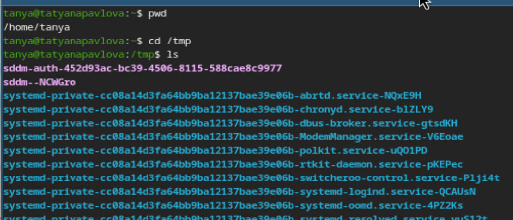{#fig:001 width=70%}

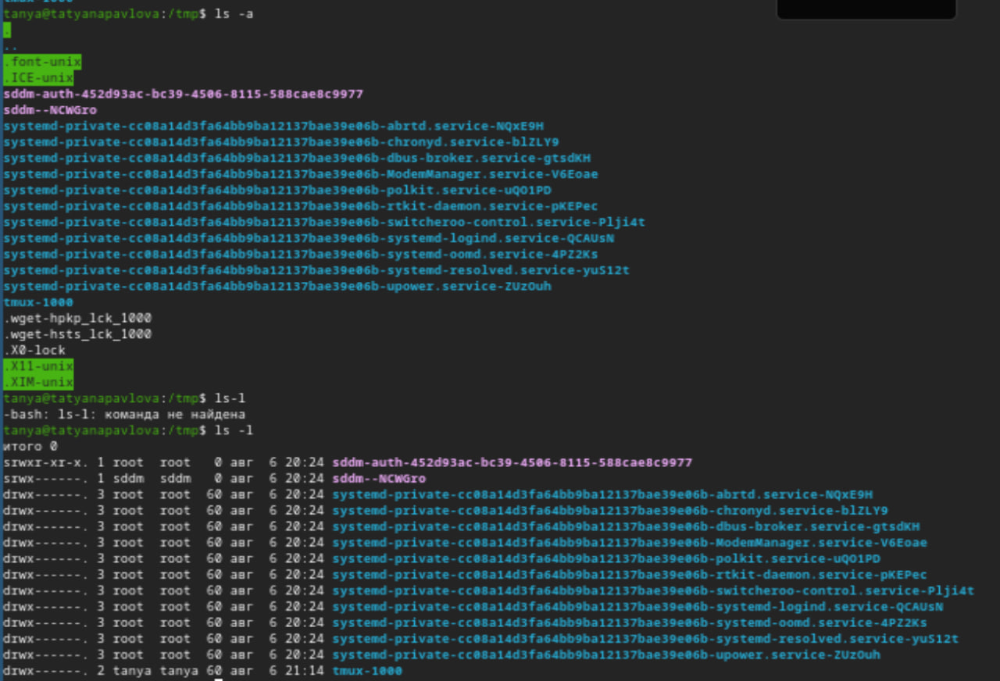{#fig:002 width=70%}

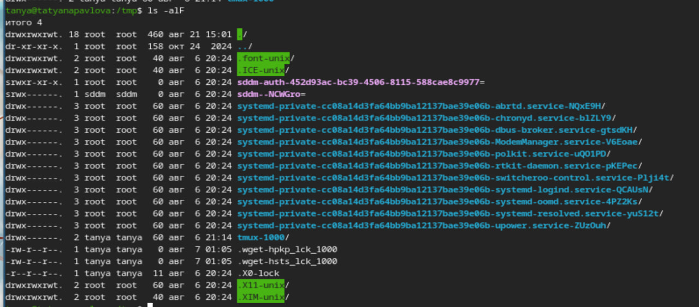{#fig:003 width=70%}

Определяю есть ли в каталоге /var/spool подкаталог с именем cron. У меня он есть (рис. 4).

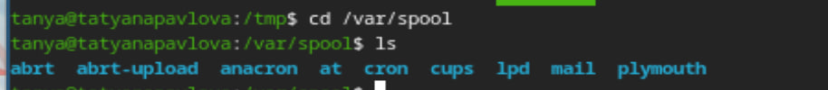{#fig:004 width=70%}

Перехожу в свой домашний каталог и вывожу на экран его содержимое. Владелец файлов - я (рис. 5).

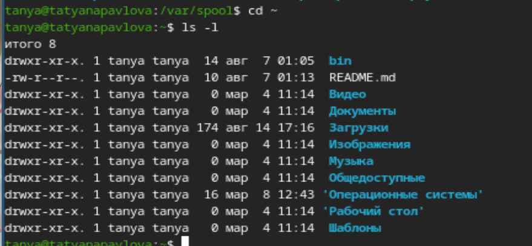{#fig:005 width=70%}

В домашнем каталоге создаю новый каталог с именем newdir. В каталоге ~/newdir создаю новый каталог с именем morefun (рис. 6).

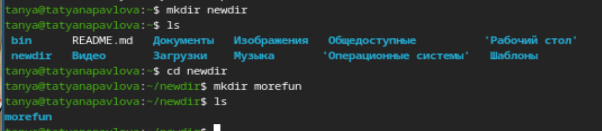{#fig:006 width=70%}

В новом каталоге создаю одной командой три новых каталога с именами letters, memos, misk. Затем удаляю эти каталоги (рис. 7).

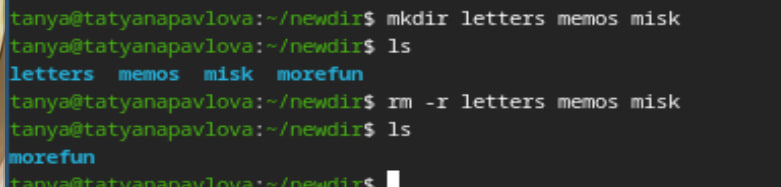{#fig:007 width=70%}

Пробую удалить ранее созданный каталог ~/newdir командой rm. Проверяю, был ли каталог удален. Удаляю каталог ~/newdir/morefun из домашнего каталога (рис. 8).

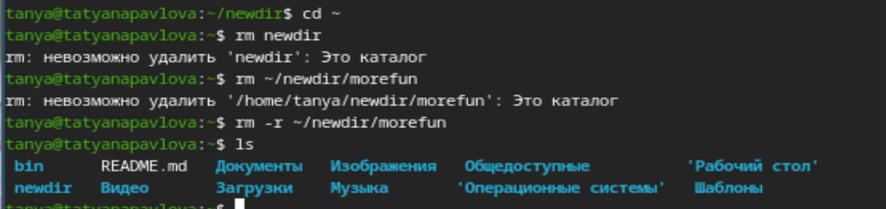{#fig:008 width=70%}

С помощью команды man определяю, какую опцию команды ls нужно использовать для просмотра содержимого не только указанного каталога, но и подкаталогов, входящих в него. С помощью команды man определяю набор опций ls, позволяющий отсортировать по времени последнего изменения выводимый список содержимого каталога с развернутым описанием файлов (рис. 9), (рис. 10).

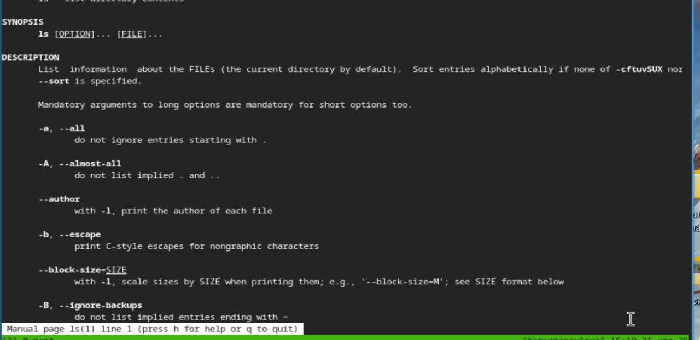{#fig:009 width=70%}

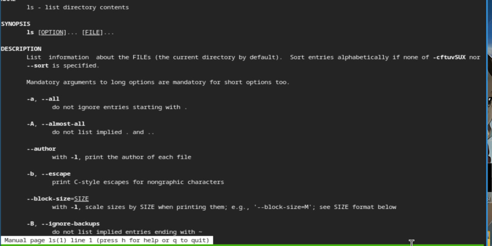{#fig:010 width=70%}

Использую команду man для просмотра описания следующих команд: cd, pwd, mkdir, rmdir, rm (рис. 11), (рис. 12), (рис. 13), (рис. 14), (рис. 15).

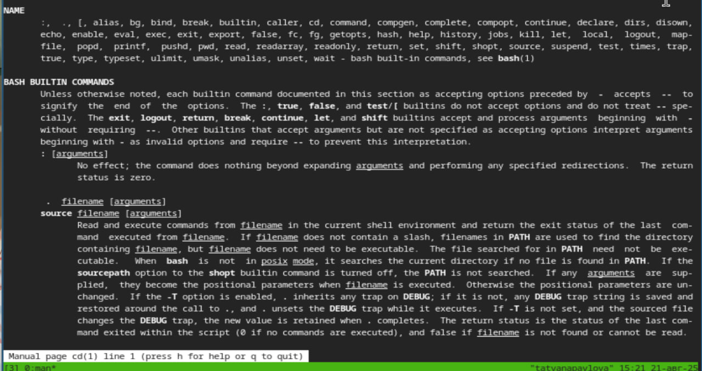{#fig:011 width=70%}

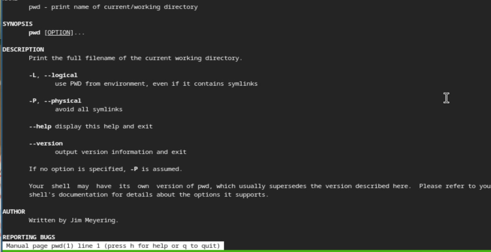{#fig:012 width=70%}

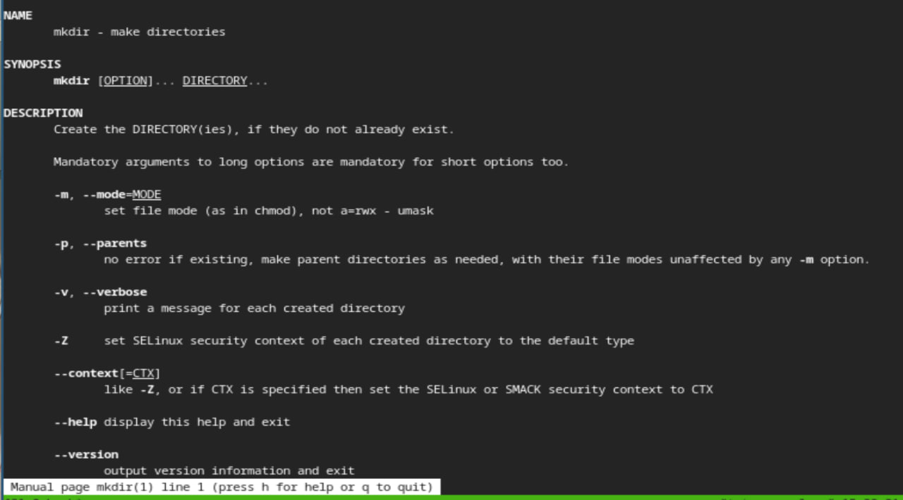{#fig:013 width=70%}

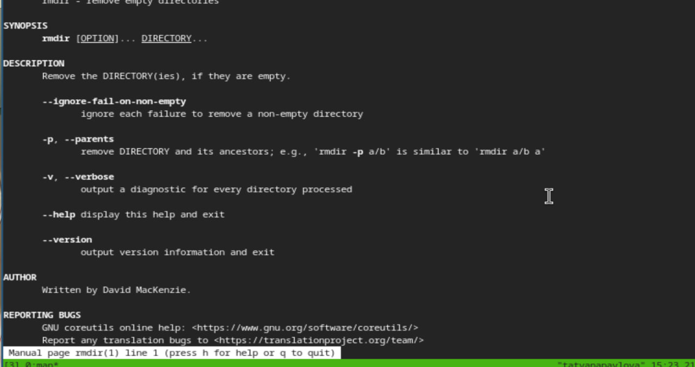{#fig:014 width=70%}

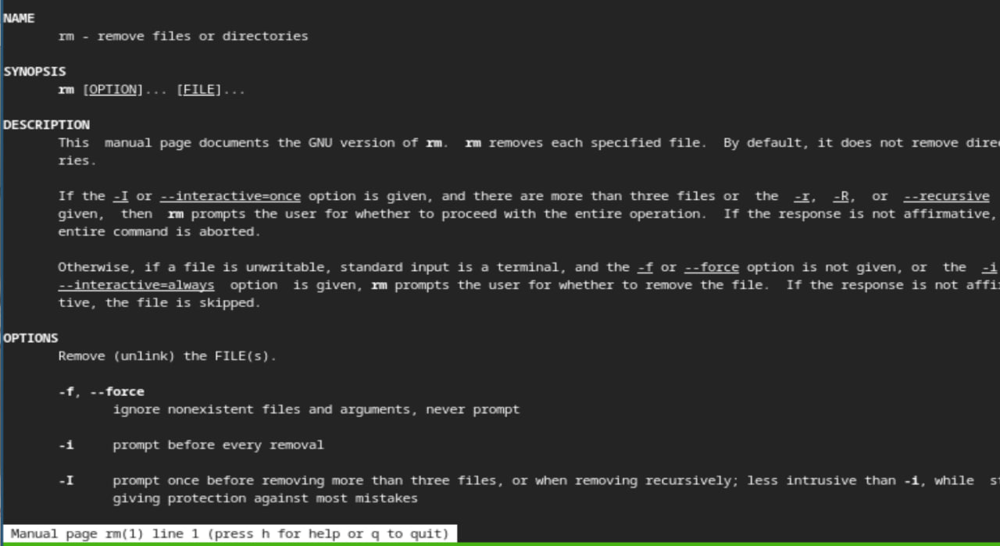{#fig:015 width=70%}

Используя информацию, полученную при помощи команды history, выполняю модификацию и исполнение нескольких команд из буфера команд (рис. 16), (рис. 17).

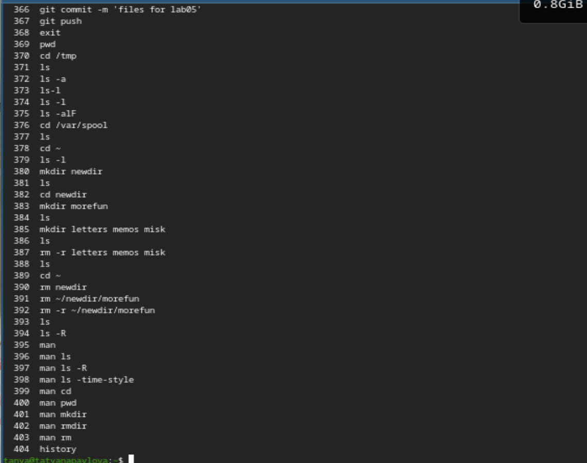{#fig:016 width=70%}

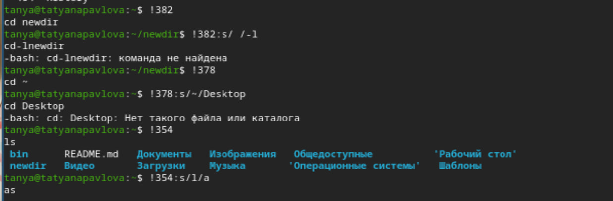{#fig:017 width=70%}

# Выводы

При выполнении данной лабораторной работы, я приобрела практические навыки взаимодействия пользователя с системой посредством командной строки.
