---
## Front matter
lang: ru-RU
title: Лабораторная работа №7
subtitle: Операционные системы
author:
  - Павлова Т. Ю.
institute:
  - Российский университет дружбы народов, Москва, Россия

## i18n babel
babel-lang: russian
babel-otherlangs: english

## Formatting pdf
toc: false
toc-title: Содержание
slide_level: 2
aspectratio: 169
section-titles: true
theme: metropolis
header-includes:
 - \metroset{progressbar=frametitle,sectionpage=progressbar,numbering=fraction}
---

# Цель работы

Целью данной работы является ознакомление с файловой системой Linux, ее структурой, именами и содержанием каталогов, а также приобретение практических навыков по применению команд для работы с файлами и каталогами, по управлению процессами(и работами), по проверке использования диска и обслуживанию файловой системы.

# Задание

1. Выполнить все примеры, приведенные в первой части описание лабораторной работы.
2. Выполнить все следующие требуемые действия и зафиксировать их в отчете.
3. Определить опции команды chmod
4. Проделать требуемые в лабораторной раюоте упражнения
5. Прочитать man по командам: mount, fsck, mkfs, kill.

# Выполнение лабораторной работы

# Выполнение всех примеров 

Выполняю все примеры, приведенные в первой части описания лабораторной работы (рис. 1), (рис. 2), (рис. 3), (рис. 4).

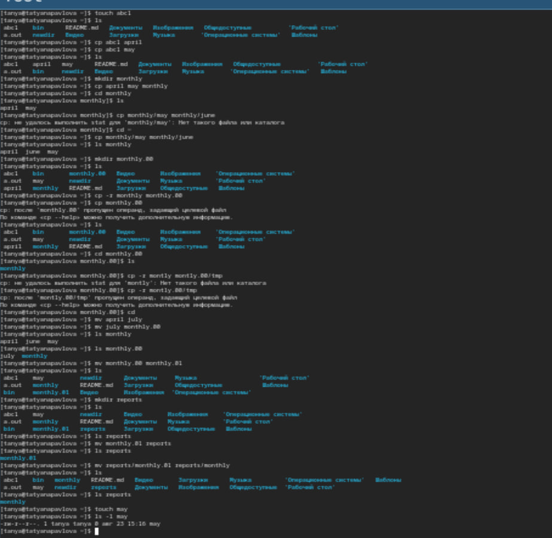{#fig:001 width=70%}

# Выполнение всех примеров (ч. 2)

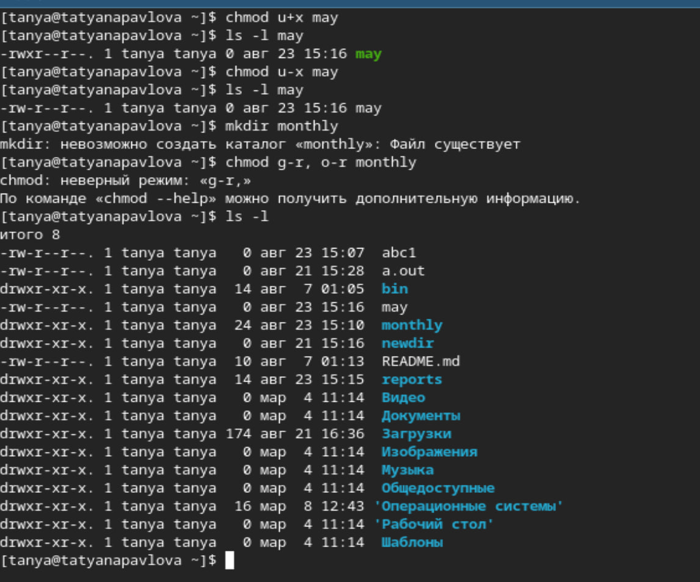{#fig:002 width=70%}

# Выполнение всех примеров (ч. 3)

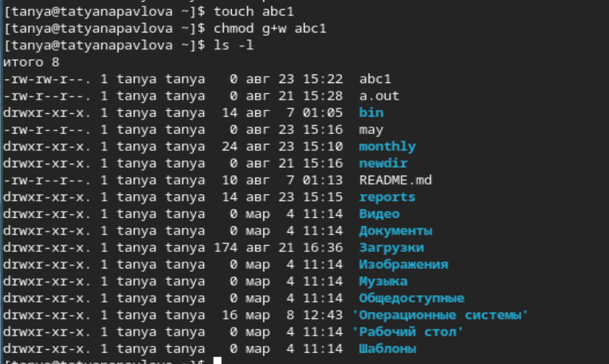{#fig:003 width=70%}

# Выполнение всех примеров (ч. 4)

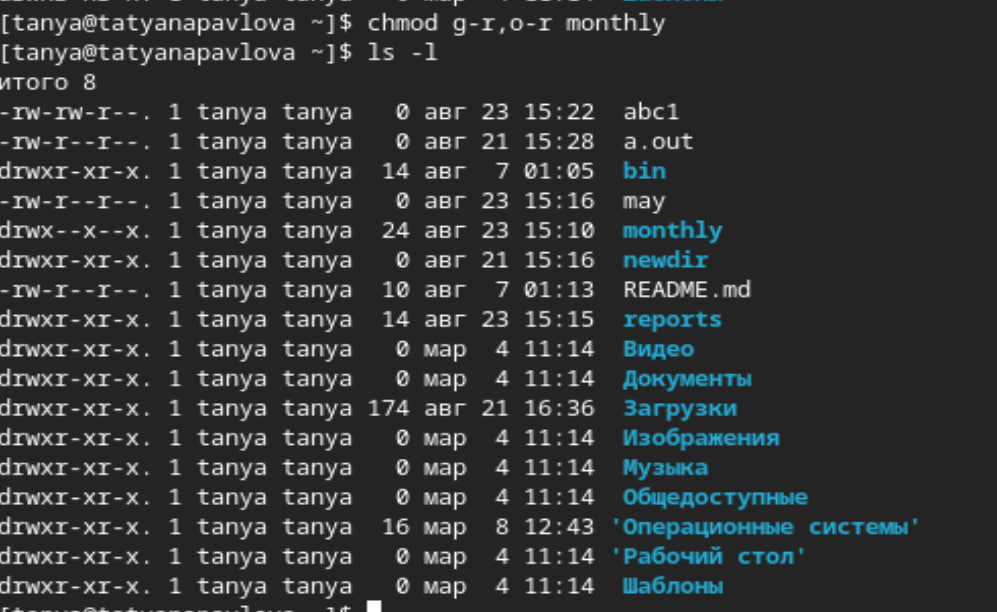{#fig:004 width=70%}

# Выполнение операций с файлами

1. Копирую файл /usr/include/sys/io.h в домашний каталог и называю его equipment. 
2. В домашнем каталоге создаю директорию ~/ski.plases, перемещаю файл ~/ski.plases/equipment в ~/ski.plases/equiplist. 
3. Создаю в домашнем каталоге файл abc1 и копирую его в каталог ~/ski.plases, называю его equiplist2. 
4. Создаю каталог с именем equipment в каталоге ~/ski.plases, перемещаю файлы ~/ski.plases/equiplist и equiplist2 в каталог ~/ski.plases/equipment. 
5. Создаю и перемещаю каталог ~/newdir в каталог ~/ski.plases и называю его plans 

# Изменение прав доступа

Изменяю права доступа ряду файлов (рис. 5), (рис. 6).

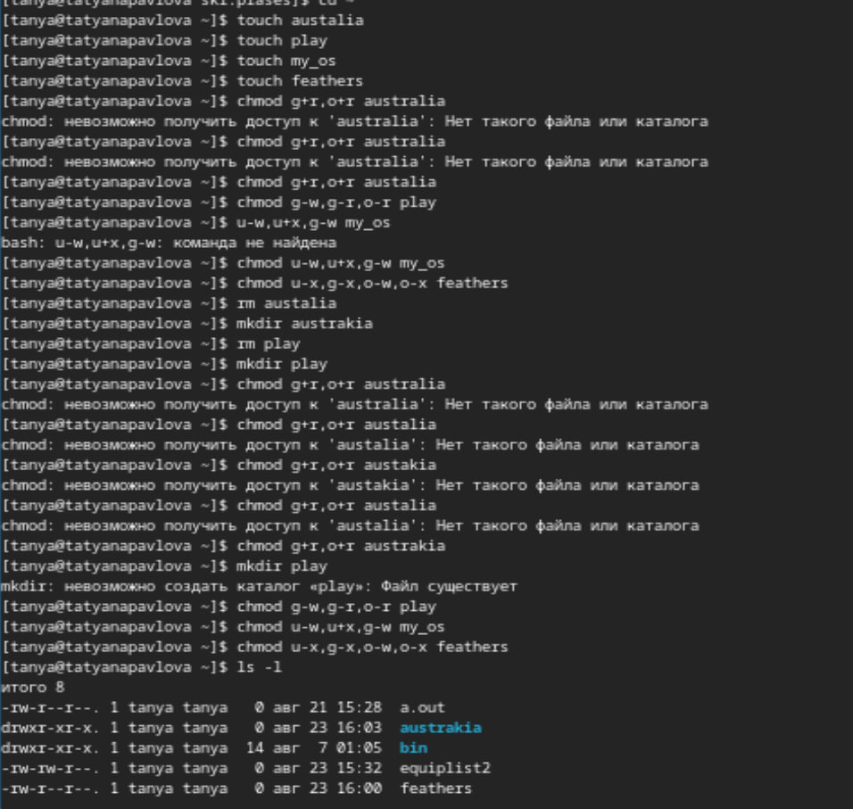{#fig:009 width=70%}

# Изменение прав доступа (ч. 2)

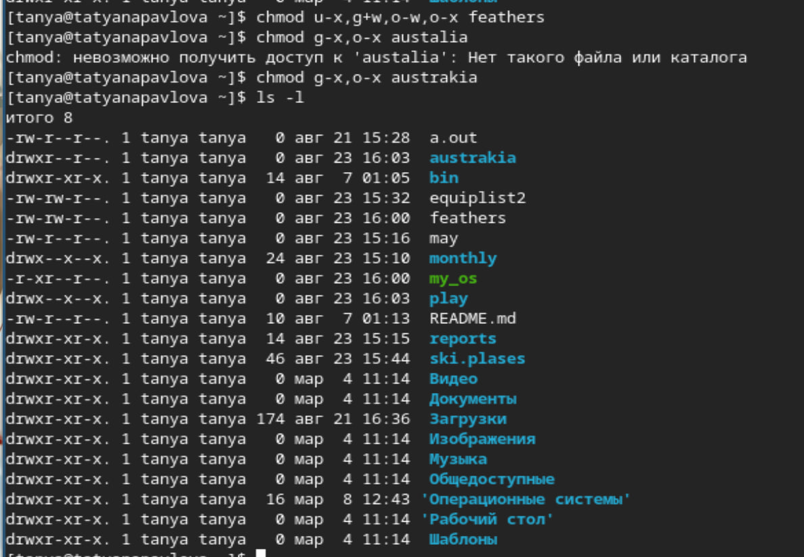{#fig:010 width=70%}

# Файл /etc/password

Просматриваю содержимое файла /etc/password (рис. 11).

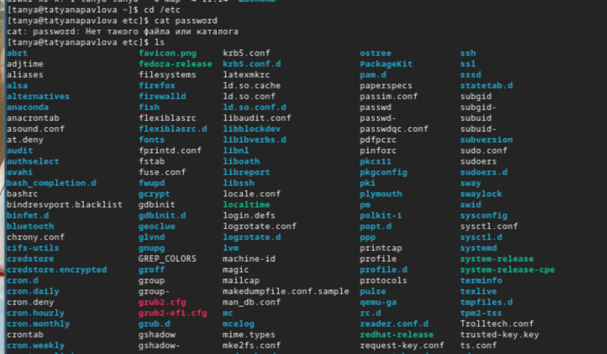{#fig:011 width=70%}

# Требуемые операции с файлами

1. Копирую файл ~/feathers  в файл ~/file.old. 
2. Перемещаю файл ~/file.old в каталог ~/play. 
3. Копирую этот каталог в кататлог ~/fun. 
4. Перемещаю каталог ~/fun в каталог ~/play и называю его games. 
5. Лишаю владельца файла feathers права на чтение. 
6. Даю владельцу файла ~/feathers право на чтение. 
7. Лишаю владельца каталога ~/play права на выполнение. 
8. Перехожу в каталог ~/play, даю владельцу каталога ~/play право на выполнение (рис. 12).

# Требуемые операции с файлами

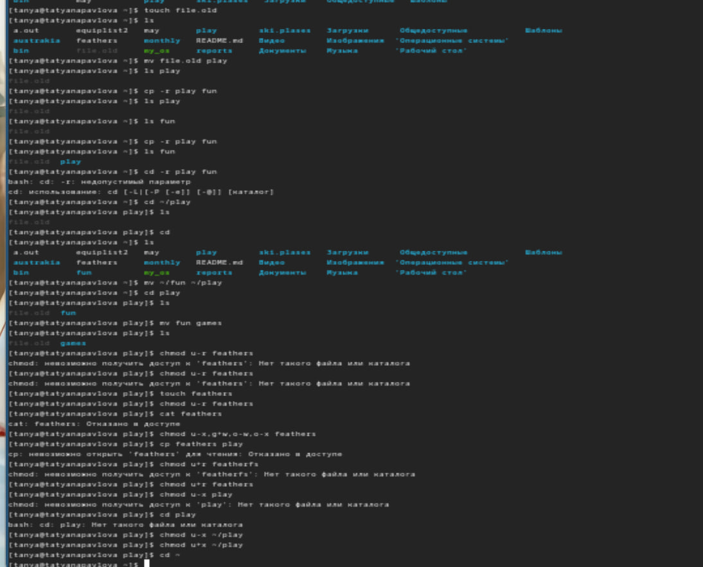{#fig:012 width=70%}

# Команда man

Вывожу и читаю man по командам mount, fsck, mkfs и kill (рис. 13), (рис. 14), (рис. 15), (рис. 16).

# Команда man (mount)

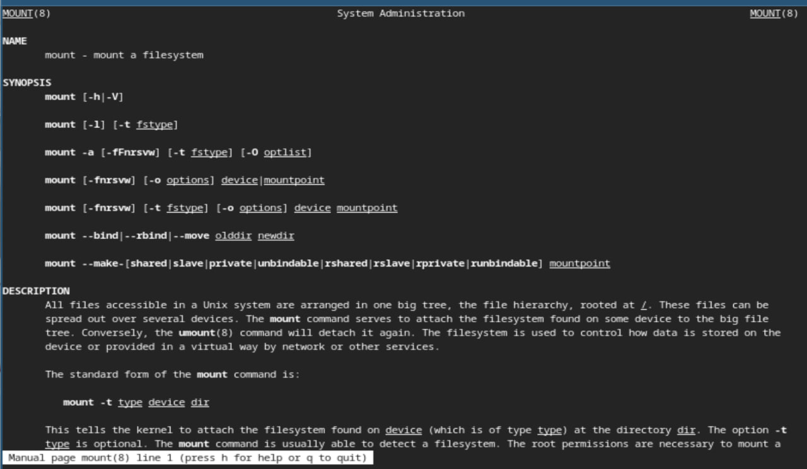{#fig:013 width=70%}

# Команда man (fsck)

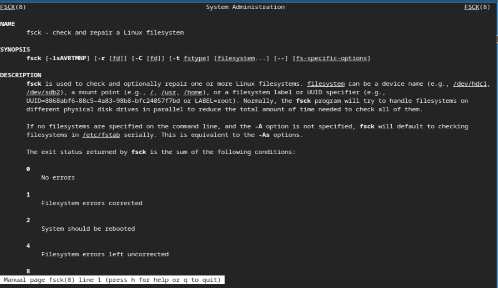{#fig:014 width=70%}

# Команда man (mkfs)

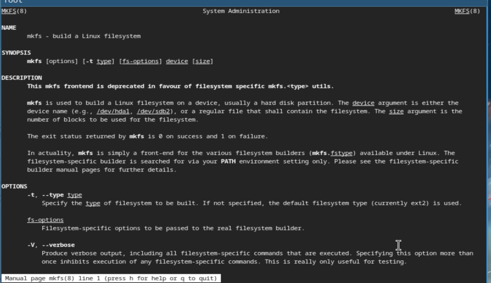{#fig:015 width=70%}

# Команда man (kill)

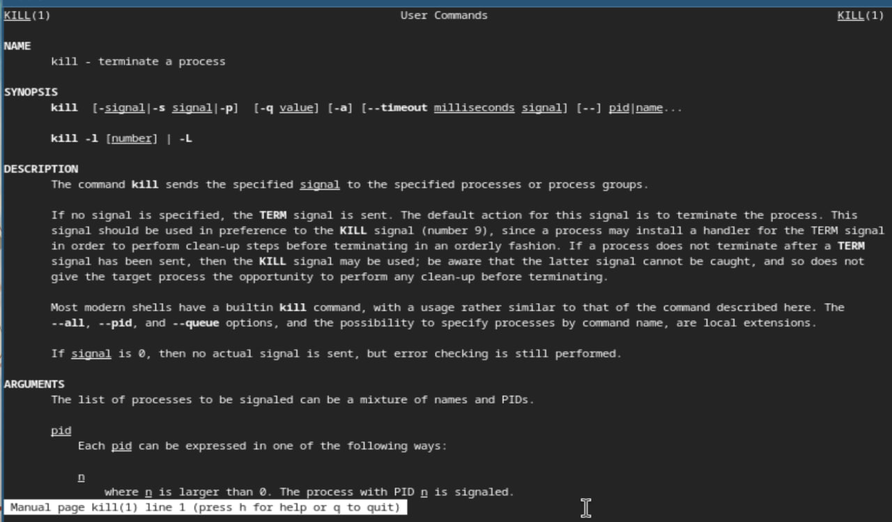{#fig:016 width=70%}

# Выводы

При выполнении данной лабораторной работы я ознакомилась с файловой системой Linux, ее структурой, именами и содержанием каталогов, а также приобрела практические навыки по применению команд для работы с файлами и каталогами, по управлению процессами(и работами), по проверке использования диска и обслуживанию файловой системы.

