---
## Front matter
title: "Лабораторная работа №7"
subtitle: "Операционные системы"
author: "Павлова Татьяна Юрьевна"

## Generic otions
lang: ru-RU
toc-title: "Содержание"

## Bibliography
bibliography: bib/cite.bib
csl: pandoc/csl/gost-r-7-0-5-2008-numeric.csl

## Pdf output format
toc: true # Table of contents
toc-depth: 2
lof: true # List of figures
lot: true # List of tables
fontsize: 12pt
linestretch: 1.5
papersize: a4
documentclass: scrreprt
## I18n polyglossia
polyglossia-lang:
  name: russian
  options:
	- spelling=modern
	- babelshorthands=true
polyglossia-otherlangs:
  name: english
## I18n babel
babel-lang: russian
babel-otherlangs: english
## Fonts
mainfont: IBM Plex Serif
romanfont: IBM Plex Serif
sansfont: IBM Plex Sans
monofont: IBM Plex Mono
mathfont: STIX Two Math
mainfontoptions: Ligatures=Common,Ligatures=TeX,Scale=0.94
romanfontoptions: Ligatures=Common,Ligatures=TeX,Scale=0.94
sansfontoptions: Ligatures=Common,Ligatures=TeX,Scale=MatchLowercase,Scale=0.94
monofontoptions: Scale=MatchLowercase,Scale=0.94,FakeStretch=0.9
mathfontoptions:
## Biblatex
biblatex: true
biblio-style: "gost-numeric"
biblatexoptions:
  - parentracker=true
  - backend=biber
  - hyperref=auto
  - language=auto
  - autolang=other*
  - citestyle=gost-numeric
## Pandoc-crossref LaTeX customization
figureTitle: "Рис."
tableTitle: "Таблица"
listingTitle: "Листинг"
lofTitle: "Список иллюстраций"
lotTitle: "Список таблиц"
lolTitle: "Листинги"
## Misc options
indent: true
header-includes:
  - \usepackage{indentfirst}
  - \usepackage{float} # keep figures where there are in the text
  - \floatplacement{figure}{H} # keep figures where there are in the text
---

# Цель работы

Целью данной работы является ознакомление с файловой системой Linux, ее структурой, именами и содержанием каталогов, а также приобретение практических навыков по применению команд для работы с файлами и каталогами, по управлению процессами(и работами), по проверке использования диска и обслуживанию файловой системы.

# Задание

1. Выполнить все примеры, приведенные в первой части описание лабораторной работы.
2. Выполнить все следующие требуемые действия и зафиксировать их в отчете.
3. Определить опции команды chmod
4. Проделать требуемые в лабораторной раюоте упражнения
5. Прочитать man по командам: mount, fsck, mkfs, kill.

# Выполнение лабораторной работы

Выполняю все примеры, приведенные в первой части описания лабораторной работы (рис. 1), (рис. 2), (рис. 3), (рис. 4).

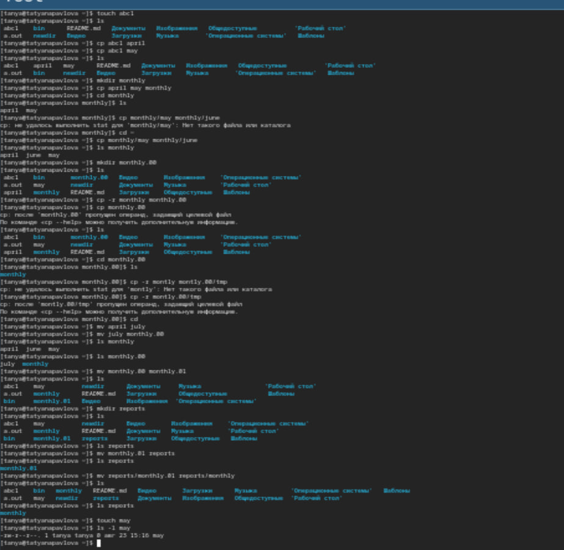{#fig:001 width=70%}

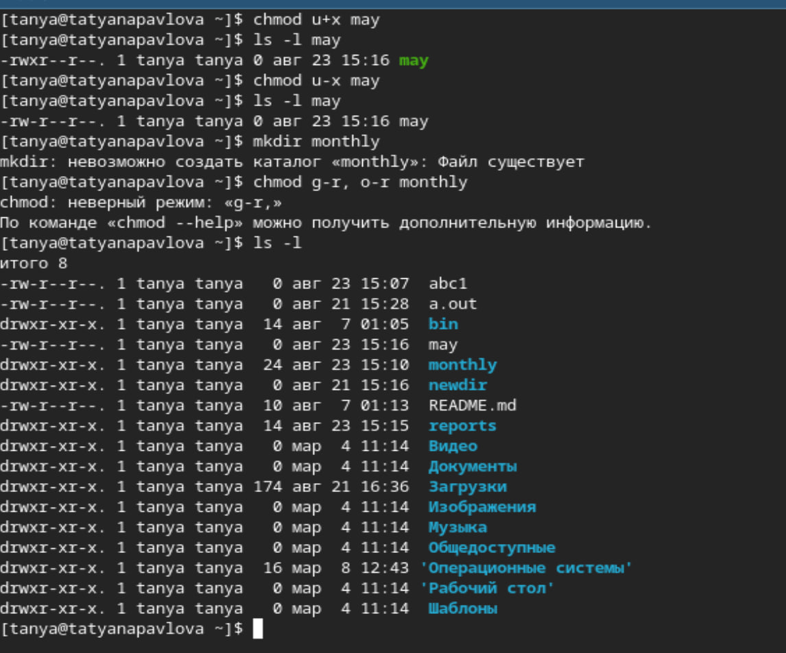{#fig:002 width=70%}

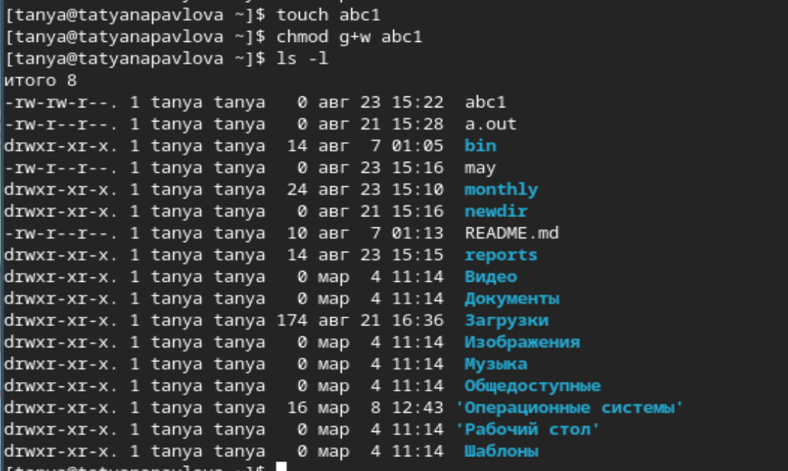{#fig:003 width=70%}

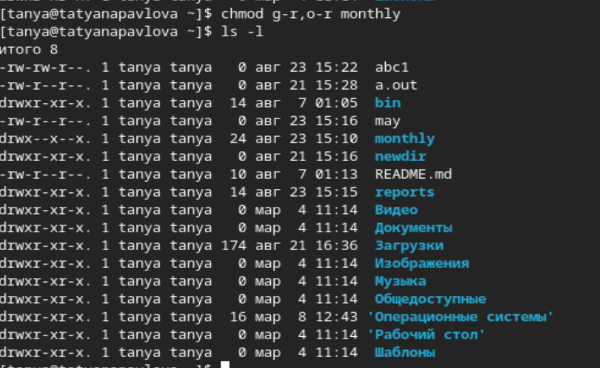{#fig:004 width=70%}

Копирую файл /usr/include/sys/io.h в домашний каталог и называю его equipment. В домашнем каталоге создаю директорию ~/ski.plases, перемещаю файл ~/ski.plases/equipment в ~/ski.plases/equiplist. Создаю в домашнем каталоге файл abc1 и копирую его в каталог ~/ski.plases, называю его equiplist2. Создаю каталог с именем equipment в каталоге ~/ski.plases, перемещаю файлы ~/ski.plases/equiplist и equiplist2 в каталог ~/ski.plases/equipment. Создаю и перемещаю каталог ~/newdir в каталог ~/ski.plases и называю его plans (рис. 5), (рис. 6), (рис. 7), (рис. 8).

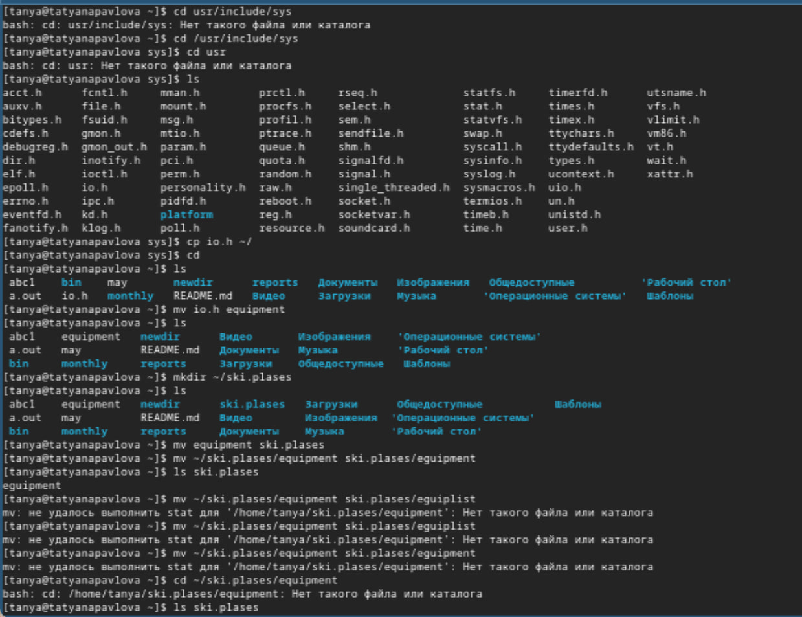{#fig:005 width=70%}

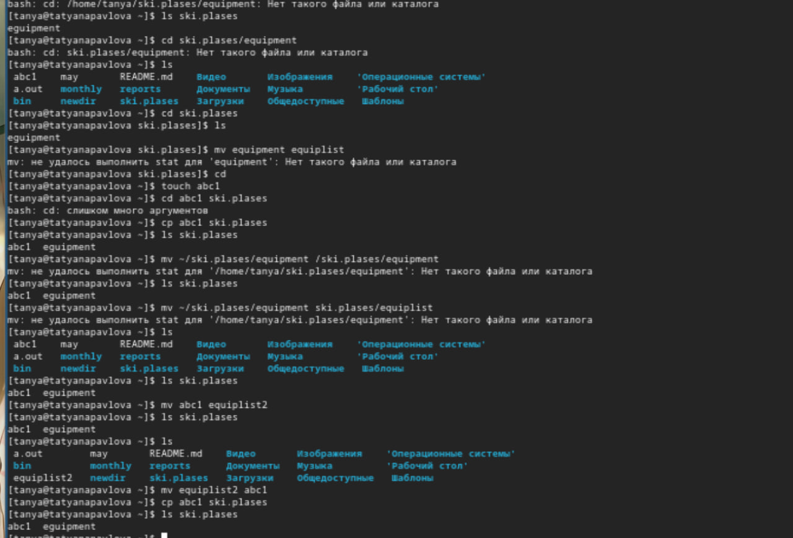{#fig:006 width=70%}

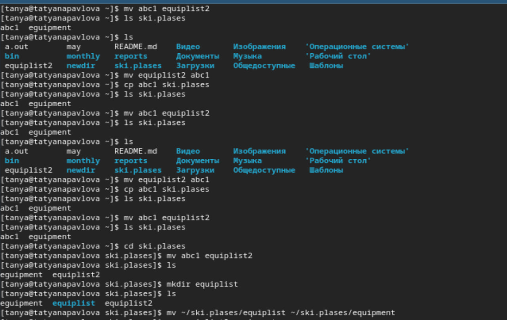{#fig:007 width=70%}

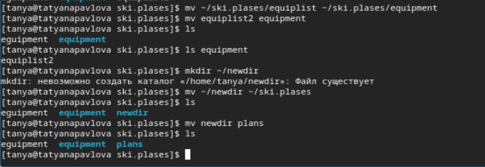{#fig:008 width=70%}

Изменяю права доступа ряду файлов (рис. 9), (рис. 10).

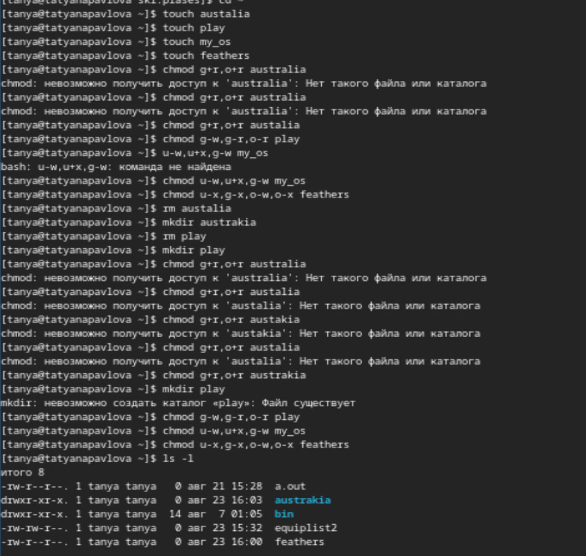{#fig:009 width=70%}

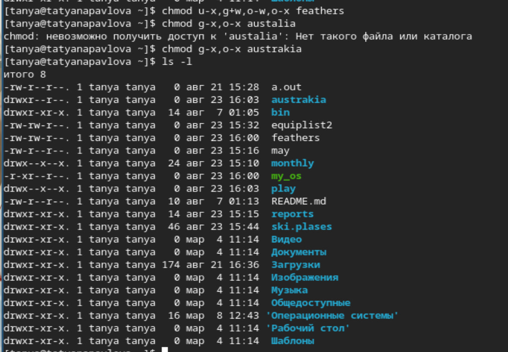{#fig:010 width=70%}

Просматриваю содержимое файла /etc/password (рис. 11).

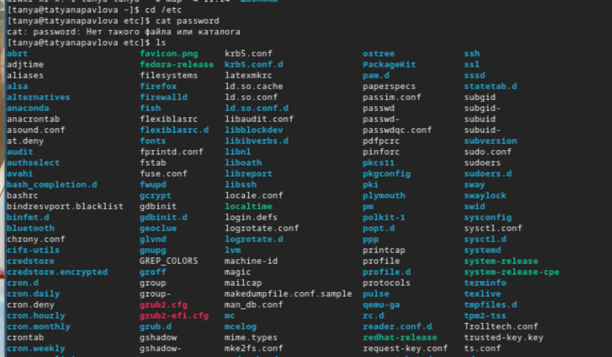{#fig:011 width=70%}

Копирую файл ~/feathers  в файл ~/file.old. Перемещаю файл ~/file.old в каталог ~/play. Копирую этот каталог в кататлог ~/fun. Перемещаю катало# Список литературы{.unnumbered}

::: {#refs}
:::
г ~/fun в каталог ~/play и называю его games. Лишаю владельца файла feathers права на чтение. Даю владельцу файла ~/feathers право на чтение. Лишаю владельца каталога ~/play права на выполнение. Перехожу в каталог ~/play, даю владельцу каталога ~/play право на выполнение (рис. 12).

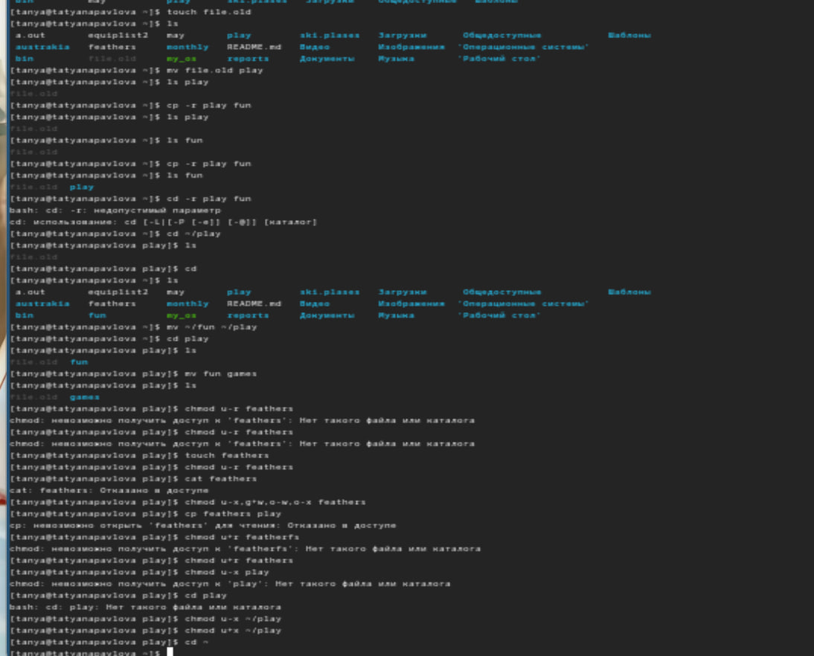{#fig:012 width=70%}

Вывожу и читаю man по командам mount, fsck, mkfs и kill (рис. 13), (рис. 14), (рис. 15), (рис. 16).

{#fig:013 width=70%}

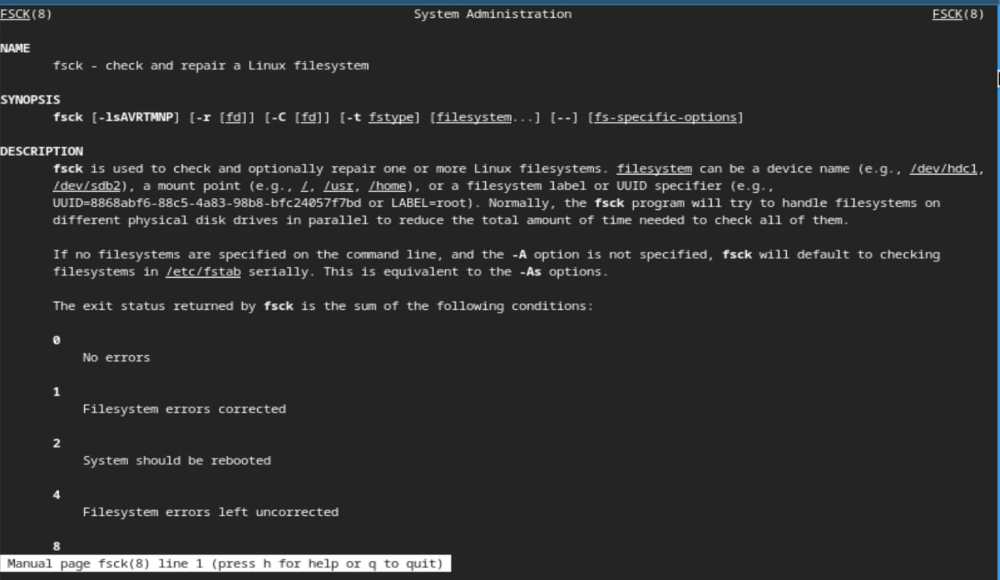{#fig:014 width=70%}

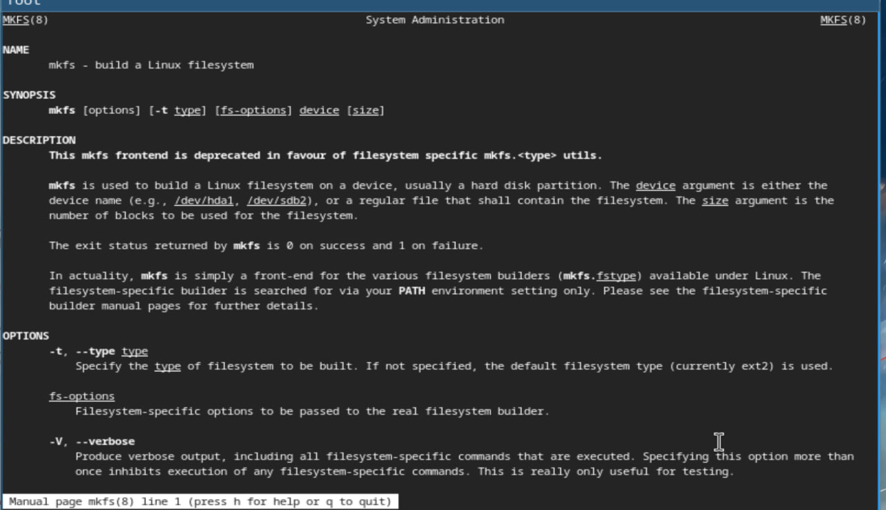{#fig:015 width=70%}

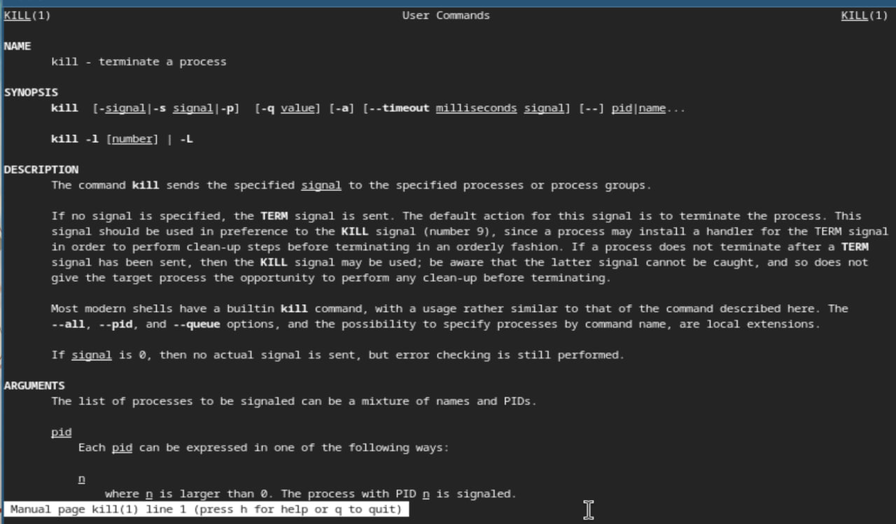{#fig:016 width=70%}

# Выводы

При выполнении данной лабораторной работы я ознакомилась с файловой системой Linux, ее структурой, именами и содержанием каталогов, а также приобрела практические навыки по применению команд для работы с файлами и каталогами, по управлению процессами(и работами), по проверке использования диска и обслуживанию файловой системы.
