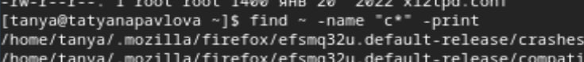

---
## Front matter
lang: ru-RU
title: Лабораторная работа №8
subtitle: Операционные системы
author:
  - Павлова Т. Ю.
institute:
  - Российский университет дружбы народов, Москва, Россия

## i18n babel
babel-lang: russian
babel-otherlangs: english

## Formatting pdf
toc: false
toc-title: Содержание
slide_level: 2
aspectratio: 169
section-titles: true
theme: metropolis
header-includes:
 - \metroset{progressbar=frametitle,sectionpage=progressbar,numbering=fraction}
---

# Цель работы

Целью данной работы является ознакомление с инструментами поиска файлов и фильтрации текстовых данных, а также приобретение практических навыков по управлению процессами (и заданиями), по проверке использования диска и обслуживанию файловых систем. 

# Задание

1. Осуществите вход в систему, используя соответствующее имя пользователя.
2. Запишите в файл file.txt названия файлов, содержащихся в каталоге /etc. Допишите в этот же файл названия файлов, содержащихся в вашем домашнем каталоге.
3. Выведите имена всех файлов из file.txt, имеющих расширение .conf, после чего запишите их в новый текстовой файл conf.txt.
4. Определите, какие файлы в вашем домашнем каталоге имеют имена, начинавшиеся с символа c? Предложите несколько вариантов, как это сделать.
5. Выведите на экран (по странично) имена файлов из каталога /etc, начинающиеся с символа h.
6. Запустите в фоновом режиме процесс, который будет записывать в файл ~/logfile файлы, имена которых начинаются с log.
7. Удалите файл ~/logfile.
8. Запустите из консоли в фоновом режиме редактор gedit.
9. Определите идентификаторпроцесса gedit, используя команду ps, конвейер и фильтр grep. Как ещё можно определить идентификатор процесса?
10. Прочтите справку (man) команды kill, после чего используйте её для завершения процесса gedit.
11. Выполните команды df и du, предварительно получив более подробную информацию об этих командах, с помощью команды man.
12. Воспользовавшись справкой команды find, выведите имена всех директорий, имеющихся в вашем домашнем каталоге.

# Теоретическое введение

В системе по умолчанию открыто три специальных потока: – stdin — стандартный поток ввода (по умолчанию: клавиатура), файловый дескриптор 0; – stdout — стандартный поток вывода (по умолчанию: консоль), файловый дескриптор 1; – stderr — стандартный поток вывод сообщений об ошибках (по умолчанию: консоль), файловый дескриптор 2 Большинство используемых в консоли команд и программ записывают результаты своей работы в стандартный поток вывода stdout. Например, команда ls выводит в стан- дартный поток вывода (консоль) список файлов в текущей директории. Потоки вывода и ввода можно перенаправлять на другие файлы или устройства. Проще всего это делается с помощью символов >, », <, «. Конвейер (pipe) служит для объединения простых команд или утилит в цепочки, в ко- торых результат работы предыдущей команды передаётся последующей. Команда find используется для поиска и отображения на экран имён файлов, соответствующих заданной строке символов.

# Выполнение лабораторной работы

# Работа с файлом file.txt

Осуществляю вход в систему, используя соответствующее имя пользователя. Записываю в файл file.txt названия файлов, содержащихся в каталоге /etc. Дописываю в этот же файл названия файлов, содержащихся в моем домашнем каталоге. (рис. 1), (рис. 2), (рис. 3).

{#fig:001 width=70%}

# Работа с файлом file.txt (рис. 2)

{#fig:002 width=70%}

# Работа с файлом file.txt (рис. 3)

{#fig:003 width=70%}

# Вывод всех файлов с расширением .conf

Вывожу имена всех файлов из file.txt, имеющих расширение .conf (рис. 4).

{#fig:004 width=70%}

# Запись в новый файл

После чего записываю их в новый текстовой файл conf.txt (рис. 5).

{#fig:005 width=70%}

# Первый вариант 

Определяю, какие файлы в вашем домашнем каталоге имеют имена, начинавшиеся с символа c. Также предлагаю несколько вариантов, как это сделать (рис. 6), (рис. 7).

{#fig:006 width=70%}

# Второй вариант

{#fig:007 width=70%}

# Вывод имен файлов с символом h

Вывожу на экран (по странично) имена файлов из каталога /etc, начинающиеся с символа h (рис. 8).

{#fig:008 width=70%}

# Запуск фонового процесса для записи имен

Запускаю в фоновом режиме процесс, который будет записывать в файл ~/logfile файлы, имена которых начинаются с log. Удаляю файл ~/logfile (рис. 9).

{#fig:009 width=70%}

# Удаление файла

Удаляю файл ~/logfile (рис. 10).

{#fig:010 width=70%}

# Запуск gedit

Запускаю из консоли в фоновом режиме редактор gedit (рис. 11).

{#fig:011 width=70%}

# Определение индентификатора gebit

Определяю идентификатор процесса gedit, используя команду ps, конвейер и фильтр grep (рис. 12).

{#fig:012 width=70%}

# man kill

Изучаю справку (man) команды kill (рис. 13).

{#fig:013 width=70%}

# Завершение процесса gedit

использую её для завершения процесса gedit (рис. 14).

{#fig:014 width=70%}

# Команды df и du

Выполняю команды df и du, предварительно получив более подробную информацию об этих командах, с помощью команды man (рис. 15), (рис. 16), (рис. 17).

# man df

{#fig:015 width=70%}

# man du

{#fig:016 width=70%}

# Выполение df и du

{#fig:017 width=70%}

# man find

Изучаю справкку команды find (рис. 18).

{#fig:018 width=70%}

# Вывод имен всех директорий

Вывожу имена всех директорий, имеющихся в моем домашнем каталоге (рис. 19).

{#fig:019 width=70%}

# Выводы

При выполнении данной лабораторной работы, я ознакомилась с инструментами поиска файлов и фильтрации текстовых данных, а также приобрела практические навыки по управлению процессами (и заданиями), по проверке использования диска и обслуживанию файловых систем.

