---
## Front matter
lang: ru-RU
title: Лабораторная работа №9
subtitle: Операционные системы
author:
  - Павлова Т. Ю.
institute:
  - Российский университет дружбы народов, Москва, Россия

## i18n babel
babel-lang: russian
babel-otherlangs: english

## Formatting pdf
toc: false
toc-title: Содержание
slide_level: 2
aspectratio: 169
section-titles: true
theme: metropolis
header-includes:
 - \metroset{progressbar=frametitle,sectionpage=progressbar,numbering=fraction}
---

# Цель работы

Целью данной работы является освоение основных возможностей командной оболочки Midnight Commander, а также приобретение навыков практической работы по просмотру каталогов и файлов; манипуляций с ними.

# Задание

1. Изучите информацию о mc, вызвав в командной строке man mc.
2. Запустите из командной строки mc, изучите его структуру и меню.
3. Выполните несколько операций в mc, используя управляющие клавиши (операции с панелями; выделение/отмена выделения файлов, копирование/перемещение файлов, получение информации о размере и правах доступа на файлы и/или каталоги и т.п.)
4. Выполните основные команды меню левой (или правой) панели. Оцените степень подробности вывода информации о файлах.
5. Используя возможности подменю Файл , выполните: 
– просмотр содержимого текстового файла; 
– редактирование содержимого текстового файла (без сохранения результатов редактирования); 
– создание каталога; 
– копирование в файлов в созданный каталог.
6. С помощью соответствующих средств подменю Команда осуществите: 
– поиск в файловой системе файла с заданными условиями (например, файла с расширением .c или .cpp, содержащего строку main); 
– выбор и повторение одной из предыдущих команд; 
– переход в домашний каталог; 
– анализ файла меню и файла расширений.
7. Вызовите подменю Настройки . Освойте операции, определяющие структуру экрана mc (Full screen, Double Width, Show Hidden Files и т.д.)
8. Создайте текстовой файл text.txt.
9. Откройте этот файл с помощью встроенного в mc редактора.
10. Вставьте в открытый файл небольшой фрагмент текста, скопированный из любого другого файла или Интернета.
11. Проделайте с текстом следующие манипуляции, используя горячие клавиши: 
4.1. Удалите строку текста. 
4.2. Выделите фрагмент текста и скопируйте его на новую строку. 
4.3. Выделите фрагмент текста и перенесите его на новую строку. 
4.4. Сохраните файл. 
4.5. Отмените последнее действие. 
4.6. Перейдите в конец файла (нажав комбинацию клавиш) и напишите некоторый текст. 
4.7. Перейдите в начало файла (нажав комбинацию клавиш) и напишите некоторый текст. 
4.8. Сохраните и закройте файл.
12. Откройте файл с исходным текстом на некотором языке программирования (например C или Java)
13. Используя меню редактора, включите подсветку синтаксиса, если она не включена, или выключите, если она включена.

# Теоретическое введение

Командная оболочка — интерфейс взаимодействия пользователя с операционной системой и программным обеспечением посредством команд. Midnight Commander (ил иmc) — псевдографическая командная оболочка для UNIX/Linux систем. Для запуска mc необходимо в командной строке набрать mc и нажать Enter . Рабочее пространство mc имеет две панели, отображающие по умолчанию
списки файлов двух каталогов.

# Выполнение лабораторной работы

# mc man

Изучите информацию о mc, вызвав в командной строке man mc (рис. 1).

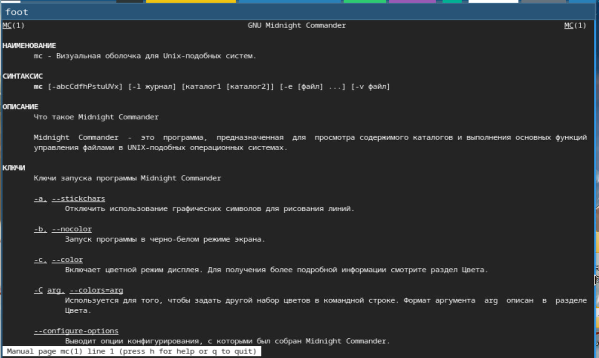{#fig:001 width=70%}

# Интерфейс mc

Запустите из командной строки mc, изучите его структуру и меню (рис. 2).

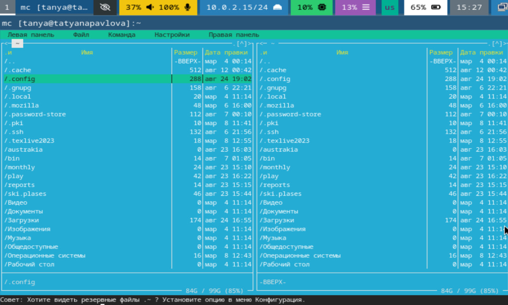{#fig:002 width=70%}

# Выполнение операций в mc

Выполните несколько операций в mc, используя управляющие клавиши (операции с панелями; выделение/отмена выделения файлов, копирование/перемещение файлов, получение информации о размере и правах доступа на файлы и/или каталоги и т.п.) (рис. 3).

{#fig:003 width=70%}

# Выполнение основных команд левой панели

Выполните основные команды меню левой (или правой) панели. Оцените степень подробности вывода информации о файлах (рис. 4).

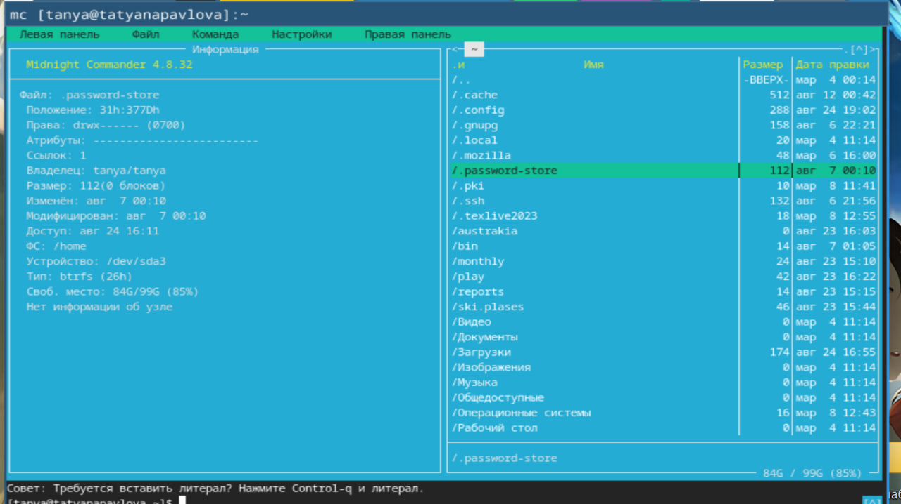{#fig:004 width=70%}

# Подменю файл

Используя возможности подменю Файл , выполните: 
– просмотр содержимого текстового файла; 
– редактирование содержимого текстового файла (без сохранения результатов редактирования); 
– создание каталога; 
– копирование в файлов в созданный каталог (рис. 5), (рис. 6), (рис. 7), (рис. 8).

# Просмотр содержимого

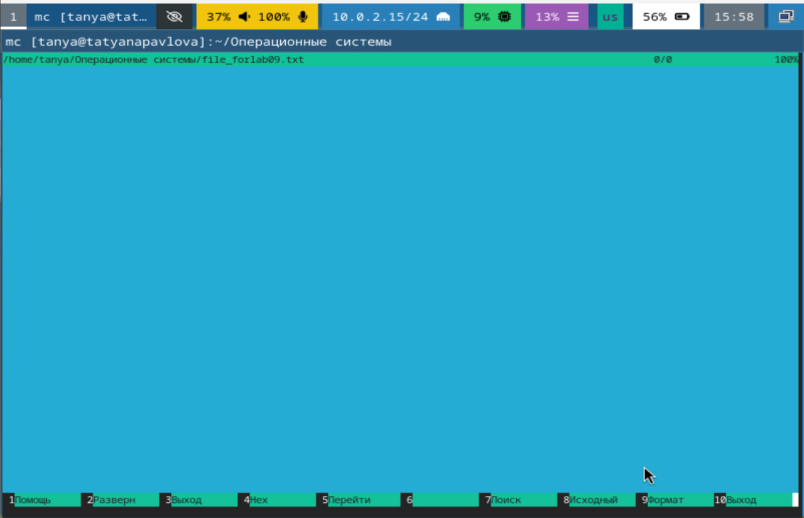{#fig:005 width=70%}

# Редактирование файла

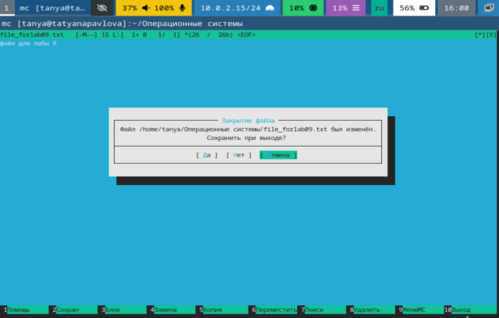{#fig:006 width=70%}

# Создание каталога

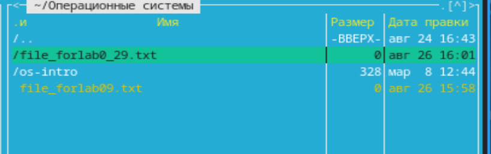{#fig:007 width=70%}

# Копирование файла в каталог

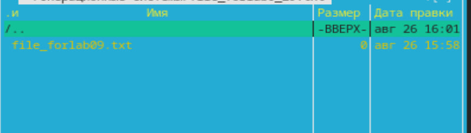{#fig:008 width=70%}

# Подменю команда

С помощью соответствующих средств подменю Команда осуществите: 
– Поиск в файловой системе файла с заданными условиями (например, файла с расширением .c или .cpp, содержащего строку main); 
– выбор и повторение одной из предыдущих команд; 
– переход в домашний каталог; 
– анализ файла меню и файла расширений (рис. 9), (рис. 10), (рис. 11).

# Поиск в файловой системе

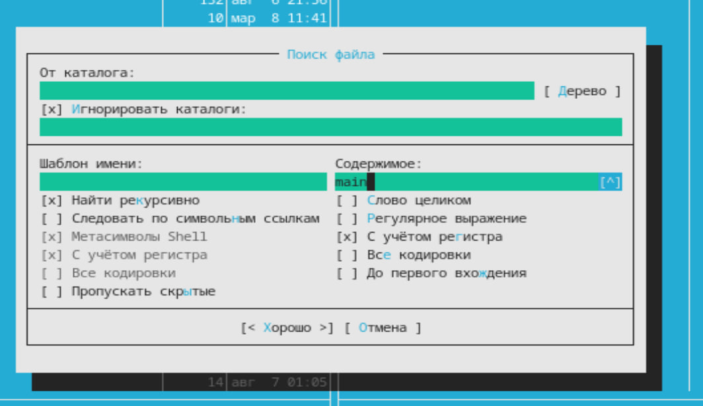{#fig:009 width=70%}

# Просмотр предыдущей команды

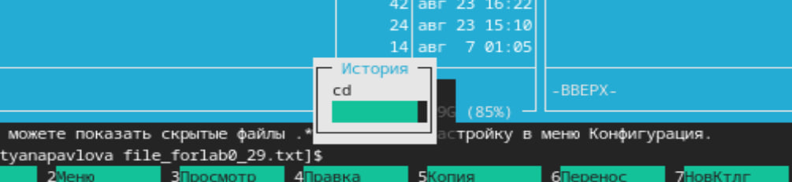{#fig:010 width=70%}

# Анализ файла меню

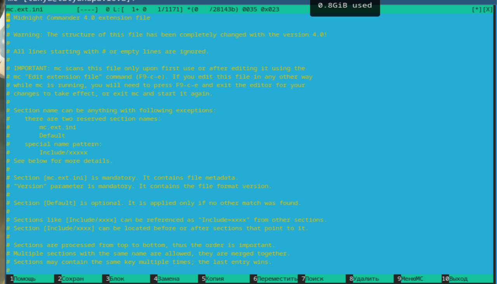{#fig:011 width=70%}

# Подменю настройки

Вызовите подменю Настройки . Освойте операции, определяющие структуру экрана mc (Full screen, Double Width, Show Hidden Files и т.д.) (рис. 12).

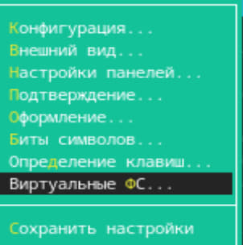{#fig:012 width=70%}

# Файл text.txt

Создайте текстовой файл text.txt. Откройте этот файл с помощью встроенного в mc редактора (рис. 13).

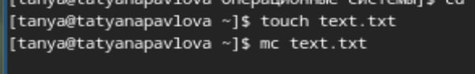{#fig:013 width=70%}

# Работа с файлом

Вставьте в открытый файл небольшой фрагмент текста, скопированный из любого другого файла или Интернета (рис. 14).

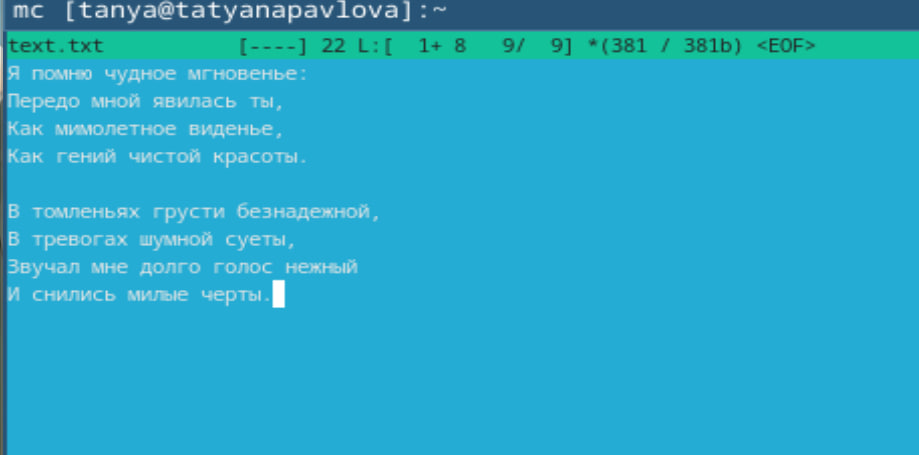{#fig:014 width=70%}

# Работа с файлом

Проделайте с текстом следующие манипуляции, используя горячие клавиши: 
4.1. Удалите строку текста. 
4.2. Выделите фрагмент текста и скопируйте его на новую строку. 
4.3. Выделите фрагмент текста и перенесите его на новую строку. 
4.4. Сохраните файл. 
4.5. Отмените последнее действие. 
4.6. Перейдите в конец файла (нажав комбинацию клавиш) и напишите некоторый текст. 
4.7. Перейдите в начало файла (нажав комбинацию клавиш) и напишите некоторый текст. 
4.8. Сохраните и закройте файл (рис. 15), (рис. 16), (рис. 17), (рис. 18), (рис. 19).

# Работа с файлом (удаление строки)

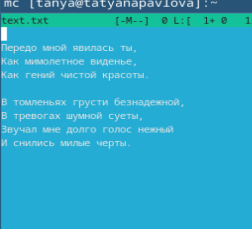{#fig:015 width=70%}

# Работа с файлом (выделение и копирование)

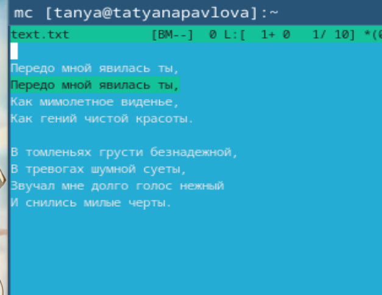{#fig:016 width=70%}

# Работа с файлом (перенос текста на новую строку)

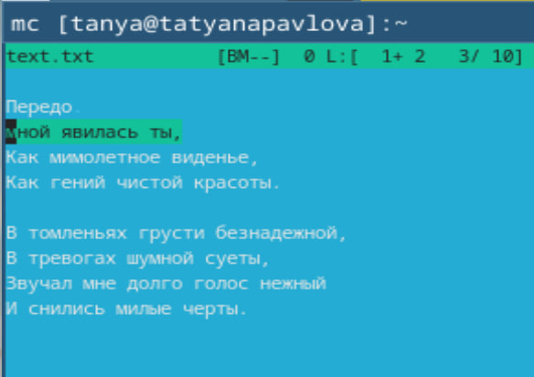{#fig:017 width=70%}

# Работа с файлом (сохранение файла)

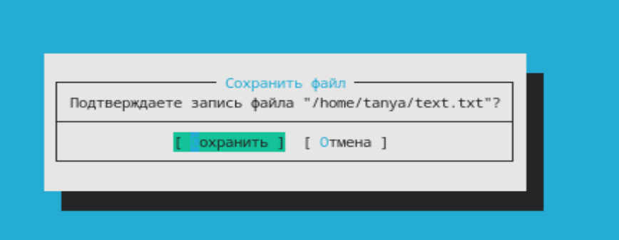{#fig:018 width=70%}

# Работа с файлом (переход в начало и конец файла)

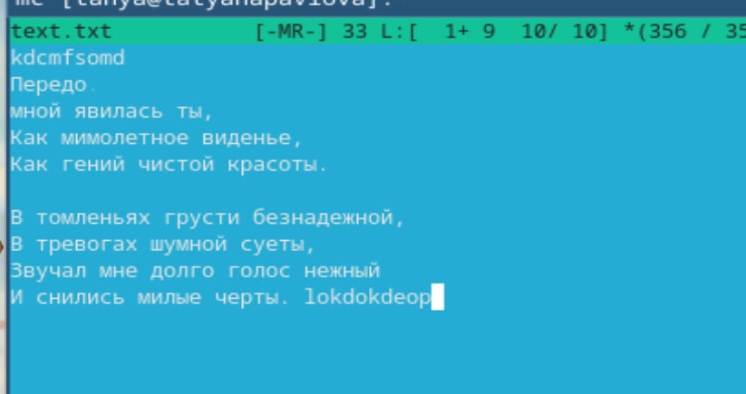{#fig:019 width=70%}

Откройте файл с исходным текстом на некотором языке программирования (например C или Java) (рис. 20).

# Файл .cpp

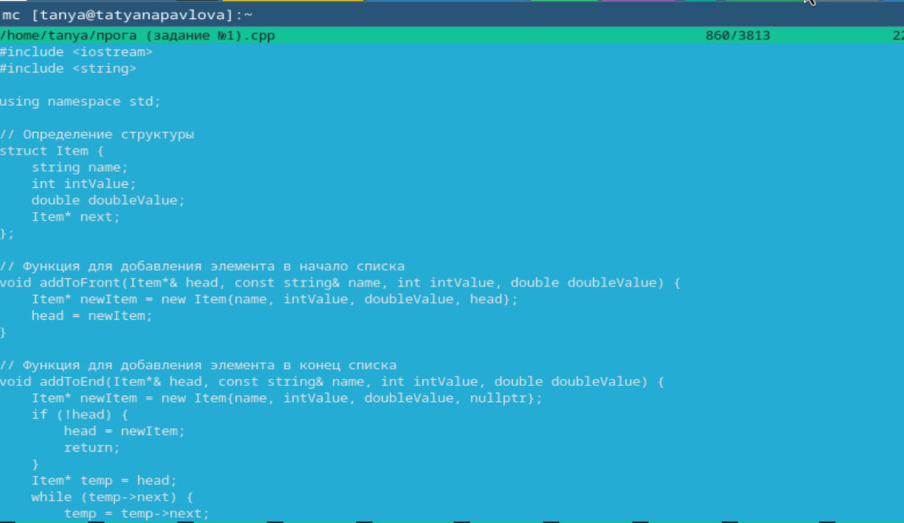{#fig:020 width=70%}

# Настройка подсветки синтаксиса

Используя меню редактора, включите подсветку синтаксиса, если она не включена, или выключите, если она включена (рис. 21).

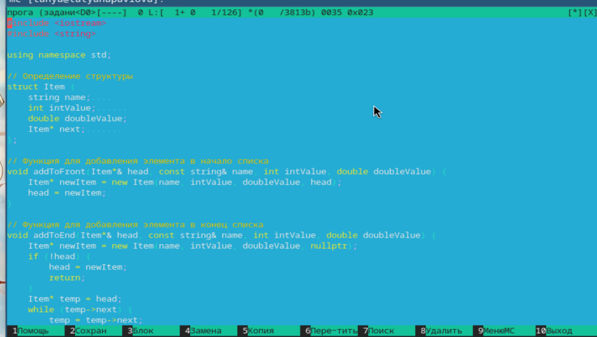{#fig:021 width=70%}

# Выводы

При выполнении данной лабораторной работы, я освоила основные возможности командной оболочки Midnight Commander, а также приобрела навыки практической работы по просмотру каталогов и файлов; манипуляций с ними.

