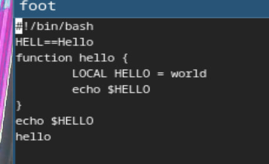
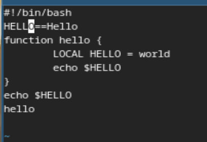
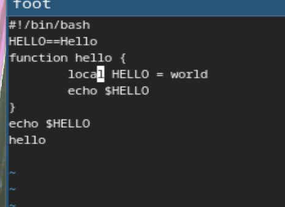
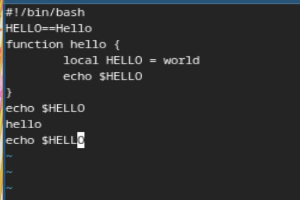
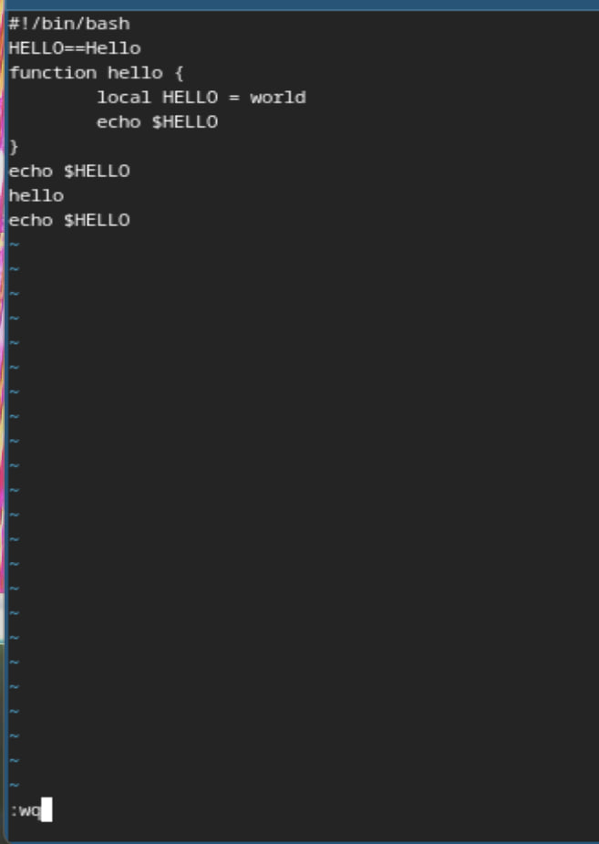

---
## Front matter
lang: ru-RU
title: Лабораторная работа №10
subtitle: Операционные системы
author:
  - Павлова Т. Ю.
institute:
  - Российский университет дружбы народов, Москва, Россия

## i18n babel
babel-lang: russian
babel-otherlangs: english

## Formatting pdf
toc: false
toc-title: Содержание
slide_level: 2
aspectratio: 169
section-titles: true
theme: metropolis
header-includes:
 - \metroset{progressbar=frametitle,sectionpage=progressbar,numbering=fraction}
---

## Цель работы

Целью данной работы является ознакомление с операционной системой Linux, а также получение практических навыков работы с редактором vi, установленным по умолчанию практически во всех дистрибутивах.

## Задание 1

1. Создайте каталог с именем ~/work/os/lab06.
2. Перейдите во вновь созданный каталог.
3. Вызовите vi и создайте файл hello.sh.
4. Нажмите клавишу i и вводите следующий текст.
5. Нажмите клавишу Esc для перехода в командный режим после завершения ввода текста.
6. Нажмите : для перехода в режим последней строки и внизу вашего экрана появится приглашение в виде двоеточия.
7. Нажмите w (записать) и q (выйти), а затем нажмите клавишу Enter для сохранения вашего текста и завершения работы.
8. Сделайте файл исполняемым.

## Задание 2

1. Вызовите vi на редактирование файла.
2. Установите курсор в конец слова HELL второй строки.
3. Перейдите в режим вставки и замените на HELLO. Нажмите Esc для возврата в командный режим.
4. Установите курсор на четвертую строку и сотрите слово LOCAL.
5. Перейдите в режим вставки и наберите следующий текст: local, нажмите Esc для
возврата в командный режим.
6. Установите курсор на последней строке файла. Вставьте после неё строку, содержащую следующий текст: echo $HELLO.
7. Нажмите Esc для перехода в командный режим.
8. Удалите последнюю строку.
9. Введите команду отмены изменений u для отмены последней команды.
10. Введите символ : дляперехода в режимпоследней строки.Запишитепроизведённые изменения и выйдите из vi.

## Теоретическое введение

В большинстве дистрибутивов Linux в качестве текстового редактора по умолчанию устанавливается интерактивный экранный редактор vi (Visual display editor). Редактор vi имеет три режима работы: 
– командный режим — предназначен для ввода команд редактирования и навигации по редактируемому файлу; 
– режим вставки — предназначен для ввода содержания редактируемого файла; 
– режим последней (или командной) строки — используется для записи изменений в файл и выхода из редактора. 
Для вызова редактора vi необходимо указать команду vi и имя редактируемого файла: vi При этом в случае отсутствия файла с указанным именем будет создан такой файл. Переход в командный режим осуществляется нажатием клавиши Esc . Для выхода из редактора vi необходимо перейти в режимпоследней строки: находясь в командном режиме, нажать Shift-; (по сути символ : — двоеточие), затем: – набрать символыwq, если перед выходом из редактора требуется записать изменения в файл; – набрать символ q (или q!), если требуется выйти из редактора без сохранения.

# Выполнение лабораторной работы

## Создание каталога и открытие файла hello.sh в vi

Создайте каталог с именем ~/work/os/lab06. Перейдите во вновь созданный каталог. Вызовите vi и создайте файл hello.sh. Нажмите клавишу i и вводите следующий текст. Нажмите клавишу Esc для перехода в командный режим после завершения ввода текста. Нажмите : для перехода в режим последней строки и внизу вашего экрана появится приглашение в виде двоеточия. Нажмите w (записать) и q (выйти), а затем нажмите клавишу Enter для сохранения вашего текста и завершения работы (рис. 1), (рис. 2).

## Создание каталога в открытие vi

{#fig:001 width=70%}

## Редактирование файла 

{#fig:002 width=70%}

## Выдача файлу прав на исполнение

Сделайте файл исполняемым (рис. 3).

{#fig:003 width=70%}

## Hello.sh, открытый в vi

Вызовите vi на редактирование файла (рис. 4).

{#fig:004 width=70%}

## Замена HELLO на HELLO

Установите курсор в конец слова HELL второй строки. Перейдите в режим вставки и замените на HELLO. Нажмите Esc для возврата в командный режим (рис. 5).

{#fig:005 width=70%}

## Замена LOCAL на local

Установите курсор на четвертую строку и сотрите слово LOCAL. Перейдите в режим вставки и наберите следующий текст: local, нажмите Esc для возврата в командный режим (рис. 6).

{#fig:006 width=70%}

## Редактирование последней строки

Установите курсор на последней строке файла. Вставьте после неё строку, содержащую следующий текст: echo $HELLO. Нажмите Esc для перехода в командный режим (рис. 7).

{#fig:007 width=70%}

## Удаление последней строки

Удалите последнюю строку (рис. 8).

{#fig:008 width=70%}

## Отмена изменений 

Введите команду отмены изменений u для отмены последней команды (рис. 9).

{#fig:009 width=70%}

## Запись изменений и сохранение файла

Введите символ : для перехода в режимпоследней строки.Запишите произведённые изменения и выйдите из vi (рис. 10).

{#fig:010 width=70%}

## Контрольные вопросы

1. Дайте краткую характеристику режимам работы редактора vi.
Редактор vi имеет три режима работы: 
– командный режим — предназначен для ввода команд редактирования и навигации по редактируемому файлу; 
– режим вставки — предназначен для ввода содержания редактируемого файла; 
– режим последней (или командной) строки — используется для записи изменений в файл и выхода из редактора. 

2. Как выйти из редактора, не сохраняя произведённые изменения?
Нажать q

3. Назовите и дайте краткую характеристику командам позиционирования.
0 - переход в начало строки, $ - переход в конец строки, g - переход в конец файла, n g - переход в строку с номером n.

4. Что для редактора vi является словом?
Строка символов

5. Каким образом из любого места редактируемого файла перейти в начало (конец) файла?
Нажать g

6. Назовите и дайте краткую характеристику основным группам команд редактирования.
Вставка текста: a - вставить текст после курсора, A - вставить текст в конец строки, i - вставить текст перед курсором, n i - вставить текст n раз, I - вставить текст в начало строки. Вставка строки: o - вставить строку под курсором, O - вставить строку над курсором. 

7. Необходимо заполнить строку символами $. Каковы ваши действия?
Перейду в режим вставки

8. Как отменить некорректное действие, связанное с процессом редактирования?
Нажать u 

9. Назовите и дайте характеристику основным группам команд режима последней строки.
Используется для записи изменений в файл и выхода из редактора

10. Как определить, не перемещая курсора, позицию, в которой заканчивается строка?
Нажать $

# Выводы

При выполнении данной лабораторной работы, я ознакомилась с операционной системой Linux, а также получила практические навыки работы с редактором vi, установленным по умолчанию практически во всех дистрибутивах.

