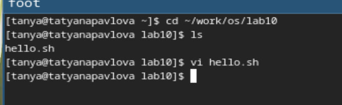
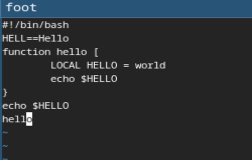
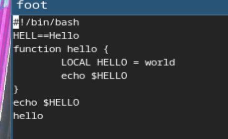
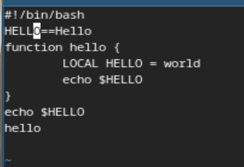
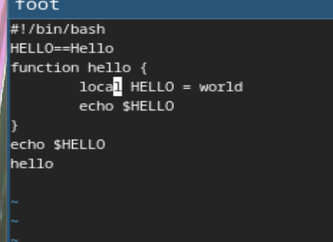
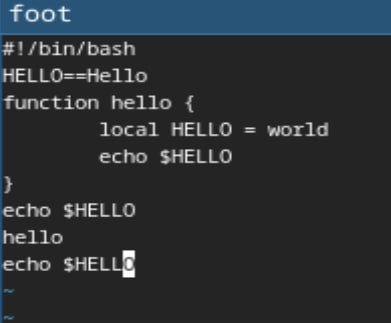
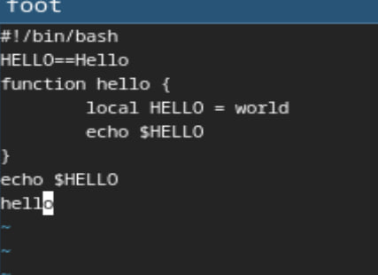
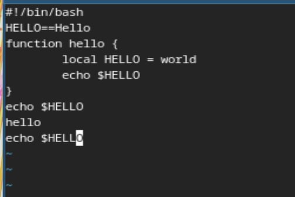
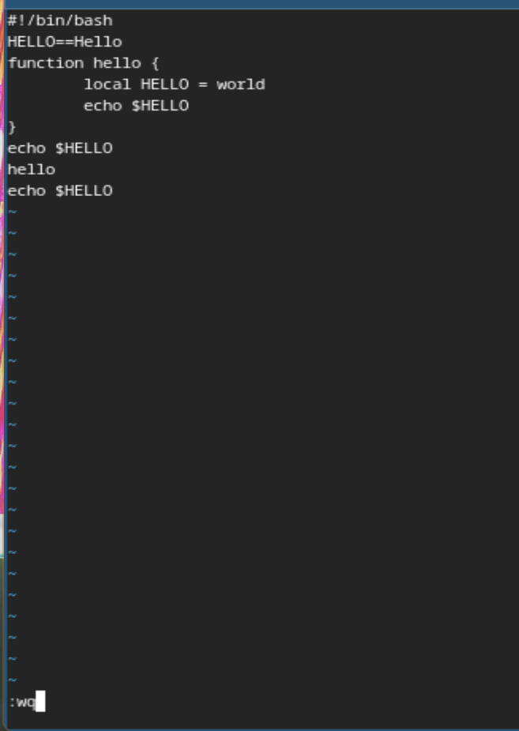

---
## Front matter
title: "Лабораторная работа №10"
subtitle: "Операционные системы"
author: "Павлова Татьяна Юрьевна"

## Generic otions
lang: ru-RU
toc-title: "Содержание"

## Bibliography
bibliography: bib/cite.bib
csl: pandoc/csl/gost-r-7-0-5-2008-numeric.csl

## Pdf output format
toc: true # Table of contents
toc-depth: 2
lof: true # List of figures
lot: true # List of tables
fontsize: 12pt
linestretch: 1.5
papersize: a4
documentclass: scrreprt
## I18n polyglossia
polyglossia-lang:
  name: russian
  options:
	- spelling=modern
	- babelshorthands=true
polyglossia-otherlangs:
  name: english
## I18n babel
babel-lang: russian
babel-otherlangs: english
## Fonts
mainfont: IBM Plex Serif
romanfont: IBM Plex Serif
sansfont: IBM Plex Sans
monofont: IBM Plex Mono
mathfont: STIX Two Math
mainfontoptions: Ligatures=Common,Ligatures=TeX,Scale=0.94
romanfontoptions: Ligatures=Common,Ligatures=TeX,Scale=0.94
sansfontoptions: Ligatures=Common,Ligatures=TeX,Scale=MatchLowercase,Scale=0.94
monofontoptions: Scale=MatchLowercase,Scale=0.94,FakeStretch=0.9
mathfontoptions:
## Biblatex
biblatex: true
biblio-style: "gost-numeric"
biblatexoptions:
  - parentracker=true
  - backend=biber
  - hyperref=auto
  - language=auto
  - autolang=other*
  - citestyle=gost-numeric
## Pandoc-crossref LaTeX customization
figureTitle: "Рис."
tableTitle: "Таблица"
listingTitle: "Листинг"
lofTitle: "Список иллюстраций"
lotTitle: "Список таблиц"
lolTitle: "Листинги"
## Misc options
indent: true
header-includes:
  - \usepackage{indentfirst}
  - \usepackage{float} # keep figures where there are in the text
  - \floatplacement{figure}{H} # keep figures where there are in the text
---

# Цель работы

Целью данной работы является ознакомление с операционной системой Linux, а также получение практических навыков работы с редактором vi, установленным по умолчанию практически во всех дистрибутивах.

# Задание 1

1. Создайте каталог с именем ~/work/os/lab06.
2. Перейдите во вновь созданный каталог.
3. Вызовите vi и создайте файл hello.sh.
4. Нажмите клавишу i и вводите следующий текст.
5. Нажмите клавишу Esc для перехода в командный режим после завершения ввода текста.
6. Нажмите : для перехода в режим последней строки и внизу вашего экрана появится приглашение в виде двоеточия.
7. Нажмите w (записать) и q (выйти), а затем нажмите клавишу Enter для сохранения вашего текста и завершения работы.
8. Сделайте файл исполняемым.

# Задание 2

1. Вызовите vi на редактирование файла.
2. Установите курсор в конец слова HELL второй строки.
3. Перейдите в режим вставки и замените на HELLO. Нажмите Esc для возврата в командный режим.
4. Установите курсор на четвертую строку и сотрите слово LOCAL.
5. Перейдите в режим вставки и наберите следующий текст: local, нажмите Esc для
возврата в командный режим.
6. Установите курсор на последней строке файла. Вставьте после неё строку, содержащую следующий текст: echo $HELLO.
7. Нажмите Esc для перехода в командный режим.
8. Удалите последнюю строку.
9. Введите команду отмены изменений u для отмены последней команды.
10. Введите символ : дляперехода в режимпоследней строки.Запишитепроизведённые изменения и выйдите из vi.

# Теоретическое введение

В большинстве дистрибутивов Linux в качестве текстового редактора по умолчанию устанавливается интерактивный экранный редактор vi (Visual display editor). Редактор vi имеет три режима работы: 
– командный режим — предназначен для ввода команд редактирования и навигации по редактируемому файлу; 
– режим вставки — предназначен для ввода содержания редактируемого файла; 
– режим последней (или командной) строки — используется для записи изменений в файл и выхода из редактора. 
Для вызова редактора vi необходимо указать команду vi и имя редактируемого файла: vi При этом в случае отсутствия файла с указанным именем будет создан такой файл. Переход в командный режим осуществляется нажатием клавиши Esc . Для выхода из редактора vi необходимо перейти в режимпоследней строки: находясь в командном режиме, нажать Shift-; (по сути символ : — двоеточие), затем: – набрать символыwq, если перед выходом из редактора требуется записать изменения в файл; – набрать символ q (или q!), если требуется выйти из редактора без сохранения.

# Выполнение лабораторной работы

Создайте каталог с именем ~/work/os/lab06. Перейдите во вновь созданный каталог. Вызовите vi и создайте файл hello.sh. Нажмите клавишу i и вводите следующий текст. Нажмите клавишу Esc для перехода в командный режим после завершения ввода текста. Нажмите : для перехода в режим последней строки и внизу вашего экрана появится приглашение в виде двоеточия. Нажмите w (записать) и q (выйти), а затем нажмите клавишу Enter для сохранения вашего текста и завершения работы (рис. 1), (рис. 2).

{#fig:001 width=70%}

{#fig:002 width=70%}

Сделайте файл исполняемым (рис. 3).

{#fig:003 width=70%}

Вызовите vi на редактирование файла (рис. 4).

{#fig:004 width=70%}

Установите курсор в конец слова HELL второй строки. Перейдите в режим вставки и замените на HELLO. Нажмите Esc для возврата в командный режим (рис. 5).

{#fig:005 width=70%}

Установите курсор на четвертую строку и сотрите слово LOCAL. Перейдите в режим вставки и наберите следующий текст: local, нажмите Esc для возврата в командный режим (рис. 6).

{#fig:006 width=70%}

Установите курсор на последней строке файла. Вставьте после неё строку, содержащую следующий текст: echo $HELLO. Нажмите Esc для перехода в командный режим (рис. 7).

{#fig:007 width=70%}

Удалите последнюю строку (рис. 8).

{#fig:008 width=70%}

Введите команду отмены изменений u для отмены последней команды (рис. 9).

{#fig:009 width=70%}

Введите символ : дляперехода в режимпоследней строки.Запишитепроизведённые изменения и выйдите из vi (рис. 10).

{#fig:010 width=70%}

# Контрольные вопросы

1. Дайте краткую характеристику режимам работы редактора vi.
Редактор vi имеет три режима работы: 
– командный режим — предназначен для ввода команд редактирования и навигации по редактируемому файлу; 
– режим вставки — предназначен для ввода содержания редактируемого файла; 
– режим последней (или командной) строки — используется для записи изменений в файл и выхода из редактора. 

2. Как выйти из редактора, не сохраняя произведённые изменения?
Нажать q

3. Назовите и дайте краткую характеристику командам позиционирования.
0 - переход в начало строки, $ - переход в конец строки, g - переход в конец файла, n g - переход в строку с номером n.

4. Что для редактора vi является словом?
Строка символов

5. Каким образом из любого места редактируемого файла перейти в начало (конец) файла?
Нажать g

6. Назовите и дайте краткую характеристику основным группам команд редактирования.
Вставка текста: a - вставить текст после курсора, A - вставить текст в конец строки, i - вставить текст перед курсором, n i - вставить текст n раз, I - вставить текст в начало строки. Вставка строки: o - вставить строку под курсором, O - вставить строку над курсором. 

7. Необходимо заполнить строку символами $. Каковы ваши действия?
Перейду в режим вставки

8. Как отменить некорректное действие, связанное с процессом редактирования?
Нажать u 

9. Назовите и дайте характеристику основным группам команд режима последней строки.
Используется для записи изменений в файл и выхода из редактора

10. Как определить, не перемещая курсора, позицию, в которой заканчивается строка?
Нажать $

# Выводы

При выполнении данной лабораторной работы, я ознакомилась с операционной системой Linux, а также получила практические навыки работы с редактором vi, установленным по умолчанию практически во всех дистрибутивах.

