---
## Front matter
title: "Лабораторная работа №11"
subtitle: "Операционные системы"
author: "Павлова Татьяна Юрьевна"

## Generic otions
lang: ru-RU
toc-title: "Содержание"

## Bibliography
bibliography: bib/cite.bib
csl: pandoc/csl/gost-r-7-0-5-2008-numeric.csl

## Pdf output format
toc: true # Table of contents
toc-depth: 2
lof: true # List of figures
lot: true # List of tables
fontsize: 12pt
linestretch: 1.5
papersize: a4
documentclass: scrreprt
## I18n polyglossia
polyglossia-lang:
  name: russian
  options:
	- spelling=modern
	- babelshorthands=true
polyglossia-otherlangs:
  name: english
## I18n babel
babel-lang: russian
babel-otherlangs: english
## Fonts
mainfont: IBM Plex Serif
romanfont: IBM Plex Serif
sansfont: IBM Plex Sans
monofont: IBM Plex Mono
mathfont: STIX Two Math
mainfontoptions: Ligatures=Common,Ligatures=TeX,Scale=0.94
romanfontoptions: Ligatures=Common,Ligatures=TeX,Scale=0.94
sansfontoptions: Ligatures=Common,Ligatures=TeX,Scale=MatchLowercase,Scale=0.94
monofontoptions: Scale=MatchLowercase,Scale=0.94,FakeStretch=0.9
mathfontoptions:
## Biblatex
biblatex: true
biblio-style: "gost-numeric"
biblatexoptions:
  - parentracker=true
  - backend=biber
  - hyperref=auto
  - language=auto
  - autolang=other*
  - citestyle=gost-numeric
## Pandoc-crossref LaTeX customization
figureTitle: "Рис."
tableTitle: "Таблица"
listingTitle: "Листинг"
lofTitle: "Список иллюстраций"
lotTitle: "Список таблиц"
lolTitle: "Листинги"
## Misc options
indent: true
header-includes:
  - \usepackage{indentfirst}
  - \usepackage{float} # keep figures where there are in the text
  - \floatplacement{figure}{H} # keep figures where there are in the text
---

# Цель работы

Целью данной лабораторной работы является ознакомление с операционной системой Linux, а также получение практические навыков работы с редактором Emacs.

# Задание

1. Открыть emacs.
2. Создать файл lab07.sh с помощью комбинации Ctrl-x Ctrl-f (C-x C-f).
3. Наберите текст
4. Сохранить файл с помощью комбинации Ctrl-x Ctrl-s (C-x C-s).
5. Проделать с текстом стандартные процедуры редактирования, каждое дейтвие должно осуществляться комбинацией клавиш. 
5.1. Вырезать одной командой целую строку (С-k). 
5.2. Вставить эту строку в конец файла (C-y).
5.3. Выделить область текста (C-space). 
5.4. Скопировать область в буфер обмена (M-w). 
5.5. Вставить область в конец файла. 
5.6. Вновь выделить эту область и на этот раз вырезать её (C-w). 
5.7. Отмените последнее действие (C-/).
6. Научитесь использовать команды по перемещению курсора. 
6.1.Переместите курсор в начало строки (C-a). 
6.2. Переместите курсор в конец строки (C-e).
6.3. Переместите курсор в начало буфера (M-<). 
6.4. Переместите курсор в конец буфера (M->).
7. Управление буферами. 
7.1. Вывести список активных буферов на экран (C-x C-b). 
7.2. Переместитесь во вновь открытое окно (C-x) o со списком открытых буферов и переключитесь на другой буфер. 
7.3. Закройте это окно (C-x 0).
7.4. Теперь вновь переключайтесь между буферами, но уже без вывода их списка на экран (C-x b).
8. Управление окнами. 
8.1. Поделите фрейм на 4 части: разделите фрейм на два окна по вертикали (C-x 3), а затем каждое из этих окон на две частипо горизонтали (C-x 2) 
8.2. В каждом из четырёх созданных окон откройте новый буфер (файл) и введите несколько строк текста.
9. Режим поиска
9.1.Переключитесь врежимпоиска (C-s) инайдитенесколько слов, присутствующих в тексте. 
9.2. Переключайтесь между результатами поиска, нажимая C-s. 
9.3. Выйдите из режима поиска, нажав C-g. 
9.4. Перейдите в режим поиска и замены (M-%), введите текст, который следует найти и заменить, нажмите Enter , затем введите текст для замены. После того как будут подсвечены результаты поиска, нажмите ! для подтверждения замены. 
9.5. Испробуйте другой режим поиска, нажав M-s o. Объясните, чем он отличается от обычного режима?

# Теоретическое введение

Основные термины Emacs 
Определение 1 
Буфер — объект, представляющий какой-либо текст. Буфер может содержать что угодно, например, результаты компиляции программы или встроенные подсказки. Практически всё взаимодействие с пользователем, в том числе интерактивное, происходит посредством буферов. 
Определение 2 
Фрейм соответствует окну в обычном понимании этого слова. Каждый фрейм содержит область вывода и одно илинесколько окон Emacs.
Определение 3 
Окно — прямоугольная область фрейма, отображающая один из буферов. Каждое окно имеет свою строку состояния, в которой выводится следующая информация: название буфера, его основной режим, изменялся ли текст буфера и как далеко вниз по буферу расположен курсор. Каждый буфер находится только в одном из возможных основных режимов. 
Существующие основные режимы включают режим Fundamental (наименее специализированный), режим
Text, режим Lisp, режим С, режим Texinfo и другие. Под второстепенными режимами понимается список режимов, которые вклю- чены в данный момент в буфере выбранного окна. 
Определение 4 
Область вывода — одна или несколько строк внизу фрейма, в которой Emacs выводит различные сообщения, а также запрашивает подтверждения и дополни- тельную информацию от пользователя.
Определение 5 
Минибуфер используется для ввода дополнительной информации и всегда отображается в области вывода. 
Определение 6 
Точка вставки — место вставки (удаления) данных в буфере.

# Выполнение лабораторной работы

Откройте emacs (рис. 1).

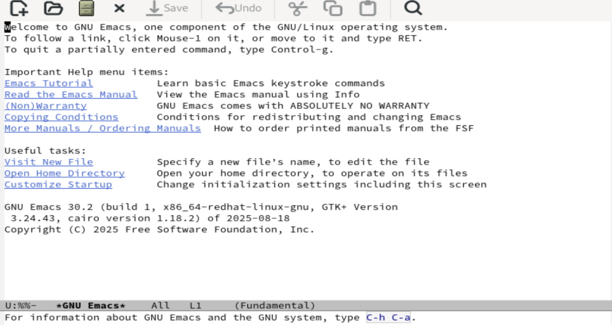{#fig:001 width=70%}

Создать файл lab07.sh с помощью комбинации Ctrl-x Ctrl-f (C-x C-f). Наберите текст (рис. 2).

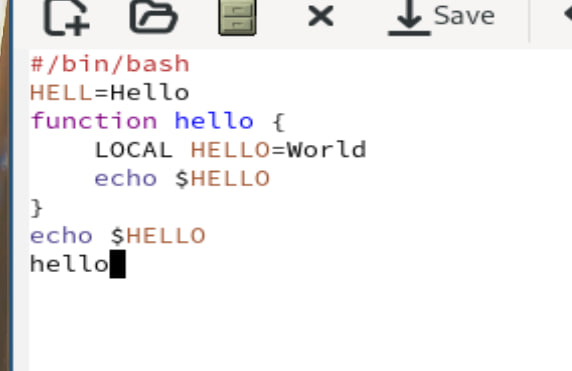{#fig:002 width=70%}

Сохранить файл с помощью комбинации Ctrl-x Ctrl-s (C-x C-s) (рис. 3).

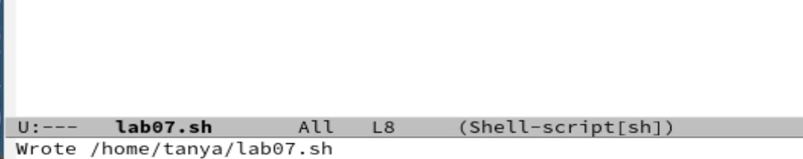{#fig:003 width=70%}

Управление буферами. 
7.1. Вывести список активных буферов на экран (C-x C-b). 
7.2. Переместитесь во вновь открытое окно (C-x) o со списком открытых буферов и переключитесь на другой буфер. 
7.3. Закройте это окно (C-x 0).
7.4. Теперь вновь переключайтесь между буферами, но уже без вывода их списка на экран (C-x b).
Проделать с текстом стандартные процедуры редактирования, каждое дейтвие должно осуществляться комбинацией клавиш. 
5.1. Вырезать одной командой целую строку (С-k). 
5.2. Вставить эту строку в конец файла (C-y).
5.3. Выделить область текста (C-space). 
5.4. Скопировать область в буфер обмена (M-w). 
5.5. Вставить область в конец файла. 
5.6. Вновь выделить эту область и на этот раз вырезать её (C-w). 
5.7. Отмените последнее действие (C-/). (рис. 4), (рис. 5), (рис. 6), (рис. 7), (рис. 8), (рис. 9).

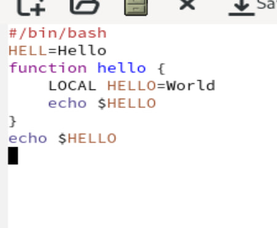{#fig:004 width=70%}

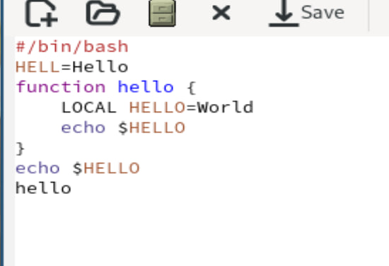{#fig:005 width=70%}

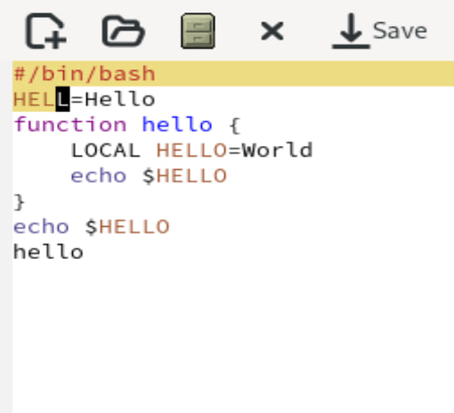{#fig:006 width=70%}

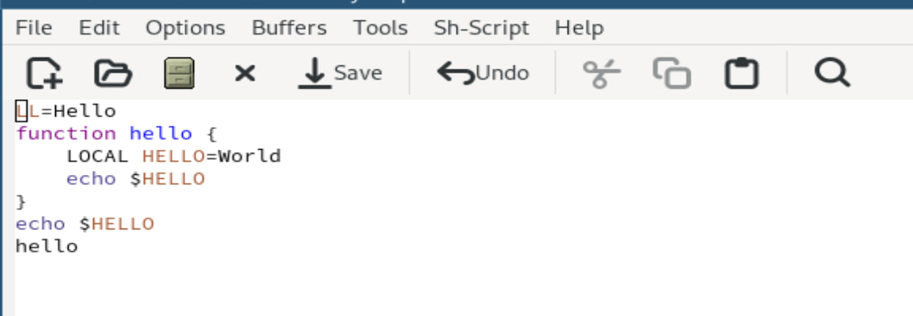{#fig:007 width=70%}

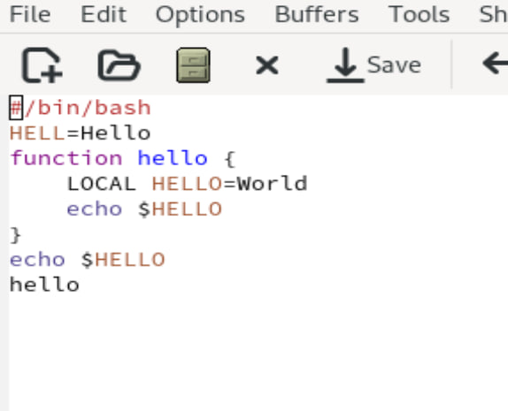{#fig:008 width=70%}

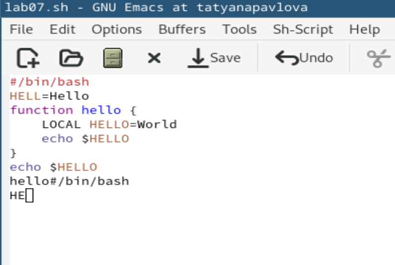{#fig:009 width=70%}

Научитесь использовать команды по перемещению курсора. 
6.1.Переместите курсор в начало строки (C-a). 
6.2. Переместите курсор в конец строки (C-e).
6.3. Переместите курсор в начало буфера (M-<). 
6.4. Переместите курсор в конец буфера (M->) (рис. 10), (рис. 11).

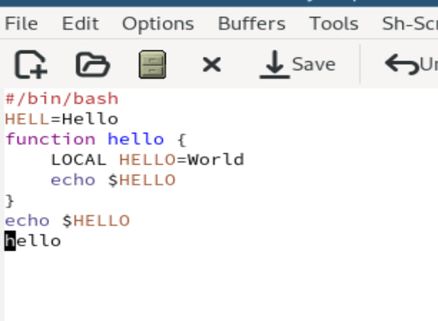{#fig:010 width=70%}

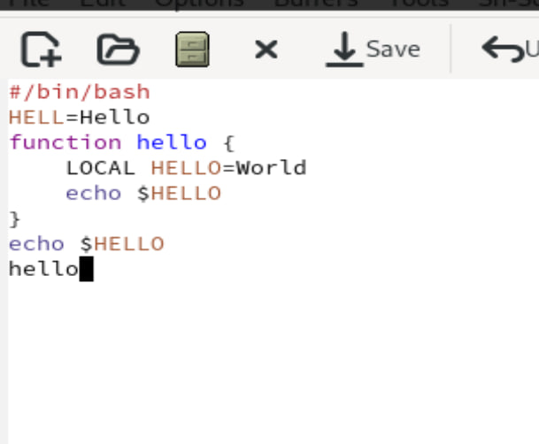{#fig:011 width=70%}

Управление буферами. 
7.1. Вывести список активных буферов на экран (C-x C-b). 
7.2. Переместитесь во вновь открытое окно (C-x) o со списком открытых буферов и переключитесь на другой буфер. 
7.3. Закройте это окно (C-x 0).
7.4. Теперь вновь переключайтесь между буферами, но уже без вывода их списка на экран (C-x b) (рис. 12), (рис. 13).

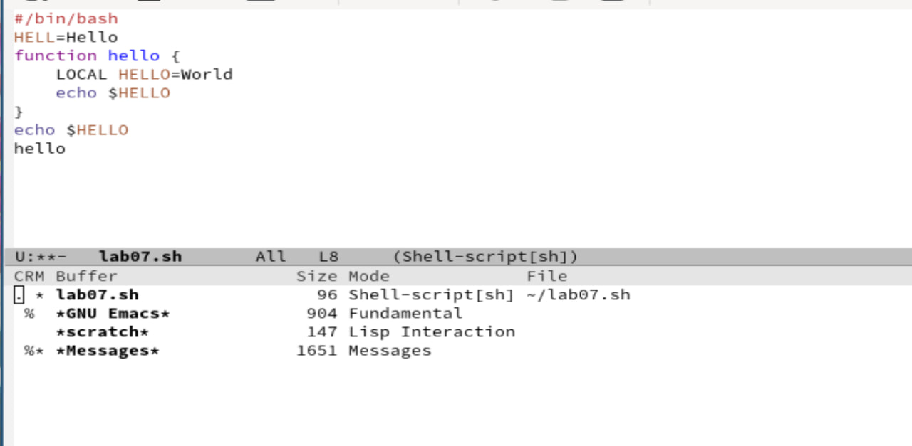{#fig:012 width=70%}

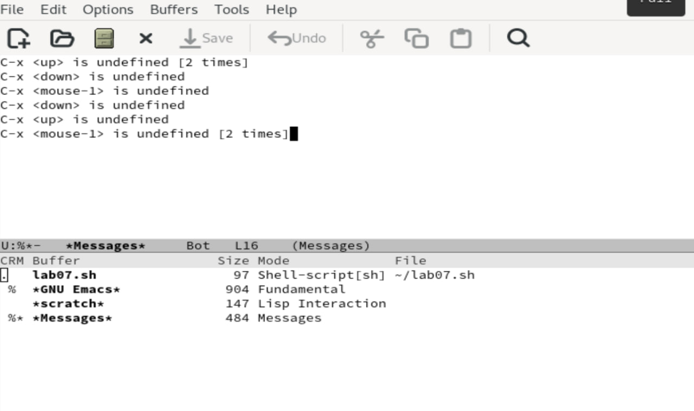{#fig:013 width=70%}

Управление окнами. 
8.1. Поделите фрейм на 4 части: разделите фрейм на два окна по вертикали (C-x 3), а затем каждое из этих окон на две частипо горизонтали (C-x 2) 
8.2. В каждом из четырёх созданных окон откройте новый буфер (файл) и введите несколько строк текста (рис. 14).

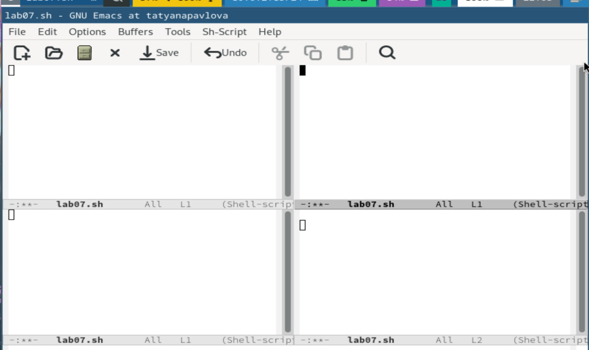{#fig:014 width=70%}

Режим поиска
9.1.Переключитесь врежимпоиска (C-s) инайдитенесколько слов, присутствующих в тексте. 
9.2. Переключайтесь между результатами поиска, нажимая C-s. 
9.3. Выйдите из режима поиска, нажав C-g. 
9.4. Перейдите в режим поиска и замены (M-%), введите текст, который следует найти и заменить, нажмите Enter , затем введите текст для замены. После того как будут подсвечены результаты поиска, нажмите ! для подтверждения замены. 
9.5. Испробуйте другой режим поиска, нажав M-s o (рис. 15), (рис. 16). 

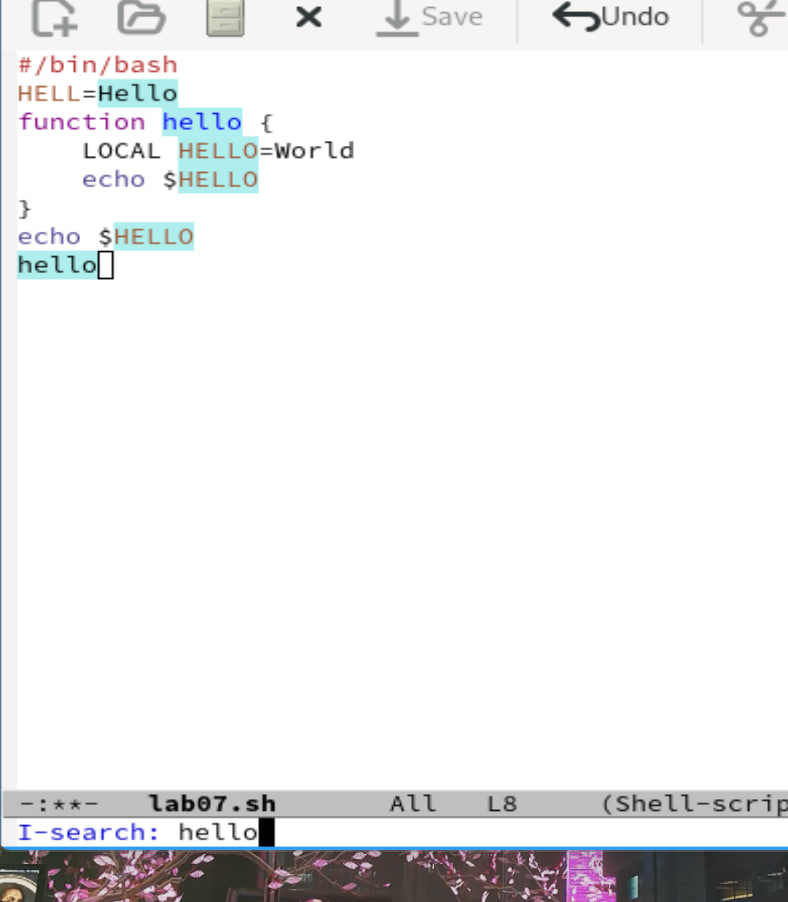{#fig:015 width=70%}

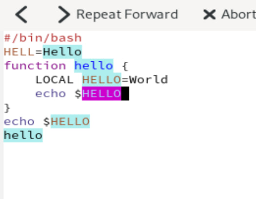{#fig:016 width=70%}

# Выводы

При выполнении данной лабораторной работы, я ознакомлилась с операционной системой Linux, а также получила практические навыки работы с редактором Emacs.
