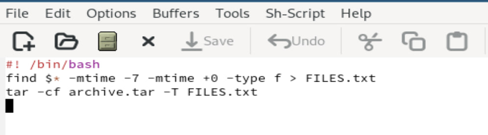

---
## Front matter
title: "Лабораторная работа №13"
subtitle: "Операционные системы"
author: "Павлова Татьяна Юрьевна"

## Generic otions
lang: ru-RU
toc-title: "Содержание"

## Bibliography
bibliography: bib/cite.bib
csl: pandoc/csl/gost-r-7-0-5-2008-numeric.csl

## Pdf output format
toc: true # Table of contents
toc-depth: 2
lof: true # List of figures
lot: true # List of tables
fontsize: 12pt
linestretch: 1.5
papersize: a4
documentclass: scrreprt
## I18n polyglossia
polyglossia-lang:
  name: russian
  options:
	- spelling=modern
	- babelshorthands=true
polyglossia-otherlangs:
  name: english
## I18n babel
babel-lang: russian
babel-otherlangs: english
## Fonts
mainfont: IBM Plex Serif
romanfont: IBM Plex Serif
sansfont: IBM Plex Sans
monofont: IBM Plex Mono
mathfont: STIX Two Math
mainfontoptions: Ligatures=Common,Ligatures=TeX,Scale=0.94
romanfontoptions: Ligatures=Common,Ligatures=TeX,Scale=0.94
sansfontoptions: Ligatures=Common,Ligatures=TeX,Scale=MatchLowercase,Scale=0.94
monofontoptions: Scale=MatchLowercase,Scale=0.94,FakeStretch=0.9
mathfontoptions:
## Biblatex
biblatex: true
biblio-style: "gost-numeric"
biblatexoptions:
  - parentracker=true
  - backend=biber
  - hyperref=auto
  - language=auto
  - autolang=other*
  - citestyle=gost-numeric
## Pandoc-crossref LaTeX customization
figureTitle: "Рис."
tableTitle: "Таблица"
listingTitle: "Листинг"
lofTitle: "Список иллюстраций"
lotTitle: "Список таблиц"
lolTitle: "Листинги"
## Misc options
indent: true
header-includes:
  - \usepackage{indentfirst}
  - \usepackage{float} # keep figures where there are in the text
  - \floatplacement{figure}{H} # keep figures where there are in the text
---

# Цель работы

Целью данной лабораторной работы является изучение основ программирования в оболочке ОС UNIX, а также научится писать более сложные командные файлы с использованием логических управляющих
конструкций и циклов.

# Задание

1. Используя команды getopts grep, написать командный файл, который анализирует командную строку с ключами: 
– -iinput file — прочитать данные из указанного файла; 
– -ooutput file — вывести данные в указанный файл;
– -p шаблон — указать шаблон для поиска; 
– -C — различать большие и малые буквы; 
– -n — выдавать номера строк. а затем ищет в указанном файле нужные строки, определяемые ключом -p.
2. Написать на языке Си программу, которая вводит число и определяет, является ли оно больше нуля, меньше нуля или равно нулю. Затем программа завершается с помощью функции exit(n), передавая информацию в о коде завершения в оболочку. Командныйфайл должен вызывать эту программу и, проанализировав с помощью команды $?, выдать сообщение о том, какое
число было введено.
3. Написать командный файл, создающий указанное число файлов, пронумерованных последовательно от 1 до � (например 1.tmp, 2.tmp, 3.tmp,4.tmp и т.д.). Число файлов, которые необходимо создать, передаётся в аргументы командной строки. Этот же ко- мандный файл должен уметь удалять все созданные им файлы (если они существуют).
4. Написать командный файл, который с помощью команды tar запаковывает в архив все файлы в указанной директории. Модифицировать его так, чтобы запаковывались только те файлы, которые были изменены менее недели тому назад (использовать команду find).

# Теоретическое введение

Bash (Bourne Again Shell) — это мощная командная оболочка Unix, которая используется для выполнения различных задач в терминале. Bash предоставляет интерактивный интерфейс, в котором пользователи могут вводить команды, а затем получать результаты. Она также поддерживает скрипты оболочки, которые представляют собой текстовые файлы, содержащие последовательность команд Bash для автоматизации задач. Bash широко используется в средах Unix и Linux, а также поддерживается Windows с помощью подсистемы Windows для Linux (WSL). Перечислим основные возможности этой оболочки. Обработка команд. Bash может обрабатывать как простые, так и сложные команды. Простые состоят из одного действия и, возможно, некоторых аргументов. Сложные команды могут содержать несколько простых, объединенных с помощью операторов конвейера (|), перенаправления ввода и вывода (<, >, >>), условных операторов (if/else, case/esac, while/do). О них мы расскажем позже. Расширенный ввод, редактирование строк. Оболочка предоставляет функции расширенного ввода, такие как автодополнение, которое предлагает возможные варианты завершения команд и имен файлов по мере их ввода. Она также поддерживает историю, позволяя пользователям просматривать ранее введенные команды, а затем повторно их использовать. Возможность создания и запуска скриптов. Скрипты оболочки — это текстовые файлы, содержащие последовательность команд. Их можно создавать с помощью текстового редактора, а затем запускать в терминале, что дает возможность пользователям автоматизировать задачи и управлять системой. Скрипты могут содержать условные операторы, циклы, функции для обеспечения дополнительной гибкости и контроля.

# Выполнение лабораторной работы

Используя команды getopts grep, написать командный файл, который анализирует командную строку с ключами: 
– -iinput file — прочитать данные из указанного файла; 
– -ooutput file — вывести данные в указанный файл;
– -p шаблон — указать шаблон для поиска; 
– -C — различать большие и малые буквы; 
– -n — выдавать номера строк. а затем ищет в указанном файле нужные строки, определяемые ключом -p (рис. 1), (рис. 2), (рис. 3), (рис. 4).

{#fig:001 width=70%}

{#fig:002 width=70%}

{#fig:003 width=70%}

{#fig:004 width=70%}

Написать на языке Си программу, которая вводит число и определяет, является ли оно больше нуля, меньше нуля или равно нулю. Затем программа завершается с помощью функции exit(n), передавая информацию в о коде завершения в оболочку. Командныйфайл должен вызывать эту программу и, проанализировав с помощью команды $?, выдать сообщение о том, какое
число было введено (рис. 5), (рис. 6), (рис. 7).

{#fig:005 width=70%}

{#fig:006 width=70%}

{#fig:007 width=70%}

Написать командный файл, создающий указанное число файлов, пронумерованных последовательно от 1 до � (например 1.tmp, 2.tmp, 3.tmp,4.tmp и т.д.). Число файлов, которые необходимо создать, передаётся в аргументы командной строки. Этот же ко- мандный файл должен уметь удалять все созданные им файлы (если они существуют) (рис. 8), (рис. 9).

{#fig:008 width=70%}

{#fig:009 width=70%}

Написать командный файл, который с помощью команды tar запаковывает в архив все файлы в указанной директории. Модифицировать его так, чтобы запаковывались только те файлы, которые были изменены менее недели тому назад (использовать команду find) (рис. 10), (рис. 11), (рис. 12).

{#fig:010 width=70%}

{#fig:011 width=70%}

{#fig:012 width=70%}

# Выводы

При выполнении данной лабораторной работы, я изучила основы программирования в оболочке ОС UNIX, а также научилась писать более сложные командные файлы с использованием логических управляющих конструкций и циклов.
